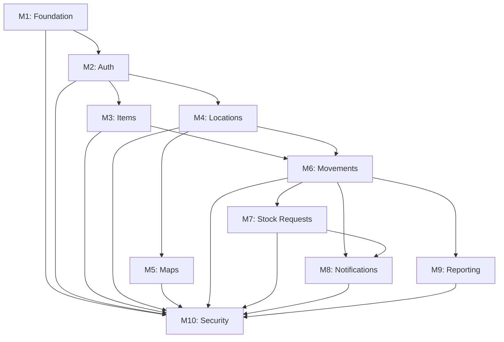

# Stock Management System - Implementation Roadmap

This directory contains the complete planning documentation for implementing the Stock Management & Location Tracking System.

## 📄 Documentation Files

### 1. [MILESTONES.md](./MILESTONES.md)
Complete milestone (epic) definitions with:
- Descriptions and goals
- Documentation references
- Dependencies
- List of child issues
- **10 milestones covering all requirements**

### 2. [ISSUES.md](./ISSUES.md) (Partial)
Detailed issue specifications with:
- Context and requirements
- Step-by-step implementation guides
- Acceptance criteria
- Testing methods
- **Partial content for Milestones 1-3** (complete specifications would be ~200KB+)

### 3. [ISSUE_TEMPLATES.md](./ISSUE_TEMPLATES.md)
Quick-copy templates for creating issues:
- Condensed format for fast issue creation
- First 17 issues fully specified
- Template format for remaining issues

### 4. [PROJECT_STRUCTURE.md](./PROJECT_STRUCTURE.md)
Implementation guide with:
- How to create milestones and issues
- Development phases and timeline
- Dependency graph
- Team recommendations
- Testing strategy
- Risk management

## 🎯 Quick Start

### For Project Managers

1. Read [PROJECT_STRUCTURE.md](./PROJECT_STRUCTURE.md) for overview
2. Review [MILESTONES.md](./MILESTONES.md) for milestone details
3. Create milestones in GitHub (see guide in PROJECT_STRUCTURE.md)
4. Create issues using templates from [ISSUE_TEMPLATES.md](./ISSUE_TEMPLATES.md)
5. Set up project board and assign team members

### For Developers

1. Read `/docs/SystemRequirementsSpecification.md` thoroughly
2. Review `/docs/openapi.yml` for API design
3. Start with Milestone 1: Foundation & Infrastructure Setup
4. Follow implementation steps in each issue
5. Run tests and verify acceptance criteria

## 📊 Project Overview

| Metric | Value |
|--------|-------|
| Total Milestones | 10 |
| Total Issues | 110+ |
| Estimated Duration | 12-18 months |
| Team Size (Recommended) | 3-5 developers |
| Tech Stack | Python/FastAPI, React/TypeScript, PostgreSQL, Redis |

## 🗺️ Milestone Roadmap

```
Phase 1: Foundation (Months 1-2)
├─ M1: Foundation & Infrastructure Setup ⚡ CRITICAL
└─ M2: User Management & Authentication ⚡ CRITICAL

Phase 2: Core Features (Months 3-6)
├─ M3: Stock Item Management
├─ M4: Location Management
└─ M6: Stock Movements ⚡ CRITICAL

Phase 3: Workflows (Months 7-9)
├─ M7: Stock Requests (Van-to-Warehouse)
└─ M8: Notifications System

Phase 4: Analytics & Polish (Months 10-12)
├─ M9: Reporting & Analytics
└─ M5: Maps & Visual Navigation

Phase 5: Production Ready (Months 13-15)
└─ M10: Security & Performance Optimization
```

## 🔗 Dependencies



## 📋 What's Included

### Complete Specifications For:

#### ✅ Milestone 1: Foundation & Infrastructure (7 issues)
- Backend structure (Python/FastAPI)
- Frontend structure (React/TypeScript)
- Database setup (PostgreSQL)
- Redis configuration
- CI/CD pipeline
- Docker environment
- Migration system

#### ✅ Milestone 2: User Management & Authentication (10 issues)
- User model and schema
- Role and permission models
- JWT authentication
- Login/refresh endpoints
- User CRUD APIs
- Role management APIs
- Permission middleware
- User management UI
- Login/logout UI
- Admin initialization

#### ⚠️ Milestones 3-10: Detailed in MILESTONES.md
- Full descriptions and goals
- Child issue lists
- Dependencies and priorities
- Acceptance criteria

### Issue Specifications Include:

- **Context:** Why the work is needed
- **Documentation References:** Links to requirements and specs
- **Implementation Steps:** Ordered, actionable steps
- **Acceptance Criteria:** Verifiable completion conditions
- **Testing Methods:** Unit tests, integration tests, manual testing
- **Code Examples:** Where applicable

## 🛠️ Tech Stack

### Backend
- **Framework:** FastAPI (Python 3.11+)
- **ORM:** SQLAlchemy
- **Database:** PostgreSQL 15
- **Cache:** Redis 7
- **Auth:** JWT (python-jose)
- **Validation:** Pydantic
- **Migrations:** Alembic
- **Testing:** pytest

### Frontend
- **Framework:** React 18
- **Language:** TypeScript
- **Styling:** TailwindCSS
- **State:** React Query (@tanstack/react-query)
- **Routing:** React Router DOM
- **HTTP Client:** Axios
- **Scanner:** zxing-js
- **Maps:** Konva.js or Fabric.js
- **Testing:** Vitest + React Testing Library

### DevOps
- **Containers:** Docker + Docker Compose
- **CI/CD:** GitHub Actions
- **Deployment:** (TBD - Docker Swarm, Kubernetes, or cloud platform)

## 📝 How to Use These Documents

### Creating Milestones

1. Navigate to: `https://github.com/TheCharlesChristy/StockControl/milestones`
2. Click "New milestone"
3. Copy title and description from `MILESTONES.md`
4. Set due date based on your timeline
5. Repeat for all 10 milestones

### Creating Issues

**Option A: Manual (Recommended for small teams)**
1. Go to: `https://github.com/TheCharlesChristy/StockControl/issues/new`
2. Copy title from `ISSUE_TEMPLATES.md`
3. Copy description
4. Select milestone
5. Add labels (backend, frontend, priority, etc.)
6. Assign to developer
7. Click "Submit new issue"

**Option B: GitHub CLI (For automation)**
```bash
# Set your token
export GH_TOKEN="your_github_personal_access_token"

# Create issue
gh issue create \
  --repo TheCharlesChristy/StockControl \
  --title "Initialize Backend Project Structure" \
  --body "$(cat issue_content.md)" \
  --milestone "Foundation & Infrastructure Setup" \
  --label "backend,setup,priority:critical" \
  --assignee "username"
```

**Option C: GitHub API (For bulk creation)**
See `PROJECT_STRUCTURE.md` for API examples.

## 🎓 Learning Resources

### For Team Members New to the Stack:

**FastAPI:**
- Official docs: https://fastapi.tiangolo.com/
- Tutorial: FastAPI for beginners

**React + TypeScript:**
- React docs: https://react.dev/
- TypeScript handbook: https://www.typescriptlang.org/docs/

**SQLAlchemy:**
- Official docs: https://docs.sqlalchemy.org/

**System Design:**
- Review the System Requirements Specification
- Study the OpenAPI specification
- Understand RBAC patterns

## ⚠️ Important Notes

### This Agent Cannot:
- ❌ Create GitHub milestones directly
- ❌ Create GitHub issues directly  
- ❌ Update GitHub via git/gh CLI (no GH_TOKEN)
- ❌ Push directly to GitHub

### This Agent Has:
- ✅ Created comprehensive documentation
- ✅ Defined all milestones with descriptions
- ✅ Specified 110+ issues with implementation details
- ✅ Provided templates for easy GitHub creation
- ✅ Documented dependencies and priorities
- ✅ Created implementation guides

## 🚀 Next Steps

1. **Review Documents:**
   - Read PROJECT_STRUCTURE.md for full understanding
   - Review MILESTONES.md for milestone details
   - Check ISSUE_TEMPLATES.md for issue formats

2. **Set Up GitHub:**
   - Create all 10 milestones
   - Create issues for Milestone 1 (Foundation)
   - Set up project board
   - Configure labels

3. **Start Development:**
   - Complete M1.1: Initialize Backend
   - Complete M1.2: Initialize Frontend
   - Complete M1.3-M1.7: Infrastructure
   - Begin M2: Authentication

4. **Establish Process:**
   - Daily/weekly standups
   - Code review process
   - Testing requirements
   - Documentation standards

## 📞 Support

For questions about:
- **Requirements:** See `/docs/SystemRequirementsSpecification.md`
- **API Design:** See `/docs/openapi.yml`
- **Implementation:** See specific issue in ISSUES.md or ISSUE_TEMPLATES.md
- **Process:** See PROJECT_STRUCTURE.md

## 📄 License

See repository LICENSE file.

## 🤝 Contributing

See CONTRIBUTING.md (to be created as part of M1.5: CI/CD Pipeline setup).

---

**Created:** 2025-11-22  
**Version:** 1.0  
**Status:** Ready for Implementation  
**Last Updated By:** GitHub Copilot Coding Agent
