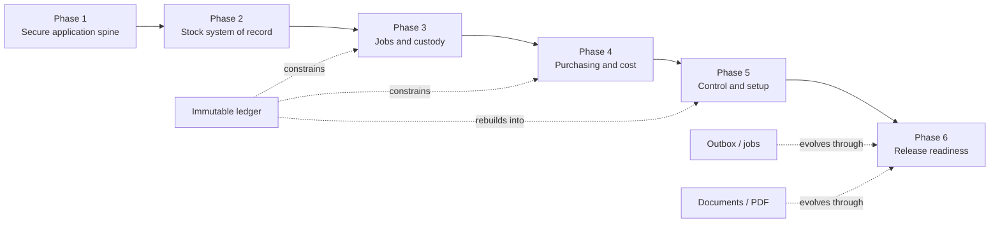

# StockControl MVP implementation playbook

**Status:** Delivery plan  
**Baseline:** Approved MVP requirements v1.0  
**Last reviewed:** 30 July 2026  
**Audience:** Engineers and Coding Agents coding sessions implementing StockControl

## 1. Purpose

This document turns the approved StockControl MVP into small, dependency-ordered work packets.
It is intentionally detailed so that a coding session with limited context can select one packet,
read a bounded set of source material, implement it, test it, and hand it off without redesigning
the product.

This is an implementation plan, not a replacement for the product requirements or architecture
decisions. A checked box means executable implementation and evidence exist; prose alone is not
evidence.

The plan covers the approved MVP only. Features explicitly deferred by
[product requirements section 16.1](./product-requirements.md#161-explicitly-deferred) must not
become dependencies of MVP acceptance.

## 2. Source-of-truth order

When sources disagree, use this order:

1. A current explicit product-owner instruction for task scope. If it changes the approved product,
   record the formal requirements/ADR change before coding rather than silently overriding the
   baseline.
2. [Approved product requirements](./product-requirements.md).
3. Accepted [architecture decisions](./architecture/README.md).
4. Public module contracts and the module README for the code being changed.
5. Reviewed [operational runbooks](./operations/README.md) for a production state-changing action.
6. [Requirements traceability](./requirements-traceability.md).
7. This playbook.
8. Existing implementation details and tests.

Do not silently resolve a genuine conflict. Stop the packet, document the conflict, and update the
requirements or add a superseding ADR through the change-control process before implementation
continues.

If a production runbook and executable infrastructure disagree, the relevant release/operations
packet is blocked until automation, runbook, tests, and traceability are reconciled together.

## 3. Current baseline

The repository already contains:

- the approved requirements, eight accepted ADRs, traceability matrix, and operational runbooks;
- a strict TypeScript/pnpm modular-monolith workspace with dependency-boundary linting;
- GitHub Actions for quality, coverage, PostgreSQL integration, browser testing, security,
  containers, SBOMs, Terraform, and Ansible validation;
- framework-independent Identity, Catalogue/Inventory, and Locations/Maps domain foundations;
- Identity cryptography, PostgreSQL persistence, security audit integrity, and database
  constraints;
- Identity application-layer security, delivery, policy, and request-context ports with their
  production adapters, AEAD delivery-secret envelope, and validated composition inputs;
- an API/worker/web runtime foundation, health endpoints, responsive application shell, and
  development authentication preview;
- initial Terraform, Ansible, container, backup, release, monitoring, and incident-response
  foundations.

The repository does **not** yet contain a complete operational vertical slice:

- Identity application use cases and real authentication HTTP routes are not wired, and the
  composed identity security adapters are not yet built by a host process;
- only foundation and Identity database migrations exist;
- Inventory and Locations intentionally have no application/persistence adapters;
- Jobs, Custody, Purchasing, Notifications, operational Audit/Stocktakes, and Reporting modules do
  not yet exist;
- API routes other than health/readiness/version do not exist;
- most protected web routes are placeholders;
- the worker does not yet claim or execute durable work;
- end-to-end tests still use preview authentication.

## 4. Complexity scale and phase order

Scores describe remaining technical complexity, invariant density, concurrency, security, and
integration risk. They are not estimates of calendar duration.

| Score | Meaning                                                      |
| ----: | ------------------------------------------------------------ |
|   1–3 | Small, isolated change with few states                       |
|   4–6 | Moderate single-module feature                               |
|   7–8 | Substantial domain-to-database-to-UI work                    |
|     9 | High-risk cross-module, security, or concurrency work        |
|    10 | Central state-machine, ledger, or financial correctness work |

| Phase                                 | Outcome                                                                        | Epic complexity |
| ------------------------------------- | ------------------------------------------------------------------------------ | --------------- |
| 1. Secure executable application      | Real bootstrap, authentication, authorised commands, jobs, and documents       | 8–9             |
| 2. Stock system of record             | Persistent catalogue, locations, stock ledger, inventory UI, and QR            | 7–10            |
| 3. Jobs, field work, and custody      | Reservations, collection, reconciliation, tools, vans, and notifications       | 8–10            |
| 4. Purchasing and stock-related money | Purchasing, replenishment, costing, VAT, invoices, and credits                 | 9–10            |
| 5. Control, insight, and setup        | Audit, stocktakes, dashboards, reports, onboarding, import, and export         | 7–9             |
| 6. Production and launch readiness    | Verification, security, observability, recovery, release, and pilot acceptance | 4–10            |

The primary dependency path is:

```text
Phase 1 application spine
  → Phase 2 catalogue + locations + inventory ledger
  → Phase 3 jobs/custody and Phase 4 purchasing/costing
  → Phase 5 control/reporting/setup
  → Phase 6 signed launch acceptance
```

Outbox/jobs, document storage, test infrastructure, report projections, observability, and release
automation must begin early and evolve with each functional phase. They must not be postponed until
the end.

## 5. Operating model for coding sessions

### 5.1 One packet per session

A session should normally implement exactly one work packet from this document. Split the packet
again before coding when it:

- changes more than two domain modules;
- introduces more than one unrelated schema family;
- contains multiple independently useful use cases;
- needs both a new infrastructure platform and a business workflow;
- cannot be described with one observable outcome;
- would make a failure difficult to attribute to one capability.

It is acceptable for one packet to span a domain interface, one adapter, and its tests when those
pieces are inseparable. It is not acceptable to combine several screens or workflows merely
because they share a phase.

When a packet is assigned, create `docs/work-packets/<PACKET-ID>.md` from section 15 rather than
adding 180 empty tracking files in advance. Its header must record:

- `Status`, `Depends on`, base commit, branch/worktree, owner/session, and independent reviewer;
- owned paths and shared-hotspot coordinator;
- exact acceptance scenarios and required commands;
- evidence links or file paths;
- the final handoff and any command not run.

Only move it to `Done` after its reviewer confirms the evidence. The epic table in this playbook is
the scope index; the work-packet record is the persistent execution status.

### 5.2 Session start checklist

Before editing:

1. Read this document's packet, dependencies, epic invariants, and completion gate.
2. Read the referenced requirements and ADRs completely.
3. Read the relevant module README, public exports, nearby implementation, and tests.
4. Inspect repository status and preserve unrelated or user-owned changes.
5. Confirm every prerequisite packet is complete in code, not merely checked in this document.
6. Search for existing types, utilities, fixtures, and patterns before creating another abstraction.
7. Write a short plan containing implementation, tests, and verification.
8. If the packet changes a public contract, migration, permission, security policy, or deployment
   behavior, identify every downstream consumer before editing.

### 5.3 Implementation sequence inside a packet

Use this sequence unless the packet states otherwise:

1. Add or refine domain/value-object tests for the rule.
2. Implement the framework-independent rule or application port.
3. Add application-use-case tests using deterministic in-memory fakes.
4. Add database schema and migration tests where persistence is required.
5. Implement the PostgreSQL repository and real-database integration tests.
6. Add or update typed API contracts and contract tests.
7. Implement the API adapter and API integration tests.
8. Implement the web/worker adapter and its component or worker tests.
9. Add the critical browser journey only after the lower layers are stable.
10. Run focused checks, then the packet completion gate.

Do not put business decisions in controllers, React components, SQL fragments, or worker handlers.
Those adapters translate and delegate to application/domain behavior.

### 5.4 Session completion and handoff

A packet is complete only when:

- its observable behavior and failure behavior are implemented;
- relevant permissions, actor, audit, idempotency, and concurrency rules are enforced server-side;
- tests cover success, denial, boundaries, concurrency/retry where applicable, and rollback;
- focused coverage and type checking pass;
- repository-wide formatting and linting pass;
- public documentation and traceability are updated when behavior changed;
- no secrets, generated build output, test credentials, or customer data were added;
- remaining limitations are explicitly reported.

Every session must finish with this handoff:

```text
Packet:
Status: complete | partial | blocked
Outcome:
Files changed:
Migrations/contracts changed:
Tests added:
Commands run and results:
Commands not run and why:
Security/data/permission considerations:
Known limitations or follow-up:
Recommended next packet:
```

Do not mark a packet complete when a required real-database, browser, migration, security, or
recovery test was skipped. Record it as partial with the exact missing evidence.

### 5.5 Copyable prompt for a future session

```text
Implement StockControl work packet <PACKET-ID> from
docs/implementation-playbook.md.

Read, in order:
1. the packet, its epic invariants, and completion gate;
2. the linked sections of docs/product-requirements.md;
3. the linked ADRs and relevant package README;
4. nearby public APIs, implementations, and tests.

Stay strictly within this packet. Preserve unrelated workspace changes. Reuse existing
patterns and keep domain rules independent of NestJS, React, Kysely, and deployment code.
Implement the required tests at the correct layers, run the focused checks and the packet
completion gate, update documentation/traceability if warranted, and end with the handoff
format required by the playbook. If a prerequisite or product decision is missing, stop and
report it instead of inventing one.
```

### 5.6 Parallel-session rules

Parallel work is safe only when file ownership and contracts are clear.

- Establish shared contracts, migrations, and public ports before parallel consumers start.
- Give only one session ownership of a migration file, public contract file, or package export at a
  time.
- Prefer parallel work in different packages or separate feature folders.
- Do not let two sessions mechanically reformat or rename the same area.
- Integrate the smallest dependency packet first, then rebase/re-read before downstream editing.
- Run cross-module integration tests after parallel branches are combined.

## 6. Repository and architecture rules

### 6.1 Dependency direction

Use the existing modular-monolith direction:

```text
packages/contracts
      ↑
packages/modules/*              framework-independent domain/application
      ↑
packages/platform/*             PostgreSQL, cryptography, documents, observability adapters
      ↑
apps/api | apps/worker | apps/web
```

- A module must not import another module's internals or persistence adapter.
- Cross-module calls use exported application interfaces or versioned domain events.
- HTTP, React, Kysely, object storage, and worker code depend inward on ports.
- A cross-module invariant is coordinated by an application service in one database transaction.
- Add new workspace packages to TypeScript references, boundary lint rules, pnpm workspace
  configuration, builds, tests, and CI as required.

Use these likely module boundaries:

- existing `packages/modules/identity`;
- existing `packages/modules/inventory` for Catalogue and Inventory;
- existing `packages/modules/locations`;
- new Jobs and Reservations module;
- new Allocation and Custody module;
- new Purchasing module;
- new Notifications module;
- new operational Audit/Stocktakes module or an explicitly documented split;
- new Reporting module.

Follow the established `packages/platform/identity-persistence` adapter pattern when creating
module-specific PostgreSQL persistence packages. `packages/platform/database` continues to own
database configuration, schema typing, migration execution, role/grant policy, and canonical
migration registration.

### 6.2 Domain and application design

- Use immutable value objects and discriminated unions for state.
- Validate external/persisted data at the boundary; do not trust TypeScript types at runtime.
- Inject clocks, UUID generators, cryptography, and external effects.
- Capture the clock once per command.
- Make state transitions explicit and reject unsupported transitions.
- Return typed business outcomes; do not use exception text as a business contract.
- Keep command-specific invariants next to the owning aggregate/application service.
- Represent quantities and money as exact decimal values or integer minor units according to the
  approved domain policy. Never use binary floating point for persisted calculations.
- Store timestamps as UTC instants and distinguish calendar dates from instants.

### 6.3 Transactions, ledger, audit, and idempotency

For every stock-changing or security-sensitive command:

1. Authenticate the actor and resolve their effective capability.
2. Validate contextual item/job/van rules and required recent authentication.
3. Begin the transaction and claim/lock the scoped idempotency key and request fingerprint when
   retryable; return a completed replay before taking business locks.
4. Lock the minimum complete set of business rows needed to decide safely, in the global order
   below.
5. Evaluate separation-of-duties, safeguard, and override policy.
6. Append exactly the applicable authoritative stock-ledger, Identity-security-audit, or
   operational-audit facts from the P1-E2 ownership matrix; do not duplicate competing truth.
7. Update current projections with optimistic versions and database constraints.
8. Add outbox events or scheduled jobs in the same transaction.
9. Commit once.

Global cross-module business-lock order:

```text
Identity user/reference state
  → Catalogue item/configuration
  → Locations hierarchy/location/van
  → Inventory holding/batch/asset/commitment/cost
  → Jobs/reservations
  → Custody/allocations/transfers
  → Purchasing/invoices
  → Stocktakes
  → Notifications
  → append-only audit/outbox completion
```

Within one class, acquire rows in canonical stable-ID byte order. Unlocked pre-reads are allowed,
but after taking a lock the command must never acquire an earlier class. A necessary exception
requires an accepted concurrency ADR and an update to every competing command; a packet must not
invent a local order. Add the order to a shared lock-order registry/test helper in P1-E2-W05.

Historical ledger/audit rows are never updated or deleted by the runtime role. Corrections are new,
linked events. A retried identical command returns the stored outcome; reuse with another actor or
fingerprint is rejected.

### 6.4 API rules

- All endpoints live under `/api/v1`.
- Route handlers contain transport translation only.
- Use typed request/response contracts and keep OpenAPI 3.1 checked against the implementation.
- Use ISO 8601 UTC instants, calendar-date strings, and decimal strings.
- Use consistent Problem Details with stable application codes and correlation IDs.
- Enforce authentication and authorisation server-side on reads and writes.
- Require CSRF/origin/fetch-metadata protection for browser mutations.
- Require scoped idempotency keys for retryable stock-changing commands.
- QR targets identify a resource or action page; they never carry authority.
- Secret-bearing responses use `Cache-Control: no-store`.

### 6.5 Web rules

- Build responsive browser experiences for desktop, tablet, and phone from one implementation.
- Prefer semantic HTML, labelled controls, visible focus, large touch targets, and status text/icons
  in addition to colour.
- Use role and capability information for navigation convenience only; the server remains
  authoritative.
- Every screen needs loading, empty, success, validation, permission-denied, conflict, retry, and
  unexpected-error behavior where relevant.
- Preserve form input after recoverable errors.
- Prefer accessible role/name queries in tests over implementation selectors.
- Camera scanning must have a keyboard/manual fallback.

### 6.6 Migration rules

- One reviewed migration represents one coherent schema step.
- Every table has explicit ownership, constraints, indexes, and runtime/migrator grants.
- Security/ledger history is append-only at both type and database levels.
- Use foreign keys, checks, unique indexes, exclusion/locking strategy, and version triggers as
  defense in depth.
- Provide explicit rollback statements when safe; document forward-fix-only boundaries otherwise.
- Update `schema.ts`, migration registration, checksums, migration tests, and restore/upgrade
  fixtures together.
- Test from an empty database and, once a release exists, from the previous supported schema with
  representative data.

### 6.7 Dependency and supply-chain rules

- Use the versions locked by `.node-version`, root `packageManager`, engines, and the lockfile
  (currently Node 24.18.0 and pnpm 11.9.0).
- Verify with `pnpm install --frozen-lockfile`; never broaden a feature packet into a general
  dependency upgrade.
- Search the workspace before adding a library and add it only to the narrowest package that needs
  it.
- Use the workspace catalogue for deliberately shared TypeScript/Vitest versions.
- Preserve `strictPeerDependencies` and the reviewed `allowBuilds` list in
  `pnpm-workspace.yaml`.
- Commit an intentional `pnpm-lock.yaml` change with the dependency change and review licence,
  maintenance, transitive size, install scripts, advisories, runtime exposure, and removal path.
- Keep `pnpm audit --audit-level high` clean. A temporary exception needs owner, exposure,
  mitigation, verification, expiry/review trigger in
  [the dependency risk register](./security/dependency-risk-register.md).
- Pin GitHub Actions to reviewed commits and production containers to immutable digests.
- Review Terraform provider lock changes separately and keep Ansible collection versions exact.

## 7. Testing playbook

### 7.1 Test layers

| Layer                  | Purpose                                                           | Normal dependencies                                       |
| ---------------------- | ----------------------------------------------------------------- | --------------------------------------------------------- |
| Domain unit            | Exact business rules, state transitions, calculations             | No framework, database, network, or wall clock            |
| Application unit       | Orchestration, permission/safeguard decisions, transaction intent | Deterministic fakes implementing ports                    |
| Persistence unit       | Mapping, validation, SQL shape, CAS handling                      | Recording/fake Kysely driver                              |
| PostgreSQL integration | Constraints, transactions, concurrency, roles, migrations         | Real PostgreSQL 18                                        |
| API integration        | HTTP contracts, cookies, CSRF, authorisation, errors, idempotency | Real application composition; real DB for critical writes |
| Component              | Accessible web behavior and state handling                        | Browser-like test environment and controlled API adapter  |
| End-to-end             | Critical user journeys and cross-module behavior                  | Real API, worker, web, PostgreSQL, and object store       |
| Operational            | Build, deploy, backup/restore, alerts, capacity                   | Production-shaped isolated environment                    |

Follow the repository's existing placement and discovery conventions:

- framework-independent module tests:
  `packages/modules/<module>/test/<behavior>.spec.ts`;
- platform adapter/mapping tests:
  `packages/platform/<adapter>/test/<behavior>.spec.ts`;
- real PostgreSQL tests: `*.integration.spec.ts` in the owning platform/API test folder;
- API unit/contract tests: `apps/api/test/*.spec.ts`;
- React tests: co-located `*.test.ts`/`*.test.tsx`;
- cross-process browser tests: `apps/e2e/tests/*.spec.ts`;
- infrastructure/operational checks: beside the relevant `infra` or `scripts` implementation and
  invoked by a named root/CI command.

When adding a package or test class, first add an intentional discovery test and prove the focused
package command, root command, and CI job select it and cannot succeed with zero tests.

Mocks cannot prove PostgreSQL locking, browser behavior, PDF correctness, object isolation, backup
integrity, or cross-process retries. Use the real dependency at the layer where its semantics
matter.

### 7.2 Unit-test standards

- Use Arrange–Act–Assert and name the business outcome.
- Use deterministic clocks, IDs, random sources, and ordered fixtures.
- Test every allowed transition and each forbidden transition.
- Test values just below, at, and just above every boundary.
- Use table-driven tests for roles, permissions, states, units, VAT codes, conditions, and status
  combinations.
- Assert immutable input/output behavior and defensive copies for secret/byte values.
- Prefer builders with valid defaults plus explicit overrides.
- Test externally meaningful outcomes rather than private method calls.
- Test failure codes/types, not prose alone.
- Add a regression test before fixing a reproduced defect.

Make the business evidence obvious in every test:

1. Arrange one valid baseline with builders and injected clock/IDs.
2. Change only the facts named by the scenario.
3. Execute one public command/query; never call a private helper to prove behavior.
4. Assert the typed result and complete authoritative state.
5. Assert required ledger/audit/outbox/idempotency effects and forbidden-effect absence.
6. On failure, assert both the error and unchanged state.
7. For a regression, include a short issue/work-packet reference in the test name or comment.

Business modules must remain above the configured 80% line and branch thresholds. Critical
inventory, identity, reservation, purchasing, and costing invariants require explicit scenarios
even when percentage thresholds already pass.

### 7.3 PostgreSQL integration standards

Use PostgreSQL 18; do not substitute SQLite or an in-memory query engine.

Required patterns:

- migrate an empty database with the production migration runner;
- use separate migrator and runtime roles and assert denied destructive operations;
- create unique test identities rather than depending on execution order;
- coordinate concurrent transactions with an explicit barrier so the race is reproducible;
- assert exactly which contender succeeds and verify the final projection and ledger;
- prove rollback leaves no partial ledger, projection, audit, outbox, or idempotency record;
- prove constraints reject malformed data even when repositories are bypassed;
- prove terminal/immutable rows cannot be resurrected or rewritten;
- test optimistic version conflicts and stale readers;
- verify indexes and query plans for critical large-data queries where performance matters.

For idempotency, always test:

1. the first command executes;
2. the same actor/key/fingerprint replays the same outcome without new side effects;
3. the same key with a different fingerprint is rejected;
4. the same key with another actor is rejected;
5. two concurrent identical commands create one business outcome.

### 7.4 API and security-test standards

Every protected resource/command needs:

- unauthenticated rejection;
- authenticated but capability-denied rejection;
- contextual denial, such as wrong collector, van, item entitlement, approval limit, or ownership;
- allowed role-template behavior;
- explicit per-user Allow and Deny behavior;
- stale recent-authentication rejection where configured;
- malformed body/query/path validation;
- CSRF, Origin, and Fetch Metadata rejection for browser mutations;
- stable Problem Details code and correlation ID;
- no-store and cookie attributes for secret/session responses;
- audit assertions for success and security-relevant denial without secret leakage;
- idempotent retry and conflicting-key behavior where applicable.

Do not expose whether an account, reset token, invitation, or protected resource exists when the
approved security policy requires a generic result.

### 7.5 UI, browser, and accessibility standards

Component tests cover:

- keyboard operation and focus movement;
- accessible name, description, validation association, and live announcements;
- loading, empty, success, conflict, denied, and retry states;
- role/capability-aware navigation without treating it as security;
- form preservation and duplicate-submit prevention;
- responsive variants of modals/sheets and dense tables;
- text/icon status cues in addition to colour.

End-to-end tests must use real bootstrap/sign-in/MFA, not preview authentication, before release.
Prefer user-facing roles and names in Playwright locators. Retain traces/screenshots/video only on
failure. Test Chromium, Firefox, and WebKit plus representative desktop and mobile viewports.

Run automated accessibility checks on every core page and important modal state. Supplement them
with manual keyboard, zoom/reflow, touch-target, screen-reader announcement, camera-denied,
scanner, and print-preview checks.

### 7.6 Precision and financial tests

- Generate fractional quantities at supported scale limits.
- Test exact pack conversion, including non-divisible and fractional-pack rejection.
- Test net + VAT = gross under every configured code/rate and explicit rounding point.
- Use property/table tests to prove weighted-average conservation across receipts, consumption,
  return, credit, invoice variance, and complete depletion.
- Assert internal transfers preserve total value.
- Assert reusable-tool issue/return creates no material expenditure.
- Assert consume-on-issue reversal restores original transaction cost.
- Assert invoice variance splits deterministically between remaining and exited stock.
- Never compare persisted money or quantity through JavaScript floating-point tolerances.

### 7.7 Worker and notification tests

- Concurrent workers cannot claim the same job.
- A crash after claim is recovered after lease expiry.
- Duplicate outbox delivery is harmless.
- Deliver subject position 2 before 1: immutable history remains source-ordered, the per-subject
  high-water mark stays at 2, current state cannot regress, and any gap/freshness signal reconciles.
- Backoff, attempt limit, dead-letter state, and manual retry are deterministic.
- Recurring reminders reuse stable deduplication identities and retain occurrence history.
- Acknowledgement, resolution, reassignment, and escalation are separate facts.
- Notifications never become a hidden prerequisite for an ordinary business command.
- Worker readiness fails when its database/job dependencies cannot be used.

### 7.8 Documents, PDF, and restore tests

- Reject public access, unsafe filenames, oversized data, mismatched media types, and cross-record
  access.
- Verify opaque object keys and installation isolation.
- Verify upload quarantine/scanning state and safe download disposition.
- Make PDF template inputs deterministic and record template/input/output digests.
- Parse generated PDFs to assert identity, text, page count, and QR payload.
- Render representative A4/thermal/PO PDFs and visually inspect them before acceptance.
- Restore database and object versions together; validate every reference and digest.

### 7.9 Standard commands

Run the narrowest useful checks during development:

```text
pnpm --filter <package-name> typecheck
pnpm --filter <package-name> test:unit
pnpm --filter <package-name> test:coverage
```

Install and start the currently available local dependencies:

```text
pnpm install --frozen-lockfile
pnpm services:up
pnpm db:migrate
```

Then run real dependency tests when applicable:

```text
pnpm test:integration
pnpm test:e2e
```

Every completed packet must finish with:

```text
pnpm quality
```

At epic completion, run:

```text
pnpm test:coverage
pnpm test:integration
pnpm test:e2e
pnpm quality
```

Shut local services down when finished:

```text
pnpm services:down
```

Current limitation: `pnpm services:up` creates the `stockcontrol` development database, while the
current Playwright fallback expects a separately initialized `stockcontrol_e2e` database and only
starts API/web with preview authentication. Until P1-E1-W10, P1-E2-W08, P1-E3, and P1-E4-W06 make
the local E2E harness self-contained, use the E2E GitHub workflow or explicitly create isolated
test roles/database and migrate them. Do not present a local `pnpm test:e2e` failure caused by this
known harness gap as product behavior. The future harness must document one command that:

1. creates an isolated E2E database with separate Admin/migrator/runtime roles;
2. applies compiled migrations and deterministic real-auth fixtures;
3. initializes MinIO buckets and Mailpit, and starts API, worker, web, and delivery dependencies
   with readiness checks;
4. installs the required Playwright browsers;
5. runs retry-safe journeys and cleans up test-owned state.

Do not add that command to this list as an available command until its script exists.

If local Docker, browsers, credentials, or infrastructure tools are unavailable, do not claim the
corresponding gate passed. Record the missing command and rely on the required CI job before merge.

## 8. Phase 1 — Secure executable application

**Phase objective:** Replace preview authentication and runtime scaffolding with real, secure,
transactional application behavior.

**Primary requirements:** 9, 10.1, 12.2, 12.3, and 15  
**Primary ADRs:** [0001](./architecture/0001-modular-monolith.md),
[0003](./architecture/0003-authentication-and-sessions.md),
[0004](./architecture/0004-postgresql-jobs-and-outbox.md),
[0005](./architecture/0005-rest-and-openapi.md), and
[0006](./architecture/0006-private-documents-and-pdf.md)

Phase 1 packet DAG:

1. Implement P1-E2-W01, W02, and W06 first to lock errors, trusted actor/request context,
   runtime schemas, and OpenAPI conventions; P1-E1-W01 may proceed in parallel.
2. Implement P1-E2-W03, W04, W07, and W08 plus the transaction-runner and repository-binding
   portion of W05. At this point the outbox is only a compile-time port; do not claim the W05
   atomic outbox probe has passed.
3. Implement P1-E3-W01 and W02. Only then finish P1-E2-W05's real transaction/outbox probe.
4. Implement P1-E1-W02 through W09 against those conventions. Invitation and reset lifecycle tests
   may precede delivery, but P1-E1-W05/W06 are not complete until their durable scheduling tests
   pass against P1-E3-W01/W02. Complete P1-E2's representative Identity vertical-slice gate.
5. Implement P1-E3-W03 through W05 and P1-E1-W11 delivery, then P1-E1-W10 real-auth browser flows.
6. Implement P1-E4-W01/W02, the upload saga, concrete scanner adapter, scan worker, PDF behavior,
   and the whole phase checkpoint.

This order deliberately breaks the otherwise circular dependency between real Identity sessions
and the shared authenticated API/transaction spine.

### 8.1 Epic P1-E1 — Identity application and security administration

**Complexity:** 9/10  
**Dependencies:** Existing Identity domain, identity-security, identity-persistence, and Identity
database migration  
**Likely code areas:** `packages/modules/identity`, `packages/platform/identity-persistence`,
`packages/platform/identity-security`, `packages/contracts`, `apps/api`, and `apps/web`

Locked invariants:

- every account belongs to a named individual and is invite-only after bootstrap;
- Admin authentication always requires an acknowledged active TOTP factor;
- unknown, disabled, malformed, and wrong-password sign-in attempts are externally
  indistinguishable;
- disabling a user or changing privileged access revokes incompatible sessions atomically;
- requesters cannot approve their own MFA recovery;
- another active Admin or documented vendor verification is required for MFA recovery;
- no action can remove the final capable active Admin;
- default sessions expire after two idle hours for Office/Engineer, 30 idle minutes for Admin, and
  12 absolute hours for every role; Admin configuration may only shorten these limits;
- raw passwords, tokens, TOTP secrets, recovery codes, provisioning URIs, and session cookies are
  never logged or persisted in plaintext.

| Packet        | Deliverable                                                                                                                                                                                                                                                                                                                                                                                                                                                                                                                                                                                                      | Required tests and exit evidence                                                                                                                                                                                                                                                                                                                                                                                                            |
| ------------- | ---------------------------------------------------------------------------------------------------------------------------------------------------------------------------------------------------------------------------------------------------------------------------------------------------------------------------------------------------------------------------------------------------------------------------------------------------------------------------------------------------------------------------------------------------------------------------------------------------------------- | ------------------------------------------------------------------------------------------------------------------------------------------------------------------------------------------------------------------------------------------------------------------------------------------------------------------------------------------------------------------------------------------------------------------------------------------- |
| **P1-E1-W01** | Define application-layer security/generator/delivery ports and production composition inputs for clock, UUIDs, password hashing, purpose-separated opaque tokens, TOTP, encrypted TOTP, recovery codes, audit integrity, dummy password hash, invitation/reset delivery, bounded network facts, and policy. Define a versioned AEAD delivery-secret envelope port with fresh nonces, external active/retained key IDs, expiry, and authenticated data binding envelope version, purpose, job ID, recipient identity, token record, and installation. Keep Identity decoupled from Node/platform implementations. | Compile-time adapter conformance; deterministic fake tests; actor/network facts cannot come from command bodies; ciphertext changes for the same plaintext; purpose/job/recipient/installation substitution and tamper fail; active/retained-key decrypt and re-encrypt; expired envelope cleanup; startup rejects missing/short/duplicate/unknown keys and test adapters in production; no secret values in configuration/delivery errors. |
| **P1-E1-W02** | Implement `GetBootstrapStatus`, token issue/rotation, bootstrap start, TOTP verification, recovery-code acknowledgement, and bootstrap completion. Return raw bootstrap/enrolment material only after commit.                                                                                                                                                                                                                                                                                                                                                                                                    | Unit tests for empty/pending/expired/completed states, CAS conflict, wrong token, TOTP replay, acknowledgement requirement, and display-once results. Real-DB test proves Active Admin/password/TOTP/recovery codes/session/audit are all committed or all rolled back.                                                                                                                                                                     |
| **P1-E1-W03** | Implement password sign-in, MFA challenge verification, recovery-code sign-in, session creation, session validation/touch, role assurance checks, and password rehash. Execute Argon2 outside the transaction, then revalidate credential version/state before success.                                                                                                                                                                                                                                                                                                                                          | Unknown email still executes dummy Argon2; all generic failures match; concurrent TOTP/recovery use permits one success; Admin never gets single-factor session; stale credential/status blocks session; session idle/absolute boundaries and active-user joins are tested.                                                                                                                                                                 |
| **P1-E1-W04** | Implement sign-out, recent reauthentication, MFA reauthentication, session-token rotation, revoke one/all sessions, and security-policy session-limit changes. Preserve the original absolute expiry across rotation.                                                                                                                                                                                                                                                                                                                                                                                            | Tests for sign-out idempotence, stolen/stale token, recent-auth boundaries, rotation invalidating the old token, no absolute-lifetime extension, role/status changes revoking sessions, and atomic audit.                                                                                                                                                                                                                                   |
| **P1-E1-W05** | Implement invite, inspect, accept, revoke, reissue, and atomic delivery scheduling through W01's AEAD delivery envelope. Office/Engineer acceptance activates after password creation; Admin acceptance remains invited until MFA acknowledgement completes. Raw links never enter logs or plaintext durable job payloads; queued secret material is purpose/job/recipient-bound, short-lived, and retention-tested.                                                                                                                                                                                             | Generic invalid/expired/revoked/accepted results; one-time concurrent acceptance; email uniqueness; 72-hour default; reissue invalidates prior token; Admin cannot activate without full MFA; failed required scheduling rolls invitation/audit back; envelope tamper/wrong-recipient/expiry; job/log/DB plaintext-secret scan.                                                                                                             |
| **P1-E1-W06** | Implement generic password-reset request, W01 AEAD-enveloped delivery scheduling, and completion. Request always returns the same accepted response. Completion replaces the password, completes/revokes reset tokens, and revokes all sessions without auto-login.                                                                                                                                                                                                                                                                                                                                              | Unknown/disabled/active responses indistinguishable; token expiry/single use/purpose separation; password boundaries; concurrent completion allows one; scheduling and password/session/reset/audit rollback; envelope purpose/job/recipient binding; raw link absent from plaintext job/log/DB artifacts.                                                                                                                                  |
| **P1-E1-W07** | Implement optional MFA enrolment for Office/Engineer, recovery-code regeneration, request/approve/reject/expire/complete MFA recovery, old-credential replacement, vendor verification, and TOTP encryption-key rotation. Consume `needsReencrypt` by lazy transactional re-encryption or a durable maintenance job before retiring an old key.                                                                                                                                                                                                                                                                  | Enrolment acknowledgement; recovery-code scoping; old codes/sessions revoked only on commit; self/subject approval denied; vendor case; concurrent completion; retained-old-key decrypt, re-encrypt rollback, safe old-key retirement, and no plaintext secret.                                                                                                                                                                             |
| **P1-E1-W08** | Implement list/get users, change role/status/display/email, replace permission settings, disable/enable, revoke sessions, and update security policy. Add safeguard configuration required by approved sensitive actions. Export a bounded transaction-aware `ActiveUserReferenceQuery` returning stable user ID, active/disabled state, standard role, and version for host-bound domain reference validation; consumers never import Identity internals.                                                                                                                                                       | Full role-template × Allow/Deny/default matrix; self-permission mutation denied; final-Admin projection under concurrency; promotion to Admin requires active acknowledged TOTP; mandatory reason/recent auth; actor/previous/new values audited; target sessions revoked; active/disabled/role/version query, inaccessible fields absent, boundary lint, and role-change race fixture.                                                     |
| **P1-E1-W09** | Add versioned Identity HTTP contracts, Nest composition, session and CSRF cookies, authentication/current-user guard, capability guard, origin/fetch-metadata policy, Problem Details mapping, rate-limit responses, and no-store headers.                                                                                                                                                                                                                                                                                                                                                                       | API tests for cookie flags, pre-auth/session CSRF rotation, exact origin, generic failures, challenge exhaustion, stable error codes, Retry-After, body/log redaction, permissions, recent auth, and no-store. Generate/check the Identity portion of OpenAPI.                                                                                                                                                                              |
| **P1-E1-W10** | Replace web preview authentication with real bootstrap, sign-in, TOTP/recovery, invitation, reset, session-expired, team, permission, and MFA-recovery screens. Update Playwright/local/CI bootstrap to use real cookies/CSRF/TOTP and reviewed test-only secrets; test-only setup must be absent from production.                                                                                                                                                                                                                                                                                               | Component states, keyboard/focus, secret disposal; empty DB → bootstrap → MFA sign-in → permission change → revocation; `VITE_ENABLE_AUTH_PREVIEW` absent from release project; production bundle/route negative check; documented repeatable fixture.                                                                                                                                                                                      |
| **P1-E1-W11** | Implement SMTP/email composition and versioned delivery handlers for invitations and password resets using P1-E3 durable jobs and W01's AEAD envelope. Configure Mailpit locally and a production adapter without changing Identity use cases. Decrypt only inside the bounded handler immediately before composition; retain old envelope keys only for unexpired jobs and re-encrypt or expire them before key retirement.                                                                                                                                                                                     | Mailpit integration proves recipient/link; duplicate delivery follows documented dedupe policy; revoke/reissue invalidates the old link; tamper/wrong AAD; active-to-retained key rotation across worker restart; safe old-key retirement; expiry/cleanup; production missing adapter fails safely; DB/log/job-API plaintext-secret scan.                                                                                                   |

Epic completion gate:

- preview authentication is disabled in production and release tests;
- the complete bootstrap and sign-in/MFA journeys pass against PostgreSQL;
- user/permission/session changes satisfy final-Admin and session-revocation invariants;
- all Identity security/persistence/domain coverage gates pass;
- OpenAPI and browser contracts match the real API.

### 8.2 Epic P1-E2 — Transactional application and API spine

**Complexity:** 9/10  
**Dependencies:** existing platform/database foundations; P1-E1 supplies the real actor/session
vertical slice after W01/W02/W06 establish its boundary conventions  
**Likely code areas:** shared application ports in modules, `packages/contracts`, `packages/platform/core`,
`packages/platform/database`, and `apps/api`

Locked invariants:

- server-side capability and contextual policy are evaluated for every command and protected query;
- state, projections, immutable audit, idempotency outcome, approvals, and outbox events commit
  atomically where one decision spans them;
- non-overrideable authentication, audit, self-approval, and final-Admin rules remain
  non-overrideable;
- a controller never owns a business rule.

Boundary-safe type ownership:

- externally visible request/response/error schemas belong in `packages/contracts`;
- module-specific command and application-context types belong in their owning module;
- trusted HTTP request/session context belongs in `apps/api`;
- platform adapters implement module ports and do not become a shared service locator;
- introduce a shared-kernel package only through an accepted ADR plus updated boundary lint.

Authoritative audit ownership:

- Identity account, credential, MFA, session, security-policy, and permission actions go to the
  sealed Identity security audit.
- Every stock quantity, asset, condition, location, commitment, collection, custody, and value
  change is represented by the immutable stock ledger and its linked owning-domain facts. The
  ledger is the authoritative transaction history for those changes.
- Catalogue, location/map, workflow/configuration, purchasing-administration, safeguard, and other
  non-stock operational changes go to the append-only operational audit.
- A cross-domain command writes each applicable authority in the same host-owned transaction and
  links them with one correlation ID. It must not copy the same business fact into multiple stores
  as competing sources of truth. Technical logs are never an audit substitute.

P1-E2 owns only generic safeguard evidence: reason, recent authentication, independent approver,
protected-input fingerprint, expiry/revocation, override evidence, and lifecycle. Inventory owns
quantity-threshold decisions using `ExactDecimal`; Purchasing/Costing owns money, VAT, value-limit,
and approval-limit calculations after its exact types and ADR are accepted.

| Packet        | Deliverable                                                                                                                                                                                                                                                                                                                                                                                                                                                                                                                                              | Required tests and exit evidence                                                                                                                                                                                                                                                                                                                                                                                    |
| ------------- | -------------------------------------------------------------------------------------------------------------------------------------------------------------------------------------------------------------------------------------------------------------------------------------------------------------------------------------------------------------------------------------------------------------------------------------------------------------------------------------------------------------------------------------------------------- | ------------------------------------------------------------------------------------------------------------------------------------------------------------------------------------------------------------------------------------------------------------------------------------------------------------------------------------------------------------------------------------------------------------------- |
| **P1-E2-W01** | Define shared application result/error vocabulary: authentication required, permission denied, recent auth required, validation, unavailable/expired resource, safeguard approval required, idempotency conflict, optimistic conflict, and internal failure. Map it to stable Problem Details without erasing module-specific codes.                                                                                                                                                                                                                     | Unit mapping table for all codes/statuses; API test preserves field errors and correlation ID; unexpected errors remain generic; secrets and database details are absent.                                                                                                                                                                                                                                           |
| **P1-E2-W02** | Define current-actor, effective-capability, contextual-authorisation, recent-authentication, reason, represented-user, and override context passed to application commands.                                                                                                                                                                                                                                                                                                                                                                              | Role/override table tests; explicit Deny wins; missing actor/recent auth/reason fails before mutation; represented and acting identities are both retained.                                                                                                                                                                                                                                                         |
| **P1-E2-W03** | Generalise scoped idempotency persistence and command fingerprinting around the existing Inventory policy. Define replay-safe response references and retention.                                                                                                                                                                                                                                                                                                                                                                                         | First/replay/conflicting fingerprint/conflicting actor/concurrent duplicate scenarios with real PostgreSQL; rollback does not reserve a key; canonical fingerprint is stable across JSON property order.                                                                                                                                                                                                            |
| **P1-E2-W04** | Implement reusable safeguard and approval-evidence primitives for mandatory reasons, recent authentication, independent second-user approval, protected-input fingerprints, evidence expiry/revocation, and supported Admin override. Owning modules decide whether and when a safeguard applies and calculate domain thresholds with their own exact types.                                                                                                                                                                                             | Boundary tests; requester cannot approve; approval invalidates when protected input changes; expired/revoked approval denied; override requires capability and reason; non-overrideable rules cannot be configured away; no generic number or floating-point threshold logic.                                                                                                                                       |
| **P1-E2-W05** | Implement a host-owned serializable transaction runner, shared global lock-order registry/assertion helper, and transaction-bound repository factories such as `bind(transaction)` for module state, authoritative audit, idempotency, and outbox. Refactor `KyselyIdentityUnitOfWork` so cross-platform commands can join an externally supplied transaction without a global service locator or nested transaction. The runner/binding design may precede P1-E3, but the packet cannot complete until P1-E3-W01/W02 supply the real outbox repository. | Application fake proves scope and rejects backward/stable-ID lock acquisition; after P1-E3-W01/W02, a real probe commits Identity/domain state + the audit authority selected by the ownership matrix + idempotency + outbox or none; competing multi-module probes finish without deadlock; nested/foreign transaction misuse fails; serialization/CAS maps correctly; connection is released after every outcome. |
| **P1-E2-W06** | Select and document one runtime-schema/type/OpenAPI source of truth, migrate existing Identity contracts to it, and prohibit a third/duplicated validation style. Establish schemas for IDs, decimal/money strings, instants, dates, pagination, filters, sorting, idempotency, action subresources, and compatibility; add deterministic OpenAPI generation/drift CI.                                                                                                                                                                                   | Architecture decision and migration plan; malformed/extra-property/round-trip tests; OpenAPI 3.1 validation; live response and generated client compile; deliberate schema drift fails; breaking-change policy documented.                                                                                                                                                                                          |
| **P1-E2-W07** | Add the permanent append-only operational-audit migration, schema types, transaction-bound repository, deployment-lifetime retention category, query-by-correlation primitive, and exhaustive runtime grants. Keep it distinct from sealed Identity security audit and the stock ledger.                                                                                                                                                                                                                                                                 | Empty/rerun/restore migration; required actor/system origin and bounded before/after facts; real transaction rollback with command; runtime update/delete denied; housekeeping cannot delete it; retention and permission-isolation tests.                                                                                                                                                                          |
| **P1-E2-W08** | Replace the API package's single hard-coded integration-test filename with a dedicated integration configuration/glob for every `*.integration.spec.ts`, keep unit and integration discovery separate, and prove the root script/workflow includes future API suites.                                                                                                                                                                                                                                                                                    | Add an intentional discovery fixture that fails/passes only when selected; package/root/CI command evidence; unit command excludes DB suites; integration command uses isolated PostgreSQL and cannot silently pass with zero tests.                                                                                                                                                                                |

Epic completion gate:

- one representative protected mutation passes through actor → policy → transaction → audit →
  idempotency → outbox → HTTP response;
- retry and concurrent requests cannot duplicate it;
- module-specific errors survive the HTTP adapter;
- boundary lint proves application/domain code has no NestJS, React, Kysely, or object-store
  dependency.

### 8.3 Epic P1-E3 — Durable worker, outbox, and scheduled jobs

**Complexity:** 8/10  
**Dependencies:** P1-E2 transaction/outbox port and PostgreSQL foundation  
**Likely code areas:** new job/outbox application contract, database migration/repositories,
`packages/platform/core`, and `apps/worker`

Locked invariants:

- committed domain events are not lost;
- a job remains the durable source of truth through crashes and retries;
- concurrent workers do not execute one lease simultaneously;
- every handler is idempotent;
- failed work becomes visible and actionable rather than disappearing.

| Packet        | Deliverable                                                                                                                                                                                                                                                                                                                                                                                                                                                                                                                                                                                                                                                                               | Required tests and exit evidence                                                                                                                                                                                                                                                                                                                                                            |
| ------------- | ----------------------------------------------------------------------------------------------------------------------------------------------------------------------------------------------------------------------------------------------------------------------------------------------------------------------------------------------------------------------------------------------------------------------------------------------------------------------------------------------------------------------------------------------------------------------------------------------------------------------------------------------------------------------------------------- | ------------------------------------------------------------------------------------------------------------------------------------------------------------------------------------------------------------------------------------------------------------------------------------------------------------------------------------------------------------------------------------------- |
| **P1-E3-W01** | Add outbox and scheduled-job schema/types/migration: versioned payload, run time, dedupe key, state, attempts, lease owner/expiry, failure summary, timestamps, and retention metadata. Restrict runtime grants.                                                                                                                                                                                                                                                                                                                                                                                                                                                                          | Migration up/down/unit tests; checks for valid lifecycle/time/attempts; unique active dedupe; runtime cannot mutate completed history destructively; empty/restore migration succeeds.                                                                                                                                                                                                      |
| **P1-E3-W02** | Implement transactional outbox insert and repositories for bounded `FOR UPDATE SKIP LOCKED` claim, lease extension, completion, retry/backoff, terminal failure, and safe manual retry.                                                                                                                                                                                                                                                                                                                                                                                                                                                                                                   | Real-PG concurrent claim, lease expiry recovery, stale worker rejection, deterministic backoff bounds, attempt limit, dedupe, and rollback tests.                                                                                                                                                                                                                                           |
| **P1-E3-W03** | Define the generic versioned outbox-event envelope—event ID, producer, type, version, subject kind/ID, monotonic subject version or ledger sequence plus ordinal, occurred/recorded time, correlation/causation, and dedupe facts—and implement dispatcher/handler registry plus worker loop. Each producing domain owns the payload schema and source position. Consumers dedupe by event ID, append immutable history in source order, and update current state only when the position is newer than their per-subject high-water mark; gaps trigger freshness/reconciliation rather than blocking work. Startup/readiness rejects any enabled producer type/version without a handler. | Envelope/source-position compatibility; deliver position 2 before 1 and prove no current-state regression while immutable history remains correctly ordered; duplicate event ID; gap/freshness/rebuild; unknown persisted version/type fails visibly; enabled-producer-without-handler readiness failure; payload ownership/boundary lint; shutdown/crash/retry; log redaction/correlation. |
| **P1-E3-W04** | Implement scheduler ticks for stable deduplication, recurring work derivation, and housekeeping of eligible completed job/outbox rows without touching immutable business audit.                                                                                                                                                                                                                                                                                                                                                                                                                                                                                                          | Two scheduler instances create one job; UTC/deadline boundary tests; recurrence restart is stable; housekeeping retention boundaries and role restrictions tested.                                                                                                                                                                                                                          |
| **P1-E3-W05** | Make worker readiness depend on database/job capability. Add queue depth, oldest age, attempts, stuck leases, failed count, handler latency, and manual-retry observability interfaces.                                                                                                                                                                                                                                                                                                                                                                                                                                                                                                   | Readiness fails on unusable job store; metrics are deterministic; failure creates an operational signal; integration test exercises API commit → outbox → worker handler.                                                                                                                                                                                                                   |

Epic completion gate:

- the integration test proves a committed event survives API/worker restart and is handled once in
  business effect;
- concurrent worker, crash, retry, dead-letter, and manual retry tests pass;
- worker health and operational signals reflect real queue capability.

### 8.4 Epic P1-E4 — Private documents and PDF platform

**Complexity:** 8/10  
**Dependencies:** P1-E1 authorisation, P1-E3 async jobs, MinIO/S3 foundation  
**Likely code areas:** a documents application module/ports, platform object/PDF adapters,
database migration, `apps/api`, and `apps/worker`

Locked invariants:

- object bytes remain private and installation-isolated;
- the browser never receives bucket credentials;
- document identity, object key/version, purpose, domain linkage, digest, creator, and retention are
  immutable; scan/generation lifecycle is versioned, monotonic, and terminally guarded;
- unsafe/unscanned content is not served inline;
- PDF output is generated from bounded, versioned, deterministic input.

P1-E4 packet DAG and ownership:

1. P1-E4-W01 defines document lifecycle plus the versioned scanner port/result contract.
   P1-E4-W02 implements object storage, while W07 implements the concrete production scanner
   adapter against W01; these can proceed in parallel.
2. P1-E4-W08 exclusively owns the upload saga and its application commands using W01/W02 plus
   P1-E3-W01/W02 transactional scheduling.
3. P1-E4-W03 adds authorization, policy validation, and HTTP/download composition around W08; it
   does not reimplement saga state.
4. P1-E4-W06 depends on W07 and W08 and owns asynchronous scan execution. W04/W05 own PDF
   rendering/templates independently after W01/W02.

| Packet        | Deliverable                                                                                                                                                                                                                                                                                                                                                                                                                                                                        | Required tests and exit evidence                                                                                                                                                                                                                                                                                                                                               |
| ------------- | ---------------------------------------------------------------------------------------------------------------------------------------------------------------------------------------------------------------------------------------------------------------------------------------------------------------------------------------------------------------------------------------------------------------------------------------------------------------------------------- | ------------------------------------------------------------------------------------------------------------------------------------------------------------------------------------------------------------------------------------------------------------------------------------------------------------------------------------------------------------------------------ |
| **P1-E4-W01** | Define document purpose/retention/status contracts and the versioned malware-scanner port/result/failure vocabulary. Add immutable identity/object/link/digest facts plus separately versioned monotonic upload, scan, and generation lifecycle fields. Include opaque object key, safe display name, media type, length, actor, template/input/output digest, and retention.                                                                                                      | Domain/migration tests distinguish immutable facts from allowed lifecycle transitions; scanner adapter compile-time contract; invalid regression/terminal change/digest/retention rejected; six-year purchasing/VAT category represented.                                                                                                                                      |
| **P1-E4-W02** | Implement S3-compatible object port and MinIO/production adapter for put/head/get/version/delete-under-policy using opaque keys and least-privilege credentials.                                                                                                                                                                                                                                                                                                                   | MinIO integration for encryption/TLS configuration contract where observable, installation isolation, missing object, checksum mismatch, stream failure cleanup, and denied public access.                                                                                                                                                                                     |
| **P1-E4-W03** | Add authorized upload-initiation/completion/status/download HTTP and host composition around W08's application commands. Enforce actor/resource access, size, declared/detected type, filename, purpose/link, safe content disposition, signed-link/proxy policy, and stable errors. Production composition fails closed unless W07's real scanner is configured and healthy.                                                                                                      | API/contract tests for cross-user/resource denial, oversized/type mismatch/path names, incomplete/digest mismatch state, scanner unavailable/infected/clean presentation, production fake/missing scanner rejection, signed-link expiry or proxied download, no inline active content, and applicable operational audit; injected W08 outcomes prove no duplicated saga logic. |
| **P1-E4-W04** | Implement sandboxed asynchronous PDF rendering port, versioned template registry, bounded input/resources, generation jobs, reproducible metadata, and failure/retry behavior.                                                                                                                                                                                                                                                                                                     | Same template/input produces the same logical content digest; unknown template version and untrusted external resource rejected; CPU/time/output bounds; retry does not create conflicting successful documents.                                                                                                                                                               |
| **P1-E4-W05** | Add initial generic A4 label, thermal label, and purchase-order template contracts. Domain-specific data binding is completed in P2-E5 and P4-E1.                                                                                                                                                                                                                                                                                                                                  | Parse/render fixtures; required human-readable fields and QR payload; page dimensions/margins; long-name wrapping; empty/large line sets; representative visual review artifacts.                                                                                                                                                                                              |
| **P1-E4-W06** | After W07/W08, implement the quarantine scan worker: load only a document request ID, stream the quarantined object through the W01 scanner port, record clean/rejected/failure monotonically through W08 commands, retry safely, and prevent all download until clean. Extend document integration CI with isolated MinIO, the worker, and the same scanner protocol/implementation selected for production; broad browser E2E may additionally use a deterministic test adapter. | Duplicate/crash/retry and scanner-timeout tests; real-adapter benign/test-signature outcomes; infected never served; bounded-stream abort cleanup; clean exactly once; terminal failure visible; API/worker/scanner restart; MinIO private-object and missing/digest mismatch tests; CI proves object service/worker/scanner readiness.                                        |
| **P1-E4-W07** | After W01, record the production malware-scanner product/protocol and supported version in an ADR or reviewed deployment decision, then implement its concrete production adapter, configuration validation, bounded streaming, timeout behavior, and readiness probe. Phase 6 provisions this selected service; it does not choose a different scanner.                                                                                                                           | Adapter contract against the real selected scanner in a disposable environment; known benign and standard test-signature files; unavailable/timeout/oversized stream/version mismatch; readiness; production startup failure; no file bytes, object credentials, or sensitive names in logs.                                                                                   |
| **P1-E4-W08** | After W01/W02, implement and document the exclusive database/object-store upload saga and application commands: create pending metadata and opaque temporary key, upload, verify object head/length/digest, finalize quarantine metadata, schedule scanning, record monotonic scan outcomes, and reach clean/rejected terminal state. Add a bounded reconciler for expired incomplete metadata and unreferenced temporary objects; never delete a referenced or retained object.   | Application and real-object integration tests; crash/restart at every database/object boundary; scheduling rollback and retry; duplicate completion/outcome; missing/replaced object; delayed object visibility if supported; orphan grace-period and cleanup; referenced-object negative deletion test; final metadata/object/digest agreement.                               |

Epic completion gate:

- private upload/download passes against MinIO;
- quarantine scanning passes through the durable worker and production cannot enable uploads with a
  fake or absent scanner; the selected concrete adapter passes its real-service contract;
- upload crash recovery leaves no downloadable unscanned object, lost referenced object, or
  permanently leaked temporary object;
- metadata/object digest and authorisation are enforced;
- a worker-generated representative PDF can be requested, retried, downloaded, parsed, and audited;
- backup requirements for document objects are recorded for P6-E4.

## 9. Phase 2 — Stock system of record

**Phase objective:** Turn the existing Catalogue/Inventory and Locations/Maps domain rules into a
persistent, concurrent, responsive operational stock product.

**Primary requirements:** 2, 3, 4, 7, 10.1, 12.2, and 14.2  
**Primary ADRs:** [0001](./architecture/0001-modular-monolith.md),
[0002](./architecture/0002-immutable-ledger-and-projections.md),
[0005](./architecture/0005-rest-and-openapi.md),
[0006](./architecture/0006-private-documents-and-pdf.md), and
[0007](./architecture/0007-abstract-location-maps.md)

Phase 2 packet DAG:

1. Pull the design-only P4-E2-W01 Costing/VAT ADR forward before P2-E3-W00/W01. It must lock the exact
   PostgreSQL quantity/money/cost representation and permanent cost-fact linkage even though the
   Purchasing workflows remain in Phase 4.
2. Implement P2-E3-W00's minimal Costing foundation/base-currency initialization. Complete P2-E1
   catalogue domain/persistence and P2-E2-W01 through W03 basic hierarchy,
   persistence, and fulfilment interface.
3. Implement P2-E3 ledger/projections. Its public occupancy/status queries then unblock
   P2-E2-W07/W08 archive decisions and map overlays.
4. Complete P2-E4 inventory queries/UI and Phase 2 item/asset QR targets.
5. Phase 3 registers job/reservation/allocation/custody integrations against the extension ports;
   Phase 2 must not fake those future workflows.

This ordering deliberately breaks the Catalogue/Locations/Inventory and Inventory/Costing cycles.

The runtime dependency direction is equally explicit. Inventory owns a caller-side
`LocationEligibilityPort`; host composition binds it to the Locations public query interface, so
Inventory never imports the Locations package. Location archive/removal and map-status composition
are host-owned cross-module coordinators; Locations never imports Inventory. The write coordinator
uses the P1-E2 transaction runner and transaction-bound public interfaces. Boundary lint and a
composition test must fail if either module imports the other's internals.

### 9.1 Epic P2-E1 — Catalogue persistence and search

**Complexity:** 7/10  
**Dependencies:** Phase 1 actor/transaction/API spine  
**Likely code areas:** `packages/modules/inventory`, new Inventory persistence adapter,
database migration/schema, contracts, API, and web catalogue administration

Locked invariants:

- internal item IDs and immutable human-readable item codes are globally unique and never reused;
- barcode/manufacturer aliases are unique while assigned; removal or reassignment is explicit,
  safeguarded, and audited rather than permanently forbidden by an unapproved rule;
- tracking mode and handling policy remain independent;
- returnable stock is serialized for MVP;
- units and pack conversions are exact;
- an exact identifier may resolve a candidate, but no name/fuzzy match silently merges items;
- retired catalogue records remain historically resolvable. Retirement blocks new demand,
  replenishment/PO creation, and unreferenced new receipts, but never strands existing holdings,
  commitments, serialized assets, returns, or a pre-retirement inbound obligation: those may still
  be moved, issued/consumed, returned/received against the retained reference, conditioned, and
  written off until exhausted;
- expiry is an immutable batch/receipt fact in Phase 2; do not invent a catalogue default
  shelf-life or “expiry setting” without a later approved requirement and ADR.

| Packet        | Deliverable                                                                                                                                                                                                                                                                                                                                                                                                                                 | Required tests and exit evidence                                                                                                                                                                                                                                                                                                                                                                                              |
| ------------- | ------------------------------------------------------------------------------------------------------------------------------------------------------------------------------------------------------------------------------------------------------------------------------------------------------------------------------------------------------------------------------------------------------------------------------------------- | ----------------------------------------------------------------------------------------------------------------------------------------------------------------------------------------------------------------------------------------------------------------------------------------------------------------------------------------------------------------------------------------------------------------------------- |
| **P2-E1-W01** | Close Catalogue domain gaps before persistence: immutable public item code allocation, category access inheritance with item override, item-specific entitlement policy references, explicit alias release/reassignment, archive/rehydration, and stable equivalence-group membership/conversion rules. Keep supplier entities/item-code commercial policy in Purchasing.                                                                   | Domain tests for public-code non-reuse, category/default/override resolution, alias unique-while-assigned and safeguarded reassignment, tracking/handling/unit combinations, archive, and directed/round-trip exact equivalence conversions.                                                                                                                                                                                  |
| **P2-E1-W02** | Add catalogue, public-code ledger, identifier/alias assignment history, pack, category, access-policy/item-entitlement, equivalence-group/member/conversion, reorder settings, and versioned reversible retirement/reactivation history with stable IDs, constraints, indexes, and grants. Batch lot/expiry remains a receipt fact owned by Inventory.                                                                                      | Empty/rerun/restore migration; concurrent public-code allocation; alias uniqueness while assigned and retained audit history; conversion/pack checks; access/entitlement references; retire/reactivate version/history and stale conflict; runtime grants; no destructive archive or unapproved shelf-life column.                                                                                                            |
| **P2-E1-W03** | Implement validating mappings/repositories with CAS, exact identifier lookup, and bounded candidate search by item ID/code, name, MPN, barcode, and category. Location search belongs to P2-E4's inventory query, not the catalogue repository.                                                                                                                                                                                             | Corrupt mapping fails closed; UUID/date/decimal validation; CAS; exact namespace/value; alias release/reassignment history; index-backed search plans; no location/purchasing-table dependency.                                                                                                                                                                                                                               |
| **P2-E1-W04** | Implement create/update/archive/reactivate, pack, category/access, identifier assign/release/reassign, exact-match, and suspected-duplicate application use cases with actor, safeguards, operational audit, and idempotency. Archive records the retirement instant/policy version; downstream public policy distinguishes prohibited new demand/restock from permitted disposition of retained stock and pre-existing inbound references. | Concurrent duplicate alias permits one owner; reassignment permission/recent-auth/reason; live quantity/commitment/serialized asset can archive without becoming unusable; new demand/unreferenced receipt denied; existing movement/issue/return/condition/write-off and pre-archive inbound receipt allowed; archive-vs-new-demand/receipt race has one valid outcome; reactivate history; no silent merge; retry/rollback. |
| **P2-E1-W05** | Implement stable equivalence-group create/update/archive/member/conversion commands and query/API contract used by substitution. Preserve direction, original identities, version, and history.                                                                                                                                                                                                                                             | Non-member/non-equivalent denial; fractional/exact conversion and non-representable result; forward/reverse distinction; cycle/round-trip policy; stale/archive/history; permissions/audit/OpenAPI.                                                                                                                                                                                                                           |
| **P2-E1-W06** | Add core catalogue contracts/API endpoints for search, exact scan lookup, detail, creation, update, archive, packs, identifiers, categories, access, and reorder settings.                                                                                                                                                                                                                                                                  | Contract decimals/units; permissions; invalid combination; duplicate conflict; pagination/sort/filter; idempotent create; OpenAPI drift check.                                                                                                                                                                                                                                                                                |
| **P2-E1-W07** | Build catalogue search/detail/editor screens used by guided receiving. Keep creation choices, item code, packs, categories/access, aliases, reorder, duplicate, and archive decisions explicit and accessible.                                                                                                                                                                                                                              | Component tests for quantity/serialized and handling fields, alias reassignment safeguard, packs, duplicates, archive, denial, keyboard/mobile; real-API CRUD journey.                                                                                                                                                                                                                                                        |
| **P2-E1-W08** | Build the small Admin equivalence-group/member/conversion editor and catalogue detail presentation required for later substitution review.                                                                                                                                                                                                                                                                                                  | Direction/conversion labels, stale conflict, archive/history, invalid member, keyboard/mobile/axe, Admin vs Office/Engineer permissions.                                                                                                                                                                                                                                                                                      |

Epic completion gate:

- catalogue records survive persistence rehydration without bypassing domain validation;
- item IDs/public codes are non-reusable, and identifier aliases are unique under concurrency with
  an audited reassignment history;
- a permitted user can create, find, edit allowed fields, and archive an item through the real UI.

### 9.2 Epic P2-E2 — Locations, buildings, vans, and maps

**Complexity:** 8/10  
**Dependencies:** Phase 1, existing Locations domain, P1-E4 for uploaded floor plans  
**Likely code areas:** `packages/modules/locations`, new Locations persistence adapter,
database migration/schema, contracts, API, and web location/map features

Locked invariants:

- zero Branches is valid only before initialization, at most one active Branch may exist under
  concurrency, and exactly one is required for setup/readiness; Buildings belong directly to it;
- IDs/codes remain stable and used codes are never reused;
- occupied, referenced, or parent locations are archived rather than erased;
- only an active eligible Storage node may fulfil general stock;
- creating a Building atomically creates its blank `BuildingMap`; configuring regions or uploading
  a background is optional, and every configured region links to one same-Building node;
- vans/job sites remain non-fulfilment locations even without geometry;
- general building/bin-scoped user permissions are not introduced in MVP;
- colour is never the only map status cue.

| Packet        | Deliverable                                                                                                                                                                                                                                                                                                                                                                                                                                                                                                                    | Required tests and exit evidence                                                                                                                                                                                                                                                                                                                                                                         |
| ------------- | ------------------------------------------------------------------------------------------------------------------------------------------------------------------------------------------------------------------------------------------------------------------------------------------------------------------------------------------------------------------------------------------------------------------------------------------------------------------------------------------------------------------------------ | -------------------------------------------------------------------------------------------------------------------------------------------------------------------------------------------------------------------------------------------------------------------------------------------------------------------------------------------------------------------------------------------------------- |
| **P2-E2-W01** | Add normalized hierarchy, used-code, building-map, region, van, van-assignment, and internal job-site rows that rehydrate the existing validated `LocationDirectorySnapshot`/`BuildingMapSnapshot`; do not persist one opaque aggregate blob. Represent empty-install state explicitly.                                                                                                                                                                                                                                        | Migration constraints for zero-before-setup/at-most-one active Branch, readiness requiring exactly one, ancestry/ownership, global code ledger, stable region/location links, one map/building, van assignment/primary user, archive lifecycle, normalized-row rehydration, concurrent first-Branch creation, and grants.                                                                                |
| **P2-E2-W02** | Implement repositories that lock/rehydrate `LocationDirectorySnapshot` and `BuildingMapSnapshot`, enforce optimistic versions, and persist hierarchy/map/audit atomically.                                                                                                                                                                                                                                                                                                                                                     | Corrupt snapshot rejection; concurrent code claim; stale map/directory CAS; transaction rollback; hierarchy-map diagnostics; blank-map invariant.                                                                                                                                                                                                                                                        |
| **P2-E2-W03** | Implement one branch; building creation with atomic blank map; location create/rename/move/search; fulfilment policy; and bulk-code query use cases/API. Defer occupancy/history archive decisions to W07.                                                                                                                                                                                                                                                                                                                     | Permission/recent-auth/actor audit; cross-building/cycle/orphan denial; blank map created once; active-parent rules; pagination/search; fulfilment interface is sufficient to unblock P2-E3.                                                                                                                                                                                                             |
| **P2-E2-W04** | Implement Locations-owned van create/assignment/primary Engineer replacement/archive through a caller-side `ActiveUserReferencePort` bound by host composition to P1-E1-W08. Expose job-site create/deactivate primitives only as host-internal application interfaces accepting a branded trusted job reference/status/empty fact minted by the Jobs coordinator; there is no Phase 2 public job-site mutation endpoint and Locations never imports Jobs.                                                                     | Capability tests; primary assigned and one-or-more active Engineers; non-Engineer/disabled denial; barrier-controlled assignment versus Identity role/disable change follows Identity → Locations lock order; reservation source exclusion; host-only job-site primitive idempotency/uniqueness; body spoof/public-route absence; trusted terminal-and-empty fact required to deactivate; boundary lint. |
| **P2-E2-W05** | Implement optional blank-map configuration: upload/change authorised background; region create/edit/nest/archive; hierarchy link; z-order; aliases; and consistency validation.                                                                                                                                                                                                                                                                                                                                                | Geometry/property boundaries; polygon validation; same-Building link; archive/history; document authorization; atomic map/audit; a blank regionless map remains valid.                                                                                                                                                                                                                                   |
| **P2-E2-W06** | Build accessible hierarchy manager, van editor, and abstract map editor for pointer/touch/keyboard, with search and bulk human-readable location-code print output.                                                                                                                                                                                                                                                                                                                                                            | Keyboard geometry/move alternatives, focus, nesting/link errors, unsaved conflict, mobile; blank and uploaded map journeys; print fields/dimensions; no Inventory status dependency.                                                                                                                                                                                                                     |
| **P2-E2-W07** | After P2-E3 occupancy/history queries exist, implement a host-owned `ArchiveLocationCoordinator`. It begins a serializable transaction, locks Location state before Inventory occupancy/history using the documented global order, queries Inventory through its transaction-bound public interface, and invokes the Locations archive/remove command in the same transaction. Occupied, historically referenced, or parent nodes archive; an eligible empty unreferenced leaf may be removed while its code remains reserved. | Occupied/archive and empty/remove; barrier-controlled archive/remove versus new receipt, transfer destination, or new holding permits one valid outcome without deadlock; backward-lock assertion; rollback; archived-parent rules; code non-reuse; reason/recent-auth/operational audit; boundary lint/query tracing prove no direct Inventory table or internal-package access.                        |
| **P2-E2-W08** | After P2-E3 status queries exist, implement a host-owned read-query composer that combines Locations map data with Inventory status through their public query interfaces. Show colour plus text/icon without storing display state as Inventory or Locations truth.                                                                                                                                                                                                                                                           | Projection/status mapping; permission filtering applied before composition; stale/unknown state; text/icon without colour; responsive map browser journey; boundary lint and query tracing prove no cross-module table/internal import.                                                                                                                                                                  |

Epic completion gate:

- an Admin can configure the complete one-branch/multi-building hierarchy and maps from empty state;
- location identity, archive, fulfilment, van, hierarchy, and map policies pass persistence and
  browser tests; job-site create/deactivate primitives pass contract and persistence tests here,
  while their integrated job browser journeys belong to P3-E1-W04/W11/W15;
- Inventory can consume fulfilment decisions only through the exported Locations contract.

### 9.3 Epic P2-E3 — Immutable inventory ledger and projections

**Complexity:** 10/10  
**Dependencies:** P2-E1 Catalogue, P2-E2-W01 through W03 Locations persistence/fulfilment,
P1-E2 transactions/idempotency, and the design-only P4-E2-W01 Costing/VAT ADR pulled forward  
**Likely code areas:** `packages/modules/inventory`, new Inventory persistence adapter,
database migration/schema, API application services, outbox event contracts

Locked invariants:

- no accepted command creates negative stock or double commitment;
- quantity/pack conversion is exact at the item's base unit;
- serialized assets have immutable non-reused human-readable asset codes, are indivisible, and have
  one physical state/location projection; later Custody facts are linked through opaque public
  relation IDs without Inventory owning their state machine;
- every accepted change appends actor-attributed immutable ledger entries and updates projections
  in one transaction;
- corrections are linked new entries;
- retry creates one business outcome;
- projections can be deterministically rebuilt from the ledger;
- internal transfers preserve total quantity. They preserve value once P4-E2-W04 activates the
  accepted cost projection; Phase 2 retains the immutable linkage needed to prove that later.

| Packet        | Deliverable                                                                                                                                                                                                                                                                                                                                                                                                                                                                                                                                                                                                                                                                                                                 | Required tests and exit evidence                                                                                                                                                                                                                                                                                                                                                                                            |
| ------------- | --------------------------------------------------------------------------------------------------------------------------------------------------------------------------------------------------------------------------------------------------------------------------------------------------------------------------------------------------------------------------------------------------------------------------------------------------------------------------------------------------------------------------------------------------------------------------------------------------------------------------------------------------------------------------------------------------------------------------- | --------------------------------------------------------------------------------------------------------------------------------------------------------------------------------------------------------------------------------------------------------------------------------------------------------------------------------------------------------------------------------------------------------------------------- |
| **P2-E3-W00** | After P4-E2-W01 is accepted, create the narrowly scoped Costing foundation named by that ADR. Implement exact base-currency `Money`, installation stock-finance settings, accepted policy version, and Admin initialization through a public interface/API. Exactly one ISO 4217 base currency is required before the first valued opening/receipt/import and becomes immutable after any financial fact; P4 extends this owner with VAT/costing rather than duplicating it. This is not a general accounting module.                                                                                                                                                                                                       | Exact Money unit/serialization and extreme PostgreSQL round trips; empty/uninitialized state; concurrent first initialization permits one currency; invalid currency/scale; receipt-before-initialization denied; change allowed before and denied after first value fact; permissions/recent auth/operational audit; restart/restore; boundary ADR/lint; no VAT, ledger, payment, or general-accounting behavior invented. |
| **P2-E3-W01** | Under the accepted Costing/VAT ADR, design the permanent ledger/projection and cost-fact linkage: sequence, command/idempotency, exact quantity/assets with immutable public asset-code allocation, source/destination, opaque cross-module relations, prior/result state, condition, recorded/effective time, reversal, and holding/batch/asset projections. Include immutable batch-creation facts—batch ID, lot, expiry, and receipt provenance—and distinguish immutable serialized-asset identity/master facts from rebuildable current asset state. Document a PostgreSQL representation that preserves the domain's full significant-digit/scale bounds; do not assume `numeric(38,18)` is sufficient without proof. | Schema review against requirements 3/5/6/8/10; extreme integer/fraction/scale round trips and non-representable rejection; clean rebuild from multiple batches and serialized receipts; batch lot/expiry/provenance equality; concurrent public asset-code allocation/non-reuse; append-only ledger; serialized uniqueness; nonnegative projections; source/destination/reversal/version/index/grant tests.                 |
| **P2-E3-W02** | Implement transaction-scoped ledger, holding, batch, asset, idempotency, and projection repositories with the shared global lock-order registry, canonical stable-ID ordering, and CAS.                                                                                                                                                                                                                                                                                                                                                                                                                                                                                                                                     | Mapping validation; insert + projection + idempotency + the audit authority selected by the P1-E2 ownership matrix + outbox atomicity; stale conflict; runtime ledger update/delete denied; deterministic multi-holding and Locations → Inventory ordering; backward acquisition rejected; concurrent archive/receipt/transfer tests finish without deadlock.                                                               |
| **P2-E3-W03** | After W00, implement opening balance and receipt commands for quantity stock, packs, batches/expiry, and serialized assets with public asset code, condition, destination, and the immutable policy-compliant base-currency cost input/link defined by P4-E2-W01. Customer/production data must provide that value fact. Quantity-only receipts are allowed only in disposable development/test fixtures, are visibly unresolved, and cannot pass customer setup, financial reporting, or release readiness. Never create a provisional financial schema.                                                                                                                                                                   | Fractional/pack/serial/public-code scenarios; duplicate serial/code; uninitialized/wrong-currency/invalid-scale value denial; invalid location/condition; expiry; immutable policy-compliant cost link; production/customer unresolved-value rejection; explicitly marked disposable fixture; readiness query rejects any unresolved value; concurrent receipt; replay/rollback; exact ledger/projection.                   |
| **P2-E3-W04** | Implement Inventory-owned storage transfer, free/standard/privileged consumable issue, consume, consume-on-issue, partial consumption, and low-level asset/location ledger primitives with opaque relation IDs. Leave reusable-tool checkout/return/custodian orchestration to P3-E2.                                                                                                                                                                                                                                                                                                                                                                                                                                       | Access/context matrix including item entitlement/approval; standard purpose/job/user/van; exact source; transfer conservation; partial boundaries; consume-on-issue relation; concurrent issue; actor/reason; no Custody state or user balance invented.                                                                                                                                                                    |
| **P2-E3-W05** | Implement quantity-stock quarantine/damage/expiry/loss/write-off and generic serialized condition/unavailability primitives. Engineers may report suspect/unsafe stock; Office/Admin resolve it. Serialized missing/recovery/repair/retirement and reusable-tool return remain P3-E2 orchestration. Persist the visible commitment-shortfall fact and export its producer-owned payload schema, but keep outbox publication disabled until P3-E3-W07 registers the consumer.                                                                                                                                                                                                                                                | Availability exclusion; Engineer report vs Office resolution; expiry once; quantity loss; default write-off approval/recent auth; no silent substitution; visible Phase 2 shortfall query; payload compatibility fixture but no unhandled outbox row; enabled-without-handler composition fails; opaque Custody relation retained; Inventory cannot assign a custodian.                                                     |
| **P2-E3-W06** | Implement source-specific commitment primitives used later by Reservations and Allocations: create exact quantity/asset commitment, split source, release/reduce/expire remainder, and shortfall projection. Do not implement job/allocation lifecycle here.                                                                                                                                                                                                                                                                                                                                                                                                                                                                | Several commitments sum within availability; overcommit rejected under concurrency; asset in one active commitment; source mismatch; remainder-only release; unusable source creates shortfall without moving it.                                                                                                                                                                                                           |
| **P2-E3-W07** | Implement deterministic projection rebuild/verification and a read-only consistency report without mutating ledger. Ledger sequence values must be strictly increasing in replay order but need not be contiguous; PostgreSQL sequence gaps are valid.                                                                                                                                                                                                                                                                                                                                                                                                                                                                      | Rebuild equals live projections after mixed commands/reversals; duplicate/out-of-order sequence, invalid relation/state, and projection mismatch reported; legitimate gaps accepted; repeat identical; streaming/resource plan.                                                                                                                                                                                             |
| **P2-E3-W08** | Add real-PG concurrency, role, precision, idempotency, rollback, and query-performance integration suite for the ledger.                                                                                                                                                                                                                                                                                                                                                                                                                                                                                                                                                                                                    | Barrier-controlled receipt/issue/commit/reversal races; exactly one overdraw contender loses; pack/fraction limits; retry matrix; runtime destructive grants denied; representative query plans captured.                                                                                                                                                                                                                   |
| **P2-E3-W09** | Implement Inventory-owned van-stock issue/recall/proposed-transfer commands through the Locations public movement policy for vans and eligible fulfilment locations. Van stock is never a silent reservation source; an assigned Engineer confirms physical handover/movement, or Admin uses a reasoned audited override. Keep the low-level trusted destination port extensible, but do not expose a public van-to-job command until Phase 3 supplies a real job/site and contextual policy.                                                                                                                                                                                                                               | Visible-but-unavailable van balance; unassigned Engineer denial; proposal alone does not move stock; confirmation/override actor and reason; van-to-fulfilment; Phase 2 job target/public-route denial; Phase 3 trusted-site contract fixture; concurrent/retry/rollback; no custodian change invented.                                                                                                                     |

Epic completion gate:

- mixed concurrent stock commands conserve exact quantity/assets and never create negative or
  double-committed stock;
- every outcome is actor-attributed and replay-safe;
- a clean rebuild matches every current projection;
- customer/setup readiness rejects every unresolved-value opening balance or receipt; disposable
  development fixtures are never promotable;
- cost-provenance interfaces needed by Phase 4 are stable before the migration is considered final.

### 9.4 Epic P2-E4 — Inventory dashboard and guided stock operations

**Complexity:** 9/10  
**Dependencies:** P2-E1, P2-E2, and P2-E3  
**Likely code areas:** Inventory query application services/contracts/API and `apps/web`

| Packet        | Deliverable                                                                                                                                                                                                                                                                                                                                                                      | Required tests and exit evidence                                                                                                                                                                                                                                                                                          |
| ------------- | -------------------------------------------------------------------------------------------------------------------------------------------------------------------------------------------------------------------------------------------------------------------------------------------------------------------------------------------------------------------------------- | ------------------------------------------------------------------------------------------------------------------------------------------------------------------------------------------------------------------------------------------------------------------------------------------------------------------------- |
| **P2-E4-W01** | Build inventory read projections/query API: aggregate catalogue row plus on-hand, available, reserved, allocated, conditions, value hook, location summary, and expansion by holding/pack/batch/asset. Add indexed search, filters, sort, and pagination.                                                                                                                        | Projection reconciliation tests; permission filtering; search all required fields; stable pagination/sort; van/job/custody/quarantine exclusions; representative-data response/query-plan budget.                                                                                                                         |
| **P2-E4-W02** | Replace inventory placeholder with responsive searchable table, expandable balances, condition/status cues, URL-backed filters, and accessible small-screen alternative.                                                                                                                                                                                                         | Component tests for loading/empty/error/filter/sort/pagination/expansion; keyboard and screen-reader table semantics; non-colour cues; mobile viewport; permission-limited actions.                                                                                                                                       |
| **P2-E4-W03** | Implement the guided Add stock modal/mobile sheet: require/initialize P2-E3-W00 base currency, scan/search exact match, confirm candidates/duplicates, create a catalogue item when needed, then capture the ADR-approved exact acquisition amount/unit-cost, immutable value source/reference and optional evidence link before receiving stock; offer labels/transaction link. | Existing/new/duplicate/serialized/fractional/pack flows; uninitialized finance settings; exact cost/wrong-currency/scale and provenance validation; no unresolved customer receipt; state preserved after conflict; no double submit; idempotent retry; full real-API browser journey reconciles quantity and value fact. |
| **P2-E4-W04** | Implement focused Inventory-owned receipt, storage transfer, consumable issue/consume, quantity damage/loss, suspect-condition report/resolution, and write-off request/approval screens. Generic correction and stocktake adjustment belong to P5-E1; reusable-tool checkout/return/missing/recovery belongs to P3-E2.                                                          | Component/API tests for handling/access classes, item entitlement, reason/recent-auth/approval, conflict refresh, exact quantities, condition capture, accessible confirmation, and absence of client-created custody or direct-balance-adjustment shortcuts.                                                             |
| **P2-E4-W05** | Implement transaction detail/history links and expiry/condition action queues needed by Office.                                                                                                                                                                                                                                                                                  | Actor/source/destination/prior/result/reversal display; unauthorised audit fields hidden; expired action remains until resolved; linked correction navigation; printable transaction detail.                                                                                                                              |

Epic completion gate:

- Office can create/find items, receive and move stock, issue/consume it, record damage/loss,
  resolve conditions, and complete safeguarded write-off actions from the real application;
- Engineer can perform only permitted issue/report actions;
- UI totals reconcile with ledger/projection integration fixtures;
- core desktop/tablet/phone accessibility tests pass.

### 9.5 Epic P2-E5 — QR identity, scanning, fast actions, and labels

**Complexity:** 8/10  
**Dependencies:** P1-E4 and P2-E1 through P2-E4; extended by Phase 3 reservation/allocation flows  
**Likely code areas:** contracts/API route resolver, QR/label application services, worker PDF
handlers, scanner/web components, E2E

Locked invariants:

- QR payloads are stable identifiers/URLs, never credentials;
- scanning always passes through current authentication and server authorisation;
- permanent item/asset identity remains unchanged by reservation/allocation;
- reprint retains identity;
- location QR labels and proprietary printer-driver integrations remain out of MVP scope;
- a retry cannot repeat a physical stock action.

| Packet        | Deliverable                                                                                                                                                                                                                                                                                                                                                                                                              | Required tests and exit evidence                                                                                                                                                                             |
| ------------- | ------------------------------------------------------------------------------------------------------------------------------------------------------------------------------------------------------------------------------------------------------------------------------------------------------------------------------------------------------------------------------------------------------------------------ | ------------------------------------------------------------------------------------------------------------------------------------------------------------------------------------------------------------ |
| **P2-E5-W01** | Define canonical QR target contracts and resolver registration for Phase 2 catalogue items and serialized assets only. Construct absolute URLs from configured deployment origin, never request `Host`. Expose a versioned extension registry so Phase 3 adds reservation, allocation, collection, and custody targets without changing existing targets. Resolver returns permitted actions and never executes on scan. | Configured-origin/host-spoof/version/canonicalization; guessed/archived/missing safe response; auth return path; capability/context filtering; no secret; extension collision/version tests.                 |
| **P2-E5-W02** | Implement scanner abstraction for camera and keyboard-wedge/manual barcode entry with permission prompts, timeout/cancel, duplicate scan suppression, and accessible fallback.                                                                                                                                                                                                                                           | Component tests with mocked media devices and key timing; denied/unavailable camera; rapid duplicate; invalid/alias code; focus/announcement/mobile behavior; manual fallback.                               |
| **P2-E5-W03** | Implement mobile fast actions for Phase 2 Inventory-owned movement, permitted consumable issue/consume, and suspect-condition reporting with explicit quantity/destination/purpose. Phase 3 registers reservation/allocation/custody checkout/return commands through public application interfaces.                                                                                                                     | Server denial despite visible action; idempotency/retry; free/standard/privileged matrix; fractional/serialized low-level behavior; back navigation does not resubmit; no direct Custody table/state access. |
| **P2-E5-W04** | Bind item/asset/location-text data to A4 and thermal label templates, queue PDF generation, and expose authorised generation status/download/reprint.                                                                                                                                                                                                                                                                    | QR decode round trip; human ID/name/optional location; label dimensions; large/empty selection; same identity on reprint; permission/audit; deterministic template/digest.                                   |
| **P2-E5-W05** | Add browser journeys with real auth for camera-equivalent scan, keyboard scanner, label generation/reprint, retry after lost response, and a Phase 2 stock action.                                                                                                                                                                                                                                                       | Exactly one ledger outcome after retry; mobile target; Engineer/Office differences; Chromium, Firefox fallback, and WebKit mobile smoke; print/PDF review.                                                   |

Phase 2 completion gate:

- an empty installation can initialize one base currency, configure locations, create catalogue
  items, receive fully valued stock, print/scan labels, search balances, and execute routine stock
  actions;
- exact quantities/assets and ledger/projections remain correct under retries and concurrency;
- all Phase 2 migrations, domain/application/persistence/API/component/E2E tests pass;
- this phase is the first internal operational alpha, not yet a complete MVP.

## 10. Phase 3 — Jobs, field work, custody, and notifications

**Phase objective:** Move stock safely from storage into jobs, vans, allocations, and Engineer
custody while retaining its exact commitment, physical location, custodian, condition, actor, and
reconciliation history.

**Primary requirements:** 5, 6, 7.3, 10.1, and 13  
**Primary ADRs:** [0001](./architecture/0001-modular-monolith.md),
[0002](./architecture/0002-immutable-ledger-and-projections.md),
[0004](./architecture/0004-postgresql-jobs-and-outbox.md),
[0005](./architecture/0005-rest-and-openapi.md), and
[0007](./architecture/0007-abstract-location-maps.md)

Phase prerequisites:

- Identity authentication, capability evaluation, recent-authentication safeguards, and audit are
  live.
- Catalogue, locations, inventory ledger, availability, idempotency, outbox, and durable jobs are
  operational.
- Inventory remains the authority for quantities, commitments, balances, and stock ledger facts.
- Locations remains the authority for job-site locations, vans, and movement eligibility.
- Do not reuse `packages/contracts/src/jobs.ts` for job-management contracts while it contains
  background-job contracts. Rename it in an export-preserving packet or use
  `job-management.ts`.

Phase 3 packet DAG:

1. Use P1-E3-W03's generic outbox-event envelope. Jobs, Custody, and Inventory each own and export
   their versioned payload schemas; producers never import Notifications. P3-E3-W01 notification
   catalogue/mapping declarations may proceed in parallel.
2. Implement P3-E1-W01 through W07 and P3-E2-W01 through W04 in parallel where their public
   contracts permit.
3. Implement P3-E2-W05 through W09. In particular, P3-E2-W06 must expose the
   transaction-bound serialized-custody issue command before P3-E1-W08 collection begins.
4. Implement P3-E1-W08 through W11 through Inventory, Locations, and Custody public interfaces.
   The serialized-custody parts of W11 depend on P3-E2-W08's public disposition commands.
5. P3-E3-W02 through W06 may proceed against W01 and contract fixtures. After Jobs/Custody payload
   schemas are stable, implement W07's producer-to-notification mappings, then W08/W09 UI/configuration.

Required edges: `P3-E2-W01–W03/W06 → P3-E1-W08`,
`P3-E2-W08 → serialized portions of P3-E1-W11`, and
`P3-E1-W04 JobReferenceQuery → P3-E2-W12`, and
`stable Jobs/Custody producer payloads → P3-E3-W07`.

### 10.1 Epic P3-E1 — Jobs, reservations, collection, and reconciliation

**Complexity:** 10/10  
**Dependencies:** P2-E1 through P2-E5; P1-E2 and P1-E3  
**Likely code areas:** `packages/modules/jobs`, a jobs persistence adapter, database migration,
contracts, API routes, worker handlers, `apps/web/src/features/jobs`, and E2E

Locked invariants:

- every job has exactly one retained virtual job-site location;
- pending requests create visible demand but do not reduce availability;
- approval reduces availability immediately and allocates the entire approved quantity to exact
  eligible sources in one transaction;
- partial and repeated collection are supported; serialized assets remain indivisible;
- `open reserved = approved - collected - released - expired`;
- only an allowed collector may collect, and acting collector and receiving custodian are separate
  recorded facts;
- a job deadline change never silently changes reservation expiry;
- expiry and closeout release only the uncollected remainder;
- beginning completion or cancellation stops collection, releases uncollected stock, and creates a
  reconciliation without losing collected/job-site stock;
- the disposition submitter normally cannot approve the same reconciliation;
- substitutions preserve the original demand, substitute identity, conversion, decision, and
  override reason;
- an exceptional Admin close never hides unresolved stock, location, custody, cost, or audit facts.

| Packet        | Deliverable                                                                                                                                                                                                                                                                                                                                                                           | Required tests and exit evidence                                                                                                                                                                                                                                                                                                               |
| ------------- | ------------------------------------------------------------------------------------------------------------------------------------------------------------------------------------------------------------------------------------------------------------------------------------------------------------------------------------------------------------------------------------- | ---------------------------------------------------------------------------------------------------------------------------------------------------------------------------------------------------------------------------------------------------------------------------------------------------------------------------------------------- |
| **P3-E1-W01** | Create the Jobs package and public contract. Model branded IDs; job number, name, customer, address, start instant, deadline, notes, cost centre, and allowed collectors; the one-job-site invariant; and `Draft`, `Active`, `On hold`, `Completion requested`, `Cancellation requested`, `Reconciliation required`, `Completed`, and `Cancelled` with versioned transitions.         | Field/date/collector validation plus table-driven tests for every allowed and prohibited transition, including requested → reconciliation, reconciliation → terminal, and reconciliation → active/hold; terminal edits fail; an exceptional Admin transition requires capability, recent auth, and non-empty reason.                           |
| **P3-E1-W02** | Model reservation requests, lines, approved reservations, exact source allocations, collections, releases, expiry, substitution, and reconciliation projections using `ExactDecimal`.                                                                                                                                                                                                 | Formula tests for requested/approved/collected/released/expired/open/job stock; fractional boundaries; serialized indivisibility; invalid negative or over-collected state rejected.                                                                                                                                                           |
| **P3-E1-W03** | Add job/request/reservation/source/collection/substitution/reconciliation schema and validating repositories. Persist immutable requester/creator, allowed collectors, optimistic versions, times, and relations.                                                                                                                                                                     | Migration empty/rerun/upgrade tests; FK/check/unique/version constraints; repository round trips reject corrupt rows; runtime grants; indexes justified by queries.                                                                                                                                                                            |
| **P3-E1-W04** | Implement idempotent job creation and activation. Creating a job atomically creates exactly one virtual job-site through the Locations public application interface. Export a minimal permission-aware `JobReferenceQuery` for existence, status, and actor visibility so Custody can validate optional usage links without importing Jobs internals.                                 | Retry returns the same IDs; simulated site or job failure rolls back both; concurrent create does not duplicate the site; draft/activation authorisation and audit tests; query returns only bounded public facts and hides an inaccessible/missing job consistently; boundary lint.                                                           |
| **P3-E1-W05** | Implement Engineer/permitted-user reservation request, explicit Office amendment, withdrawal, rejection, and pending-demand projection. Preserve requested and proposed/approved quantities separately and emit purchasing demand without committing stock.                                                                                                                           | Engineer/capability matrix; original requester/history; requested ≠ amended amount is visible/reasoned; pending request leaves availability unchanged; retry; projected shortage/notification once.                                                                                                                                            |
| **P3-E1-W06** | Implement approval of a request and direct Office/Admin reservation creation through the same complete exact-source allocator, stable lock order, split locations, availability commitment, idempotency, audit, and outbox. Direct creation retains creator, reason, and demand provenance. Never silently approve/allocate a short amount.                                           | Request approval and no-request direct creation; requested ≠ approved explicit history; real-PG race for final stock; split exactness; sources; self/permission policy; failure leaves no partial commitment/audit/outbox.                                                                                                                     |
| **P3-E1-W07** | After P2-E1-W05, implement substitutions through the Catalogue public equivalence query with proposal, requester acceptance/rejection, exact directed conversion, and privileged reasoned override.                                                                                                                                                                                   | Equivalent/non-equivalent items; direction/conversion exactness and non-representable result; original demand preserved; stale proposal; requester decision; override permission/recent-auth/reason; full audit provenance.                                                                                                                    |
| **P3-E1-W08** | Implement partial/repeated collection by allowed users. Record collector and receiving custodian independently and route to consumption, job-site stock, van, or serialized custody according to handling policy. Serialized collection must call P3-E2-W06's public custody command within the host-owned transaction; Jobs must never create Custody state or write Custody tables. | Partial 12 m then 8 m; concurrent collection cannot exceed open amount; wrong collector denied; retry replays; consume-on-issue vs tracked movement; serialized collection atomically links ledger and custody; injected Custody failure rolls back all; source becoming unusable creates a visible shortfall rather than silent reallocation. |
| **P3-E1-W09** | Default collect-by to the job deadline and implement hold, explicit expiry extension, the day-before-job-window reminder, every-24-hours-in-window reminders, and expiry jobs. `On hold` blocks collection but preserves commitments; reminders stop only when `open reserved = 0`, expiry, or closure; expiry releases the open remainder.                                           | Default/explicit date; before/at/after, timezone/DST; changed job deadline; extension permission/reason; recurring schedule continues after partial collection and stops after full collection; duplicate/restarted worker.                                                                                                                    |
| **P3-E1-W10** | Implement completion/cancellation request, immediate release of every uncollected remainder, and reconciliation work-item creation in one transaction.                                                                                                                                                                                                                                | Closeout blocks collection; all source commitments release; collected stock remains located; rollback test covers state/release/reconciliation/audit/outbox; retry is idempotent.                                                                                                                                                              |
| **P3-E1-W11** | Implement reconciliation dispositions: consumed, returned, transferred, written off, lost, damaged, or outstanding; independent review; reject/reopen; normal and exceptional closure. On normal terminal closure, request job-site deactivation only when it is empty; otherwise retain a visible exception and the historical site.                                                 | Submitter cannot sign off; each disposition posts the correct ledger/custody/cost relation; unresolved stock prevents normal close; empty terminal site deactivates while a non-empty site stays active with an exception; Admin exception stays visible; projection rebuild matches live job stock.                                           |
| **P3-E1-W12** | Add `/api/v1/jobs`, reservation-request, reservation, collection, and reconciliation contracts/controllers and register reservation/job-collection QR target and label types through the P2-E5 public extension interfaces.                                                                                                                                                           | Auth/capability/record access; malformed decimals/dates; versions/idempotency/Problem Details/OpenAPI; QR permanent-vs-workflow identity, configured origin, auth return, resolver permissions, encode/decode, and reprint tests.                                                                                                              |
| **P3-E1-W13** | Build responsive job list/detail, job editor, request composer, substitution decision, and source-allocation approval.                                                                                                                                                                                                                                                                | Component states for loading/empty/error/stale/denied/success; required job-field and allowed-collector validation; keyboard/phone request and approval journey; exact split sources; substitution acceptance/override.                                                                                                                        |
| **P3-E1-W14** | Build a scan/touch collection sheet for full-default, partial, and repeated collection with collector/custodian and destination/outcome choices.                                                                                                                                                                                                                                      | Wrong collector/server denial; fractional and serialized behavior; lost-response retry; full then partial input; keyboard scanner and phone accessibility; collection state refresh.                                                                                                                                                           |
| **P3-E1-W15** | Build closeout disposition and independent reconciliation-review interfaces with release, outstanding-stock, job-site, and exceptional-close warnings.                                                                                                                                                                                                                                | Browser journeys for request → approval → partial collection → reconciliation, cancellation halfway, reject/reopen, empty/non-empty job-site closure, and exceptional close; focus/error handling and non-colour warnings.                                                                                                                     |

Epic completion gate:

- all job state, formula, concurrency, expiry, substitution, and separation-of-duties scenarios pass;
- package line and branch coverage is at least 80%, with every locked invariant named explicitly;
- expiry and reminder handlers survive duplicate delivery and restart;
- projection rebuild equals the live reservation and job-stock projections;
- the critical desktop/mobile journey works with keyboard and scanner input.

### 10.2 Epic P3-E2 — User allocations, reusable-tool custody, and vans

**Complexity:** 9/10  
**Dependencies:** P2 Inventory/Locations/QR, Identity user lifecycle, and P1-E3 outbox/jobs plus
its generic event envelope. Custody owns and exports its versioned payload schemas and never depends
on Notification-module implementation; P3-E3-W07 consumes those events after they are stable.  
**Likely code areas:** `packages/modules/custody`, custody persistence, contracts/API, worker
expiry/overdue handlers, `apps/web/src/features/custody`, and E2E

Locked invariants:

- allocation, custody, physical location, condition, lifecycle, and optional job usage remain
  separate facts;
- an approved allocation reduces availability and exclusively commits its exact portion or asset;
- allocation expiry releases only its uncollected portion;
- collected quantity stock is consumed or moved to a real storage/van/job-site location; there is
  no unlocated “user quantity”;
- a reusable tool has at most one primary accountable custodian;
- normally held tools have one location, in-transit tools retain origin and destination, and
  missing tools retain last known location;
- Engineer-to-Engineer transfer requires Office approval, and sender accountability continues
  until recipient acceptance;
- condition is recorded at issue, transfer acceptance, and return;
- missing, unsafe, and unreviewed damaged-return tools are unavailable;
- tool issue, return, ordinary transfer, and temporary job use create no material expenditure;
- disabling a user creates visible offboarding exceptions and never silently reallocates stock.

| Packet        | Deliverable                                                                                                                                                                                                                                                                                                                                                                                                                                             | Required tests and exit evidence                                                                                                                                                                                                                                                                              |
| ------------- | ------------------------------------------------------------------------------------------------------------------------------------------------------------------------------------------------------------------------------------------------------------------------------------------------------------------------------------------------------------------------------------------------------------------------------------------------------- | ------------------------------------------------------------------------------------------------------------------------------------------------------------------------------------------------------------------------------------------------------------------------------------------------------------- |
| **P3-E2-W01** | Create allocation/custody vocabulary and public contracts. Model quantity allocation, serialized custody, assignment type, condition, location, represented-user action, and exception reasons.                                                                                                                                                                                                                                                         | Domain distinction tests; exact quantities; default seven-day collect-by calculation; terminal/invalid states; module boundaries.                                                                                                                                                                             |
| **P3-E2-W02** | Define the separate tool lifecycle (`Available`, `Assigned awaiting collection`, `In custody`, `Transfer pending`, `In transit`, `Returned awaiting inspection`, `Under repair`, `Missing`, `Retired`, `Written off`), condition (`Good`, `Damaged—usable`, `Unsafe`), and transfer handshake (`Requested → Office approved → Sender dispatched → In transit → Recipient accepted`), including rejection, cancellation, timeout, and on-behalf actions. | Complete lifecycle and transfer matrices; valid lifecycle × condition × custodian × location cross-product; sender remains accountable until accept; forbidden self/direct transfer; mandatory conditions/reasons; fixed-clock timeout cases.                                                                 |
| **P3-E2-W03** | Add allocation/source/custody/transfer/condition/offboarding schema and repositories with current projections plus immutable history. Store only stable opaque van/location references on custody facts; van membership and primary-user rows remain exclusively in Locations.                                                                                                                                                                          | Constraints prevent two active custodians or asset commitments; no van-membership table/column in Custody; opaque location reference validation through public policy; optimistic concurrency; corrupt rehydration rejected; migration/grant/index tests.                                                     |
| **P3-E2-W04** | Implement user allocation approval with exact eligible sources, default collect-by seven days, availability commitment, safeguards, idempotency, audit, and outbox.                                                                                                                                                                                                                                                                                     | Concurrent quantity and same-asset allocations; explicit vs default expiry; full/partial source split; failure atomicity; permission matrix.                                                                                                                                                                  |
| **P3-E2-W05** | Implement partial collection and expiry. Route collected material to consumption or a concrete location/custody; release only the remainder on expiry.                                                                                                                                                                                                                                                                                                  | Unlocated collection rejected; partial collection then expiry; duplicate QR retry; consume-on-issue; serialized asset indivisibility; notification once.                                                                                                                                                      |
| **P3-E2-W06** | Implement a transaction-bound public serialized-custody issue command shared by reservation collection and direct indefinite Engineer kit/temporary reusable-tool loans. Retain primary custodian, physical location, condition, source relation, issue actor, represented recipient, and optional due date.                                                                                                                                            | Direct and reservation-issued tool paths share one lifecycle; single custodian; Office on-behalf issue retains both actors/reason; condition required; tool acquisition and reservation relation retained; injected Inventory/Custody failure rolls back both; issue/return absent from material expenditure. |
| **P3-E2-W07** | Implement the full Office-approved Engineer transfer handshake, rejection, cancellation, timeout, and Office exception/on-behalf resolution.                                                                                                                                                                                                                                                                                                            | Concurrent accept permits one; rejection retains sender custody; in-transit origin/destination; timeout creates one exception; condition mismatch; exact audit sequence.                                                                                                                                      |
| **P3-E2-W08** | Implement return inspection, damaged/unsafe quarantine, missing, recovery/inspection, release to use, retirement, and safeguarded write-off.                                                                                                                                                                                                                                                                                                            | Missing removes availability; damaged return needs Office release; unsafe cannot issue; recovery preserves missing history; write-off retains specific cost/custody and requires configured approval.                                                                                                         |
| **P3-E2-W09** | Reuse Locations as the sole authority for one primary van Engineer and multiple authorized users through its public query/policy; do not persist duplicate van membership in Custody. Custody retains each tool's accountable custodian separately. Enable host-owned contextual van-to-job movement now that Jobs provides a trusted job/site reference. Moving a tool to a job site changes location, not custody or expenditure.                     | Authorized/non-authorized van access; removal/disable/role-change of a van user; Locations/Custody boundary lint and no duplicate membership rows; custodian/location separation; trusted job-site round trip; no public body-spoofed job target; no duplicate custody or material-cost event.                |
| **P3-E2-W10** | Consume user-disabled events and create an actionable exception for every active allocation, holding, custody assignment, or transfer.                                                                                                                                                                                                                                                                                                                  | Disabling never releases or transfers automatically; duplicate event is harmless; disabled recipient cannot accept; all exceptions retain source record and responsible Office/Admin queue.                                                                                                                   |
| **P3-E2-W11** | Add custody APIs and responsive “My custody,” administration, awaiting collection, transfer inbox/outbox, condition capture, missing report, return inspection, and offboarding screens. Register allocation/custody QR targets and fast actions through P2-E5 interfaces; QR actions call Custody public commands.                                                                                                                                     | Server capability/record tests; resolver/label/scanner/idempotency tests; browser allocation-to-van, direct tool issue, transfer, missing/recovery, return, and offboarding journeys; no QR authority or Inventory-internal shortcut.                                                                         |
| **P3-E2-W12** | After P3-E1-W04, implement optional brief reusable-tool job-usage history without changing physical location, custodian, availability, or material expenditure. Validate the link only through the Jobs `JobReferenceQuery`; a separate explicit movement is required when the tool is stored at the job site.                                                                                                                                          | Start/end/note/history permissions; missing/inaccessible/terminal-job policy; brief use keeps location/custody/cost; explicit stored-at-site movement changes only location; concurrent/retry/audit; report query; boundary lint proves no Jobs internal or table access.                                     |
| **P3-E2-W13** | Implement a common represented-user policy and explicit Office/Admin on-behalf commands/UI for allocation collection, custody acceptance, transfer step, and return. Every action retains acting user, represented user, condition where relevant, and mandatory reason.                                                                                                                                                                                | Capability/represented eligibility; reason/condition required; actor pair in audit; represented user cannot be spoofed in body; collect/accept/transfer/return scenarios; retry/concurrency; accessible on-behalf warning/confirmation.                                                                       |

Epic completion gate:

- allocation/custody/transfer invariants pass at unit, PostgreSQL, API, and browser levels;
- concurrent allocation and transfer acceptance cannot duplicate quantity or custody;
- tool workflows are proven net-zero for material expenditure;
- offboarding creates exceptions without changing custody;
- calibration, servicing, depreciation, repair invoices, and general asset management remain deferred.

### 10.3 Epic P3-E3 — Notification centre and workflow automation

**Complexity:** 8/10  
**Dependencies:** packet-specific. W01 depends only on P1-E3's generic event/worker conventions and
Identity recipient conventions; W02–W06 depend on W01. W07 additionally depends on stable
Inventory, Jobs, and Custody producer-owned payload schemas. W08/W09 depend on W02–W07.  
**Likely code areas:** `packages/modules/notifications`, notification persistence, contracts/API,
worker consumers/escalations, web notification centre, and producer mappings

Locked invariants:

- workflow notifications are in-app only in MVP; Identity invitation/reset delivery is a separate
  security channel;
- notifications never block ordinary work;
- business safeguards are separate from notification acknowledgement;
- unread/read, acknowledged, resolved, reassigned, and occurrence history are distinct facts;
- equivalent active notifications are deduplicated;
- recurrence appends history to one active notification rather than creating unrelated obligations;
- bulk acknowledgement defaults to disabled for personal, action-required, and critical notices
  and can change only through an audited, permission-controlled per-type policy;
- permission filtering prevents a notification leaking a hidden resource;
- unresolved work owned by a disabled user is reassigned;
- duplicate delivery, concurrent consumers, and worker retry cannot duplicate obligations.

| Packet        | Deliverable                                                                                                                                                                                                                                                                                                                                                                                                                                                                                                            | Required tests and exit evidence                                                                                                                                                                                                                                                                                                                  |
| ------------- | ---------------------------------------------------------------------------------------------------------------------------------------------------------------------------------------------------------------------------------------------------------------------------------------------------------------------------------------------------------------------------------------------------------------------------------------------------------------------------------------------------------------------- | ------------------------------------------------------------------------------------------------------------------------------------------------------------------------------------------------------------------------------------------------------------------------------------------------------------------------------------------------- |
| **P3-E3-W01** | Define the versioned notification catalogue, policy, and consumer-mapping declarations: supported producer event type/version, severity, recipient/owner rule, read/acknowledgement/resolution requirements, recurrence, reassignment, escalation, and action link. It references but does not own producer payload contracts; producers never import Notifications.                                                                                                                                                   | Table test covers every default type, declared producer type/version, and valid lifecycle; unsupported mapping fails visibly; package boundary lint; informational never escalates; acknowledgement does not resolve; invalid owner/action links rejected.                                                                                        |
| **P3-E3-W02** | Add notification, occurrence, ownership, acknowledgement, resolution, reassignment, and policy schema/repositories with stable active dedupe key.                                                                                                                                                                                                                                                                                                                                                                      | Concurrent inserts create one active record; immutable occurrence history; permission indexes; migrations/grants; repository round trips.                                                                                                                                                                                                         |
| **P3-E3-W03** | Implement an idempotent versioned domain-event consumer that creates or updates notifications without producers writing notification tables. Persist event ID/source position and the per-subject high-water mark; an older event may append its immutable occurrence in source order but cannot regress owner, severity, action, acknowledgement, or resolution state derived from a newer position.                                                                                                                  | Duplicate/redelivered behavior; deliver subject position 2 before 1 and prove current notification state does not regress; occurrence history orders by source position; gap/freshness signal and authoritative reconciliation; unknown payload version fails visibly; transaction and worker-crash recovery.                                     |
| **P3-E3-W04** | Implement permission-filtered list/count/detail plus read, acknowledge, resolve, reassign, and policy-permitted bulk acknowledgement commands.                                                                                                                                                                                                                                                                                                                                                                         | Owner/role matrix; default bulk-ack prohibition for personal/action-required/critical and allowed configured case; acknowledgement per occurrence where configured; hidden resource text/link not returned; concurrent actions deterministic.                                                                                                     |
| **P3-E3-W05** | Implement reminder/escalation jobs: action-required re-alert after 24 hours, Office/Admin escalation after 48, critical repeat until acknowledged/resolved, informational no escalation, personal reminder ownership retained.                                                                                                                                                                                                                                                                                         | Fixed-clock before/at/after cases; stable job dedupe; restart/retry; recurrence history; resolved work cancels future effects without deleting jobs.                                                                                                                                                                                              |
| **P3-E3-W06** | Consume user-disabled events and reassign unresolved owned notices to the configured Office/Admin fallback without changing the source domain record.                                                                                                                                                                                                                                                                                                                                                                  | One reassignment on duplicate event; no eligible fallback creates a visible Admin operational exception; history retains prior owner; disabled users cannot act.                                                                                                                                                                                  |
| **P3-E3-W07** | Map and integrate the stable producer-owned payload contracts currently available for reservation request/approval/rejection/expiry/reminders, allocation ready/expiry, low stock, out-of-stock demand, projected shortage, expired stock, overdue tools, reconciliation, and privileged overrides. Register each handler and enable its producer in the same composition change. Add later purchasing/stocktake entries only when P4/P5 export payload schemas; Notifications must not define those domain contracts. | Event-to-policy contract tests; enabled producer has registered handler at readiness; stable dedupe composition; producer/consumer version compatibility; shortage remains active until acknowledged or resolved; action links; recipient permission filtering; producer transaction writes outbox rather than a notification row; boundary lint. |
| **P3-E3-W08** | Build responsive notification drawer/page with filters, occurrence history, acknowledge, resolve, reassign, and actionable navigation. Add safe unread counts.                                                                                                                                                                                                                                                                                                                                                         | Loading/empty/failure states; keyboard/focus/live-region behavior; non-colour severity cues; action opens correct permitted record; browser escalation and disabled-owner journeys.                                                                                                                                                               |
| **P3-E3-W09** | Add Admin API/UI for per-notification-type acknowledgement, recurrence, bulk-action, ownership, and escalation policy within non-blocking product constraints.                                                                                                                                                                                                                                                                                                                                                         | Admin-only plus individual Deny; invalid policy cannot make a notice a business gate; old/new values and reason audited; configuration-version conflict; default catalogue round trip; responsive accessible editor.                                                                                                                              |

Phase 3 completion gate:

- a job can be requested, reserved, partly collected, reconciled, and closed without losing stock;
- a tool can be assigned, moved, transferred with Office approval, returned, and recovered with
  continuous custody/location history;
- required notifications deduplicate, recur, escalate, and reassign without becoming workflow
  gates;
- all concurrency, worker-retry, permission, responsive, and accessibility tests pass;
- this phase is the field-operations beta and does not yet include complete purchasing/financial
  behavior.

## 11. Phase 4 — Purchasing, replenishment, costing, VAT, and invoices

**Phase objective:** Complete the stock-related purchasing and financial subledger while staying
outside general accounting, banking, job pricing, revenue, labour, profitability, and
depreciation.

**Primary requirements:** 8, 13, 14.1, and 17  
**Primary ADRs:** [0001](./architecture/0001-modular-monolith.md),
[0002](./architecture/0002-immutable-ledger-and-projections.md),
[0004](./architecture/0004-postgresql-jobs-and-outbox.md),
[0005](./architecture/0005-rest-and-openapi.md), and
[0006](./architecture/0006-private-documents-and-pdf.md)

Implementation order:

1. Confirm the Costing/VAT ADR and P2-E3-W00 Money/base-currency foundation are complete, then add
   VAT primitives before any monetary approval limit or PO total.
2. Complete supplier, request, replenishment, approval, and ordered-PO behavior.
3. Implement landed-cost, weighted-average, specific-cost, return, and impairment primitives.
4. Post receipts atomically with stock quantity and cost provenance.
5. Complete invoices, credits, variances, payment-state history, UI, and reports.

Use these dependency waves to avoid a receipt/costing cycle:

- **Wave A:** P4-E2-W01 and P2-E3-W00 are already complete from Phase 2. Implement P4-E2-W02's VAT
  and remaining financial primitives by reusing the existing exact Money/base-currency owner.
  P4-E1-W01 through W03 may proceed in parallel only where they do not calculate protected values.
- **Wave B:** Implement P4-E2-W03 and P4-E1-W04 through W07. Buyer-value safeguards, PO totals,
  approved snapshots, and render inputs cannot begin until P4-E2-W02 and every ADR-defined
  discount/charge input from W03 are stable.
- **Wave C:** Implement P4-E2-W04 through W07 against approved PO/cost fixtures. These packets own
  cost posting, tracked-return, reversal, and impairment primitives.
- **Wave D:** Implement P4-E1-W08 after P4-E2-W04/W05 and P4-E1-W09 after P4-E2-W06. Purchasing
  owns workflow orchestration; Costing owns value-posting primitives.
- **Wave E:** complete the remaining API, UI, invoice, credit, payment, notification, report, and
  E2E packets.

### 11.1 Epic P4-E1 — Purchasing and replenishment workflow

**Complexity:** 9/10  
**Dependencies:** Phase 2 inventory/catalogue, Phase 3 demand/notifications, Identity Buyer
capabilities and safeguards, PDF platform, and P4-E2 costing ports before receipt posting  
**Likely code areas:** `packages/modules/purchasing`, purchasing persistence, contracts/API,
worker/PDF handlers, `apps/web/src/features/purchasing`, and E2E

Locked invariants:

- every supplier purchase requires explicit Buyer approval;
- a requester can never approve their own request or final order, including via override;
- the same independent Buyer may approve request and PO if within their limit;
- requests are visible demand but do not reduce current stock availability;
- linked reservation and purchasing demand is counted once;
- confirmed inbound begins only when a PO reaches `Ordered`;
- recommendations check usable/internal stock and confirmed inbound before supplier purchasing;
- a recommendation never places an order;
- pack size, minimum order quantity, target level, lead time, and explicit rounding are respected;
- the normal PO lifecycle is `PO Draft → Ordered → Part Received → Closed`; cancellation affects
  only the unreceived remainder, while receipt, backorder, invoice, credit, return, and payment
  states remain separate;
- PO number and approved snapshot are immutable;
- receiving quantity, cost provenance, ledger, PO state, audit, idempotency, and outbox commit
  atomically;
- partial receipt, backorder, cancellation, return, invoice, credit, and payment state remain
  independent facts.

| Packet        | Deliverable                                                                                                                                                                                                                                 | Required tests and exit evidence                                                                                                                                                                                                                |
| ------------- | ------------------------------------------------------------------------------------------------------------------------------------------------------------------------------------------------------------------------------------------- | ----------------------------------------------------------------------------------------------------------------------------------------------------------------------------------------------------------------------------------------------- |
| **P4-E1-W01** | Model suppliers, supplier item codes, VAT identity, current and historical prices/costs, usage inputs, lead times, preferred packs, MOQ, branch reorder/target settings, optional location minimums/targets, approval limits, and archival. | Validation/boundary tests; stable supplier identity/history after archive; duplicate supplier/code policy; location cache recommendation settings; permission and audit tests; no foreign-currency purchasing in MVP.                           |
| **P4-E1-W02** | Add supplier/request/request-line/approval/PO/PO-line/source-allocation/receipt/backorder/return schema and validating repositories.                                                                                                        | Migration/grant/constraint/index tests; unique PO number support; exact decimal columns; immutable requester/approved snapshot; repository state round trips.                                                                                   |
| **P4-E1-W03** | Implement stock-request create/amend/reject/withdraw/consolidate with immutable requester and optional linked job-demand identity. Return duplicate/open-demand context without silently merging.                                           | Engineer request journey; equivalent requests visible; linked identity retained; pending availability unchanged; retry/audit/outbox; archived item/supplier behavior.                                                                           |
| **P4-E1-W04** | Implement mandatory Buyer approval with self-approval prohibition, per-user value limits, and extra Admin approval above configured threshold.                                                                                              | Requester and represented requester cannot approve; no override path; exact threshold boundaries; expired/stale approval; independent Buyer may perform both stages; concurrent approval.                                                       |
| **P4-E1-W05** | Implement deterministic replenishment: fulfilment stock → commitments → inbound due in time → deduplicated pending demand → internal transfer → supplier suggestion, then apply pack/MOQ/target/lead-time policy.                           | Fractional units and pack conversions; linked demand counted once; internal cache/bulk transfer first; late inbound excluded; exact pack round-up; recommendation never creates a PO.                                                           |
| **P4-E1-W06** | Convert approved demand to supplier-specific PO drafts, preserve source-request allocation, allocate unique human PO numbers, support draft amendment, and invalidate stale approvals after protected changes.                              | Concurrent number allocation; supplier consolidation; change invalidates approval; exact totals; source requests remain traceable; draft retry.                                                                                                 |
| **P4-E1-W07** | Final Buyer approval changes `PO Draft` to `Ordered`, writes confirmed inbound, stores immutable render input, and queues versioned private PO PDF generation.                                                                              | Full PO transition matrix; self/final approval denied; approval limit/recent auth; atomic inbound/outbox; deterministic render input/digest; duplicate worker delivery; authorised download only.                                               |
| **P4-E1-W08** | Implement one or more receipts with destination, packs/base units, lots/expiry, serialized assets, `Ordered → Part Received → Closed`, partial/backorder state, damaged delivery, and reasoned authorised over-delivery.                    | Partial receipts are additive; exact state boundaries; concurrent final receipts cannot overreceive; overdelivery safeguard; duplicate serial/lot policy; retry; failure rolls back inventory, cost, PO, audit, notification event, and outbox. |
| **P4-E1-W09** | Implement cancellation of only remaining ordered quantity and physical supplier returns through the immutable inventory ledger. Do not imply a financial credit.                                                                            | Received quantity cannot be cancelled; partial cancellation; return source/location/condition; return does not create credit; original receipt remains unchanged; cost integration.                                                             |
| **P4-E1-W10** | Add purchasing APIs for suppliers, requests, duplicate-demand/recommendation context, approvals, PO drafts/final approval, receipts, backorders, cancellations, and returns.                                                                | Authentication, capability, requester SoD, recent auth, exact decimals, versions, idempotency, stable Problem Details, record isolation, and checked OpenAPI.                                                                                   |
| **P4-E1-W11** | Build responsive Engineer request, Buyer queue, duplicate-demand/internal-transfer panel, supplier assignment, PO draft/approval, and private PDF workspace.                                                                                | Browser request → independent approval → PO; duplicate demand and confirmed inbound; limit/Admin approval; stale draft; keyboard/mobile and permission-denied states.                                                                           |
| **P4-E1-W12** | Build responsive receiving, partial/backorder, damaged/overdelivery, cancellation, and supplier-return workflows.                                                                                                                           | Partial receipt → Part Received → Closed; overdelivery recent-auth/reason; cancellation of remainder; return without credit; lost-response retry; keyboard/scanner/mobile receiving.                                                            |
| **P4-E1-W13** | Complete notification producer mappings for purchasing request/approval outcomes, out-of-stock/projected/low-stock demand, delivery delay, and receipt.                                                                                     | Versioned outbox contract; permission-filtered recipients/action links; active shortage dedupe; receipt resolves/updates the correct notice; duplicate delivery produces one obligation/history.                                                |

Epic completion gate:

- mandatory approval and requester separation pass at domain, database, API, and browser levels;
- replenishment output is deterministic for fractional units, packs, MOQ, linked demand, and
  inbound;
- concurrent receipts cannot overreceive or duplicate stock;
- receipt quantity and cost provenance are one atomic outcome;
- PO PDFs are private, deterministic, authorised, and retry-safe;
- no automatic ordering or supplier/accounting integration has entered MVP scope.

### 11.2 Epic P4-E2 — Costing, VAT, invoices, credits, and stock-related funds

**Complexity:** 10/10  
**Dependencies:** P4-E2-W01 is the accepted design prerequisite and P2-E3-W00 is its implemented
Money/base-currency foundation. W02 extends W00 and must precede monetary approval limits and PO
totals. W03 follows W02.
P4-E1-W04/W06/W07 consume W02/W03. P4-E2-W04 through W07 then consume approved PO snapshots and
provide the cost interfaces required by P4-E1-W08/W09.  
**Likely code areas:** Purchasing money/VAT/costing/invoice subdomains, inventory cost projections,
database migration, contracts/API/UI, and financial reports

#### Required design decision before implementation

Create and accept a Costing and VAT ADR covering:

- base-currency storage and document amount scale;
- internal unit-cost precision;
- per-line/document VAT calculation and rounding point;
- supplier-stated VAT treatment;
- deterministic residual-penny allocation;
- moving-average rounding;
- landed-cost allocation and residuals;
- acquisition-origin provenance and invoice variance allocation;
- pre-receipt invoice capture/matching behavior;
- manual payment-status/balance transitions and Void eligibility;
- effective-date corrections.

No work packet may invent a different rounding convention. Recommended representation is exact
integer minor units for posted document totals (or equivalently constrained decimal strings) and
bounded `ExactDecimal` for unit costs. Never use JavaScript `number` for stock or financial
arithmetic.

Locked invariants:

- each installation has one base currency in MVP;
- net, VAT, recoverable VAT, non-recoverable VAT, and gross are retained separately;
- recoverable VAT is excluded from inventory cost; non-recoverable VAT is included;
- discounts and directly attributable landed charges change acquisition cost through auditable
  allocation;
- fungible quantity stock uses perpetual branch-wide moving weighted average;
- serialized assets retain specific acquisition cost;
- internal movement preserves total cost;
- reservation is committed cost, collection is allocation unless consume-on-issue, and consumption
  is actual material expenditure;
- reusable-tool issue, return, transfer, and temporary job use are net-zero material expenditure;
- consume-on-issue reversal restores at original consumption cost;
- receipt initially uses immutable approved-PO cost;
- later invoice variance adjusts current inventory and exited destinations without rewriting the
  receipt;
- impairment reversal cannot raise value above the applicable original-cost ceiling;
- ordinary users cannot backdate calculations; an authorised correction records a real-world
  effective date but posts a current linked adjustment;
- invoice, matching, credit, supplier return, and payment-state histories do not overwrite each
  other;
- an invoice may be captured against a supplier/PO before physical receipt; it remains explicitly
  unmatched, creates no stock value or receipt variance, and becomes match-eligible only after the
  immutable receipt exists;
- payment status is manual and additive and never initiates payment. `Unpaid` requires balance equal
  to current net payable, `Part paid` requires a balance strictly between zero and net payable,
  `Paid` requires zero, and `Disputed` retains any valid bounded balance plus a reason. Any
  non-void status may move to another when those facts hold; a regression or dispute requires a
  reason. `Void` is terminal and is allowed only before active matches, posted variances, credits,
  or payment-history evidence exist; otherwise use the applicable unmatch, credit, or correction
  workflow;
- purchasing, invoice, credit-note, VAT-supporting metadata, and linked documents retain a default
  category of at least six years.

| Packet        | Deliverable                                                                                                                                                                                                                                                                                                                                                                                                                                                                                                                                                                                                                                                               | Required tests and exit evidence                                                                                                                                                                                                                                                                                                                                                                                          |
| ------------- | ------------------------------------------------------------------------------------------------------------------------------------------------------------------------------------------------------------------------------------------------------------------------------------------------------------------------------------------------------------------------------------------------------------------------------------------------------------------------------------------------------------------------------------------------------------------------------------------------------------------------------------------------------------------------- | ------------------------------------------------------------------------------------------------------------------------------------------------------------------------------------------------------------------------------------------------------------------------------------------------------------------------------------------------------------------------------------------------------------------------- |
| **P4-E2-W01** | Draft, review, and accept the Costing/VAT ADR. Lock domain and PostgreSQL representations for `ExactDecimal` quantity, `Money`, unit/acquisition/average cost, supported range/scale, input normalization, rounding, weighted average, landed cost, VAT recovery, invoice variance, correction, and residual allocation. Define permanent immutable linkage from every opening/import/receipt value fact through stock ledger, PO/receipt/invoice provenance, corrections, and rebuilds.                                                                                                                                                                                  | Independent product/engineering review; worked examples become golden tests; extreme supported quantity/money/unit-cost values round-trip through the selected PostgreSQL types exactly; unsupported range/scale rejects before mutation; no JavaScript `number`; linkage/rebuild fixture proves no orphan or mutable replacement; ADR and architecture index linked before P2-E3 schema or financial posting is enabled. |
| **P4-E2-W02** | Reuse P2-E3-W00's exact `Money` and immutable base-currency owner; do not create another type/table. Add configurable UK purchase-VAT code/rate (`standard`, `reduced`, `zero-rated`, `exempt`, `outside scope`), net/VAT/gross, recoverable percentage, tax/supplier dates, and residual allocation primitives.                                                                                                                                                                                                                                                                                                                                                          | Cross-package type/persistence identity; exact code/rate configuration and each default treatment; full/partial/non-recoverable VAT; invalid scale/wrong currency; negative-policy boundaries; net + VAT = gross; no tolerance assertions.                                                                                                                                                                                |
| **P4-E2-W03** | Implement line discounts and landed-charge allocation by default net value and authorised quantity/weight alternatives. Retain basis, inputs, output, residual, actor, and reason.                                                                                                                                                                                                                                                                                                                                                                                                                                                                                        | Golden allocations by each basis; zero/negative/missing weight; deterministic residual by stable line ID; total allocated equals charge exactly; permission/reason tests.                                                                                                                                                                                                                                                 |
| **P4-E2-W04** | Extend ledger/projections for quantity/value and implement perpetual branch-wide weighted average with row locking. Issues carry current average; transfers preserve it.                                                                                                                                                                                                                                                                                                                                                                                                                                                                                                  | 10 @ £2 + 10 @ £4 = 20 @ £3; fractional scale; zero balance; concurrent receipts; receipt-vs-issue race; transfer preserves value; rebuild equals live cost.                                                                                                                                                                                                                                                              |
| **P4-E2-W05** | Attach specific acquisition cost, receipt/purchase provenance, and optional external accounting reference to each serialized asset. Define material-expenditure classifications for reserve, collect, consume, return, waste, loss, write-off, and tool actions.                                                                                                                                                                                                                                                                                                                                                                                                          | Specific-cost round trip; consumable/tool scenario matrix; tool issue/return/job use equals zero expenditure; tool loss/disposal reports individual acquisition cost and external reference; waste/loss retains job/user/van/location attribution.                                                                                                                                                                        |
| **P4-E2-W06** | Implement tracked return, consume-on-issue reversal at original cost, linked correction, and authorised effective date without historical rewrite.                                                                                                                                                                                                                                                                                                                                                                                                                                                                                                                        | Ordinary backdate denied; original-cost restoration after average changes; double reversal denied; recorded/effective date distinct; closed/material safeguard; original ledger/cost facts unchanged.                                                                                                                                                                                                                     |
| **P4-E2-W07** | Implement impairment and capped reversal with recoverable-value estimate, actor, approval, reason, and effective/recorded dates.                                                                                                                                                                                                                                                                                                                                                                                                                                                                                                                                          | Lower-of-cost test; unavailable expired stock; partial/full/capped reversal; threshold approval; audit and rebuild; no depreciation behavior.                                                                                                                                                                                                                                                                             |
| **P4-E2-W08** | Add invoice/line/attachment/match/credit/payment-event/variance schema and capture supplier identity/VAT details, invoice reference/date, tax point, due date, line and total net/VAT/gross, recoverable portion, attachment, balance, optional external accounting reference, duplicate signals, and six-year retention.                                                                                                                                                                                                                                                                                                                                                 | Migration/grants; exact amount/total constraints; normalized same-supplier reference plus amount/date signals; distinct supplier; private attachment; date/tax-point cases; no silent merge; retention/housekeeping; round trip.                                                                                                                                                                                          |
| **P4-E2-W09** | Implement three-way match across PO, receipt, and invoice with separate quantity, price, VAT, and unmatched variances. Support partial and multiple invoices. Capture before receipt is allowed only as an explicitly unmatched supplier/PO invoice; it posts no stock value or variance until an eligible immutable receipt is matched.                                                                                                                                                                                                                                                                                                                                  | Exact/partial/multiple matches; pre-receipt invoice remains visible/unmatched and cannot post cost; later receipt enables an authorized match; quantity and price variance coexist; overmatch denied; idempotent retry and concurrency.                                                                                                                                                                                   |
| **P4-E2-W10** | Implement the ADR-defined acquisition-provenance remaining-quantity projection used only for deterministic later adjustment allocation. New origins are opening/import, supplier receipt, and authorized positive adjustment. Internal issue/return and transfer preserve the original origin; consume-on-issue reversal restores the original consumed origin/cost; supplier return removes quantity from its original receipt origin while retaining receipt/return/credit linkage. Maintain through consumption, waste/loss, and write-off with stable locking/order. Only supplier-receipt origins are invoice-variance eligible; this is not physical-layer costing. | Mixed opening balance + two supplier receipts + issue/internal return; consume then linked reversal; positive adjustment; transfer; supplier return before/after credit; waste/write-off destination; concurrent exit versus return/reversal; rebuild; all-origin remaining provenance equals on-hand; returned supplier-origin stock remains variance-eligible and unrelated origins do not.                             |
| **P4-E2-W11** | For the matched supplier-receipt origin, allocate later price variance between its quantity still on hand from W10 and quantity already exited, following original material destinations, and post linked adjustments. Other acquisition origins are never selected.                                                                                                                                                                                                                                                                                                                                                                                                      | All remains/all exited/split 4 of 10/multiple destinations plus unrelated opening/import stock; deterministic pennies; original receipt unchanged; retry; concurrent issue/variance lock; provenance/cost rebuild.                                                                                                                                                                                                        |
| **P4-E2-W12** | Capture credit notes separately and match them to eligible invoice/receipt/physical return where applicable.                                                                                                                                                                                                                                                                                                                                                                                                                                                                                                                                                              | Physical return without credit; credit without physical return where valid; over-credit denied; partial credit; VAT reversal; exact remaining eligibility.                                                                                                                                                                                                                                                                |
| **P4-E2-W13** | Implement the locked additive manual payment-state policy for `Unpaid`, `Part paid`, `Paid`, `Disputed`, and terminal `Void`, retaining date, valid bounded balance, actor, reason where required, and external reference. Derive current net payable from invoice gross less matched credits without pretending to verify a bank payment.                                                                                                                                                                                                                                                                                                                                | Full transition/status-by-balance table; non-void correction/regression retains reason and history; disputed balance; transition out of Void denied; Void with active match/variance/credit/payment evidence denied; concurrent event version; permissions/recent auth; no payment-provider or bank action.                                                                                                               |
| **P4-E2-W14** | Add financial APIs for invoice/attachment capture, matches, variance actions, credits, payment events, impairment, and cost/provenance queries.                                                                                                                                                                                                                                                                                                                                                                                                                                                                                                                           | Authentication/record access, exact schemas, recent-auth/safeguards, private documents, idempotency/version conflicts, Problem Details, OpenAPI.                                                                                                                                                                                                                                                                          |
| **P4-E2-W15** | Build responsive invoice inbox, attachment capture, three-way matching/variance, credit, and manual payment-history workspace.                                                                                                                                                                                                                                                                                                                                                                                                                                                                                                                                            | Browser receipt → invoice → variance → payment; partial/multiple invoices; return then credit; duplicate detection; keyboard/mobile/private attachment.                                                                                                                                                                                                                                                                   |
| **P4-E2-W16** | Build impairment/reversal and cost-provenance drill-down plus operational stage summaries for `Requested`, `Committed on PO`, `Received not invoiced`, `Invoiced unpaid`, `Paid`, and `Credited`.                                                                                                                                                                                                                                                                                                                                                                                                                                                                         | Impairment/reversal journey; receipt remaining/exited provenance links; stage totals reconcile without collapsing states; job report excludes tool issue; permissions.                                                                                                                                                                                                                                                    |

Required named financial fixtures:

- fully, partly, and non-recoverable VAT;
- document rounding with at least one residual minor unit;
- landed cost allocated by value, quantity, and weight;
- weighted average with whole and fractional quantities;
- internal transfer, tracked return, and consume-on-issue reversal;
- a specific-cost tool whose issue and return are net zero;
- invoice variance with all stock present, all exited, and a 4/10 split;
- impairment followed by an attempted over-ceiling reversal.

Phase 4 completion gate:

- the accepted Costing/VAT ADR governs every exact expected value;
- VAT, landed-cost, moving-average, impairment, and invoice-variance scenarios pass without binary
  floating-point or tolerance assertions;
- real PostgreSQL races prove atomic quantity/value changes;
- receipt and cost projections rebuild from immutable facts;
- no unresolved-value opening balance or receipt exists in a customer/readiness dataset before
  financial UI, reports, beta completion, or release;
- financial documents remain private and permission-filtered;
- scope review confirms there is no general ledger, automated payment, depreciation, job revenue,
  labour, or profitability feature.

## 12. Phase 5 — Control, reporting, setup, and help

**Phase objective:** Make the complete application controllable, explainable, reportable, and
configurable from an empty customer installation.

**Primary requirements:** 10, 11, 13, 14, and 18  
**Primary ADRs:** all accepted domain/platform ADRs, especially
[0002](./architecture/0002-immutable-ledger-and-projections.md) and
[0007](./architecture/0007-abstract-location-maps.md)

Audit creation is not deferred to this phase. Every earlier stock-changing packet must already
record immutable actor and ledger facts. This phase completes their search, correction, stocktake,
reporting, import, and customer-help surfaces.

Phase 5 packet DAG:

1. Complete P5-E1 audit-query/correction/stocktake behavior first; P5-E3 setup/help work that only
   calls stable owning-module interfaces may proceed in parallel.
2. P5-E2 builds dashboards/reports on stable source projections and reuses
   P5-E1-W03/W11 transaction query, CSV, and print semantics.
3. Finish P5-E3 import once ledger/cost/readiness interfaces are stable.
4. Implement P5-E4 only after P5-E1 and P5-E2 contracts are stable. Required edge:
   `P5-E1-W03/W11 → P5-E2-W03 → P5-E4`.

### 12.1 Epic P5-E1 — Operational audit, corrections, and stocktakes

**Complexity:** 9/10  
**Dependencies:** complete Phase 2–4 stock/cost ledgers and projection rebuilds, Identity
safeguards, and domain relations. P5-E1-W03 owns normalized transaction query/filter semantics and
W11 owns the audit CSV/print surfaces. P5-E2-W03 must reuse those contracts, and P5-E4 follows
stable reports. P5-E1 has no dependency on P5-E2 or P5-E4.  
**Likely code areas:** operational audit queries, `packages/modules/stocktakes`, persistence,
contracts/API, `apps/web/src/features/audit`, `apps/web/src/features/stocktakes`

Locked invariants:

- 100% of stock-changing actions have an actor as a system invariant; automation uses a named
  system principal plus origin;
- posted ledger and operational audit facts cannot be updated or deleted by the runtime role;
- a correction is a linked reversal/adjustment with mandatory reason and separate recorded/effective
  dates;
- backdating never rewrites historical moving-average calculations;
- material or closed-record correction uses configured Admin/recent-auth safeguards;
- operational transaction and permission audit facts are retained for the life of the customer
  deployment and are excluded from technical housekeeping;
- a stocktake snapshot represents physical on-hand, including reserved stock not yet moved;
- initial counts are blind;
- ordinary movements continue during a count but invalidate affected lines;
- every serialized discrepancy requires recount; configured quantity/value policy may require
  recount, independent approval, or both for other lines;
- remaining variance receives independent approval where required;
- posting creates immutable adjustment ledger entries rather than setting a balance directly.

| Packet        | Deliverable                                                                                                                                                                                                                                                                                                                                                                                                                                                                                                                                                                               | Required tests and exit evidence                                                                                                                                                                                                                                                                                                                                                                                           |
| ------------- | ----------------------------------------------------------------------------------------------------------------------------------------------------------------------------------------------------------------------------------------------------------------------------------------------------------------------------------------------------------------------------------------------------------------------------------------------------------------------------------------------------------------------------------------------------------------------------------------- | -------------------------------------------------------------------------------------------------------------------------------------------------------------------------------------------------------------------------------------------------------------------------------------------------------------------------------------------------------------------------------------------------------------------------- |
| **P5-E1-W01** | Verify conformance to and extend the permanent P2-E3 ledger/operational-audit envelope where necessary: actor/system principal, represented user, capability, recorded/effective time, action, reason, item/asset, quantity/unit, source/destination location, job, reservation request, reservation, source allocation, user allocation, custody/transfer, supplier, PO, receipt/return, invoice/credit, stocktake, previous/resulting state, correlation, and correction linkage. Apply the P1-E2 authoritative-audit ownership matrix rather than creating a second transaction truth. | Actor and automated origin mandatory; time distinction; every relation type validates and navigates through permission-filtered public queries; representative query/export fixture crosses job reservation/collection, on-behalf custody transfer, PO/receipt/invoice/credit, and stocktake correction; every earlier command conforms; deployment-lifetime retention; no secret/personal-data excess or competing truth. |
| **P5-E1-W02** | Add database triggers/constraints and exhaustive runtime grants that prevent update/delete of posted ledger/audit facts and immutable cost relations.                                                                                                                                                                                                                                                                                                                                                                                                                                     | Runtime update/delete denial; migrator behavior; immutable field coverage; append remains permitted where intended; backup/restore retains protections.                                                                                                                                                                                                                                                                    |
| **P5-E1-W03** | Implement permission-filtered transaction history/detail with stable pagination and filters for actor, action, item, asset, location, job, request, PO, correlation, reversal, and recorded/effective dates.                                                                                                                                                                                                                                                                                                                                                                              | Filter combinations; stable tie-breaker; record-level isolation; relation navigation; query indexes/plans; screen/CSV/print semantics match.                                                                                                                                                                                                                                                                               |
| **P5-E1-W04** | Implement linked reversal/correction commands. Material and closed job/PO/invoice/receipt/stocktake corrections require Admin approval and recent auth.                                                                                                                                                                                                                                                                                                                                                                                                                                   | Reason required; self/threshold approval policy; original facts unchanged; double reversal denied; original cost used where required; transaction/audit/idempotency/outbox atomicity.                                                                                                                                                                                                                                      |
| **P5-E1-W05** | Create Stocktake aggregate and schema for full/location cycle count, scope, snapshot sequence, blind line, observation watermark, invalidation, recount, variance, approval, posting, completion, and cancellation.                                                                                                                                                                                                                                                                                                                                                                       | Complete state matrix; migration/grants; one active scope policy; validating repositories; exact quantity/value fields; serialized identities.                                                                                                                                                                                                                                                                             |
| **P5-E1-W06** | Start a count by snapshotting physical on-hand and the movement watermark. Serve blind count entry without exposing expected values to count-only users.                                                                                                                                                                                                                                                                                                                                                                                                                                  | Reserved-but-unmoved stock included; job-site/van scope; empty scope; API response/error/hidden field does not leak expected; actor/time retained.                                                                                                                                                                                                                                                                         |
| **P5-E1-W07** | Consume physical movement events to invalidate affected lines without blocking work. Expose active-count facts so ordinary receive/move/scan screens warn that a location is under count. Recount writes a new observation watermark; posting verifies no later movement.                                                                                                                                                                                                                                                                                                                 | Affected line invalidates; unaffected remains valid; movement after recount invalidates again; concurrent movement/post; duplicate event; warning appears in normal and scan journeys while the command remains available.                                                                                                                                                                                                 |
| **P5-E1-W08** | Apply a deterministic quantity/value policy whose outcome may require recount, approval, or both; always require serialized discrepancies to be recounted.                                                                                                                                                                                                                                                                                                                                                                                                                                | Below-threshold neither, recount-only, approval-only, and recount-plus-approval configurations; every serialized discrepancy; counter cannot approve own required variance; stale count/version; reason/recent-auth boundaries.                                                                                                                                                                                            |
| **P5-E1-W09** | Post approved variances as exact immutable inventory/cost adjustments linked to count, observations, actors, approver, poster, and reason.                                                                                                                                                                                                                                                                                                                                                                                                                                                | No direct balance update; one post under concurrency/retry; failure rollback; projection rebuild; audit chain; closed count cannot mutate.                                                                                                                                                                                                                                                                                 |
| **P5-E1-W10** | Add audit/correction and stocktake API contracts/controllers for queries, setup, blind entry, recount, variance approval, posting, and active-count warnings.                                                                                                                                                                                                                                                                                                                                                                                                                             | Permission/SoD/recent-auth/idempotency/versions; blind responses cannot leak expectation; normalized transaction filters; checked OpenAPI; warning query remains non-blocking.                                                                                                                                                                                                                                             |
| **P5-E1-W11** | Build transaction/audit search, detail/linkage, reversal/correction, CSV, and printable browser interfaces.                                                                                                                                                                                                                                                                                                                                                                                                                                                                               | Filter/navigation/error/component tests; CSV/print equality; own/operational/full-audit role access; reason/recent-auth/approval journey; keyboard/mobile layout.                                                                                                                                                                                                                                                          |
| **P5-E1-W12** | Build mobile stocktake setup, blind entry, invalidation warning, recount, approval, and posting interfaces, plus under-count warnings in ordinary stock screens.                                                                                                                                                                                                                                                                                                                                                                                                                          | Keyboard/phone blind count; expected value absent; location cycle-count E2E; missing serialized asset; movement during count invalidates and warns without blocking; permission/SoD states.                                                                                                                                                                                                                                |
| **P5-E1-W13** | Complete the notification producer mapping for stocktake variance, required recount/approval, invalidation, and privileged adjustment.                                                                                                                                                                                                                                                                                                                                                                                                                                                    | Versioned event/dedupe/action link; correct responsible role; material state appends occurrence; resolution follows posted/cancelled count; duplicate delivery safe.                                                                                                                                                                                                                                                       |

Epic completion gate:

- runtime immutability tests and actor-coverage query pass;
- correction and effective-date scenarios retain historical truth;
- blind APIs cannot reveal expected quantities;
- movement invalidation and posting races pass against real PostgreSQL;
- posted stocktake adjustments reproduce live balances on rebuild.

### 12.2 Epic P5-E2 — Dashboards, seven locked reports, CSV, and print

**Complexity:** 8/10  
**Dependencies:** stable authoritative projections from every domain, costing/VAT, permissions,
and background rebuild/checkpoint infrastructure  
**Likely code areas:** `packages/modules/reporting`, reporting persistence/contracts/API,
role dashboards, `apps/web/src/features/reports`, CSV and browser-print adapters

The seven MVP reports are:

1. Inventory.
2. Transactions.
3. Shortages and expiry.
4. Purchasing and VAT.
5. Job materials.
6. Tool custody.
7. Stocktake variance.

Locked invariants:

- the seven report contracts are versioned and no custom report builder is required;
- every report/card independently enforces effective permissions server-side;
- reporting projections are rebuildable derived data, never a source of truth;
- on-screen, CSV, and printable output share normalized filter semantics;
- user text is protected against CSV formula injection;
- exact decimals remain strings and timezones/formats are explicit;
- reusable tools are separated from consumable inventory/material expenditure;
- pagination and sort order are stable;
- no export leaks a record the requester cannot view.

| Packet        | Deliverable                                                                                                                                                                                                                                                                                        | Required tests and exit evidence                                                                                                                                                                                                                                          |
| ------------- | -------------------------------------------------------------------------------------------------------------------------------------------------------------------------------------------------------------------------------------------------------------------------------------------------- | ------------------------------------------------------------------------------------------------------------------------------------------------------------------------------------------------------------------------------------------------------------------------- |
| **P5-E2-W01** | Define a versioned catalogue for exactly seven reports: IDs, columns, filters, formats, sort keys, pagination, CSV headers, print headings, capability, and source freshness.                                                                                                                      | Catalogue exactness; schema validation; stable sort tie-breaker; decimal/time encoding; permission declaration for every column and link.                                                                                                                                 |
| **P5-E2-W02** | Implement rebuildable reporting projections/checkpoints and reconciliation queries from immutable source facts using P1-E3 source positions and per-subject/global high-water marks. Stale delivery cannot overwrite a newer row; gaps make freshness explicit and trigger reconciliation/rebuild. | Duplicate delivery; position 2 before 1 without regression; gap detection; rebuild equality; checkpoint restart; freshness/lag signal; derived tables can be replaced without source loss.                                                                                |
| **P5-E2-W03** | Implement Inventory and Transactions reports. The Transactions report must reuse P5-E1's normalized audit query/filter contract and projection rather than create another transaction truth.                                                                                                       | Balances/availability/reservation/allocation/custody/value reconciliation; ledger actor/reason/date/linkage; corrections visible; location/condition filters; P5-E1 screen/report filter equivalence; permission isolation.                                               |
| **P5-E2-W04** | Implement Shortages and expiry and Job materials reports.                                                                                                                                                                                                                                          | Demand deduplication; distinct low-stock, projected-shortage, and out-of-stock demand states; internal replenishment; expiring/expired actions; requested/reserved/collected/consumed/returned/released/wasted/lost/outstanding; tool issues excluded from material cost. |
| **P5-E2-W05** | Implement Purchasing and VAT report.                                                                                                                                                                                                                                                               | Requests/POs/receipts/invoices/credits/payment state; supplier spend; exact net/VAT/gross/recoverable VAT/variance; partial/multiple documents reconcile to source facts.                                                                                                 |
| **P5-E2-W06** | Implement Tool custody and Stocktake variance reports.                                                                                                                                                                                                                                             | Primary custodian/van users/location/condition/assignment/overdue/missing/transfer; expected/count/recount/variance value/actors/approval/adjustment links.                                                                                                               |
| **P5-E2-W07** | Implement role dashboards: Engineer collections/expiries/van/custody/requests; Office approvals/shortages/inbound/overdue/count variances; Admin valuation, usage by job/item/user, accuracy, shrinkage, dead stock, and purchasing trends.                                                        | Default-template tests plus individual Allow/Deny; each card query authorizes itself; usage dimensions reconcile; totals link to matching filtered reports; loading/empty/stale projection states.                                                                        |
| **P5-E2-W08** | Implement CSV and printable browser views from the same normalized query. Escape formula-like text and retain exact decimal/time values.                                                                                                                                                           | Screen/CSV/print equivalence; `=`, `+`, `-`, `@`, tab/CR prefixes; Unicode/newlines/quotes; large streaming export; cancellation; filename/content disposition; permission denial.                                                                                        |
| **P5-E2-W09** | Add production-shaped reporting fixtures, indexes, explain-plan review, deterministic rebuild command, and ungated performance baselines including one million ledger transactions. P6-E0-W01 defines the release measurement/gate.                                                                | Seed reproducibility; reconciliation totals; query plans and baseline host/tool recorded; memory-bounded CSV; no unsupported claim that the later two-second convention has already passed.                                                                               |
| **P5-E2-W10** | Build responsive report catalogue, filter panels, accessible data tables, detail links, dashboards, downloads, and print styling.                                                                                                                                                                  | Keyboard table/filter navigation; narrow-screen priorities; non-colour statuses; browser journeys for each report, dashboard role, CSV, and print; no hidden data in DOM.                                                                                                 |

Epic completion gate:

- all seven reports reconcile with authoritative facts;
- every dashboard and report has executable permission-isolation tests;
- screen, CSV, and print return equivalent filtered records;
- rebuild equality passes;
- production-shaped query-plan evidence is recorded and any performance exception is explicit.

### 12.3 Epic P5-E3 — Empty-install setup, onboarding, help, and CSV import

**Complexity:** 8/10  
**Dependencies:** First-Admin bootstrap plus public setup commands from Identity, Locations,
Catalogue, Inventory, Purchasing, Notifications, and Documents  
**Likely code areas:** a setup orchestration boundary, CSV staging/import adapter, contracts/API,
setup UI, and `docs/user/{admin,office,engineer}`

Locked invariants:

- a customer can configure the whole installation manually from an empty database;
- CSV is optional;
- one installation represents one business, one branch, and multiple buildings;
- setup is resumable and idempotent, and completion is calculated server-side;
- final-Admin and permission safeguards remain active during setup;
- every Building receives a blank abstract map automatically; configuring regions or a background
  is optional;
- dry run writes no domain data;
- commit uses the exact validated plan fingerprint and rejects intervening state change;
- imports call the same domain/application validations as manual entry;
- invalid import leaves no partial state;
- opening stock/value posts immutable actor-attributed ledger entries with import provenance;
- role documentation and contextual help cover the approved MVP but never block work.

| Packet        | Deliverable                                                                                                                                                                                                                                                                                                     | Required tests and exit evidence                                                                                                                                                                                                             |
| ------------- | --------------------------------------------------------------------------------------------------------------------------------------------------------------------------------------------------------------------------------------------------------------------------------------------------------------- | -------------------------------------------------------------------------------------------------------------------------------------------------------------------------------------------------------------------------------------------- |
| **P5-E3-W01** | Define resumable setup steps and readiness contract for organisation, branch, buildings/locations, users/permissions, catalogue defaults, stock-finance/VAT, purchasing, notification, and document settings. Readiness rejects every unresolved-value opening/import/receipt.                                  | Required/optional step table; map and CSV optional; zero/one Branch semantics; uninitialized currency and unresolved-value fixtures denied; server readiness cannot be faked by client; reopen administration; progress/version concurrency. |
| **P5-E3-W02** | Implement organization/one-branch identity, timezone, VAT, retention, purchasing limits, safeguard thresholds, and defaults through owning module interfaces. Reuse P2-E3-W00 to initialize base currency only if still unset and display its immutable value otherwise; never create another currency setting. | Second branch rejected; invalid timezone/currency; pre-financial initialization and post-financial lock; same Costing setting ID/value visible in Phase 2 and setup; permission/audit; no cross-module table writes.                         |
| **P5-E3-W03** | Implement buildings, hierarchy, and stable manual location codes through the Locations public interface. Building creation supplies the required blank map automatically; adding regions or an uploaded background is an optional setup task.                                                                   | Empty/manual setup; duplicate code; blank map exists without blocking readiness; optional geometry/background; document authorization; save/restart/resume; no direct Locations table writes.                                                |
| **P5-E3-W04** | Implement named-user invitations, standard role templates, and individual tri-state permission setup through the Identity public interface.                                                                                                                                                                     | Duplicate/inactive invitation; explicit Deny/Allow; self-change and final-Admin safeguards; recent auth/reason; save/restart/resume; no direct Identity table writes.                                                                        |
| **P5-E3-W05** | Implement catalogue, purchasing/VAT, safeguard, notification, and document defaults through each owning module's public interface.                                                                                                                                                                              | Invalid cross-setting combination; one base currency; default retention; approval/notification policies; per-step audit/version; restart/resume; no cross-module table writes.                                                               |
| **P5-E3-W06** | Build the responsive setup wizard with step navigation, save/resume, readiness summary, and explicit manual “start from scratch” path.                                                                                                                                                                          | Browser empty DB → operational readiness without CSV; session loss/reload; stale version; keyboard/focus/error summary/mobile; non-Admin denied.                                                                                             |
| **P5-E3-W07** | Write version-matched Admin, Office, and Engineer user guides and a contextual-help registry covering every MVP feature. Add optional dismissible first-use checklists.                                                                                                                                         | Documentation route/link checker; role feature coverage matrix; screenshots contain only synthetic data; checklist dismissal never grants permission or blocks work.                                                                         |
| **P5-E3-W08** | Implement bounded CSV staging with UTF-8/BOM support, safe headers, file/row/column limits, template version, digest, dry-run state, validation issues, expiry, and cleanup.                                                                                                                                    | Encoding/header/resource/path/file-type cases; digest; parser is memory bounded; malicious cells remain data; dry run causes zero domain writes.                                                                                             |
| **P5-E3-W09** | Provide versioned templates for catalogue items, barcode aliases, locations, opening quantities/values, serialized assets, and suppliers. Explicitly exclude users, existing custody, and open POs.                                                                                                             | Golden sample parses; exact decimal/pack validation; unknown version/column; optional columns; template documentation; excluded types cannot be selected.                                                                                    |
| **P5-E3-W10** | Implement duplicate/reference validation and a dry-run plan using owning-module validators. Produce the proposed opening-balance reconciliation by item/location/value before commit and bind it to the plan fingerprint.                                                                                       | Row/column errors; duplicate barcode/location/serial; suspected duplicate resolution; invalid reference; deterministic fingerprint; proposed reconciliation exact and visible; zero domain writes; no silent merge.                          |
| **P5-E3-W11** | Commit only the unchanged validated plan and its approved reconciliation preview in one transaction. Post opening quantities/values through immutable ledger commands and return a confirmation matching the preview.                                                                                           | Changed state invalidates plan; invalid row rolls back all; concurrent/identical retry; actor/source-row provenance; post-commit confirmation equals approved preview; projection/cost rebuild equals reconciliation.                        |
| **P5-E3-W12** | Add template download, upload, dry-run error/warning and pre-commit reconciliation tables, duplicate resolution, confirmation, commit, and post-commit result UI.                                                                                                                                               | Manual and import E2E; user reviews reconciliation before confirm; large table accessibility; file/validation focus; stale-plan recovery; browser refresh does not duplicate commit.                                                         |

### 12.4 Epic P5-E4 — Vendor-assisted data portability

**Complexity:** 7/10  
**Dependencies:** stable schemas/documents/reports from Phases 1–5, P1-E3 durable jobs, and Admin
recent authentication  
**Likely code areas:** versioned export contracts, cross-module read orchestration, export
worker/storage, Admin API/status UI, documentation, and E2E

Locked invariants:

- the customer owns operational data; the vendor owns the software;
- export has one consistent cutoff, stable IDs/relations, decimal strings, UTC times, record counts,
  hashes, and document mapping;
- password/session/token hashes, TOTP/recovery material, encryption/signing keys, credentials, and
  internal secrets never enter an export;
- export is authorised, recent-authenticated, asynchronous, audited, protected in transit/at rest,
  and expires from temporary delivery storage;
- re-import and a general integration platform are not MVP requirements.

| Packet        | Deliverable                                                                                                                                                                                                                                                                                                                                                                                      | Required tests and exit evidence                                                                                                                                                                                            |
| ------------- | ------------------------------------------------------------------------------------------------------------------------------------------------------------------------------------------------------------------------------------------------------------------------------------------------------------------------------------------------------------------------------------------------ | --------------------------------------------------------------------------------------------------------------------------------------------------------------------------------------------------------------------------- |
| **P5-E4-W01** | Define the versioned machine-readable export contract and manifest for organisation/configuration, catalogue, locations/maps, balances/ledger, jobs/reservations, allocations/custody, stocktakes, purchasing/VAT documents/payment state, notifications/audit, report-ready data, and document metadata/files where contractually included. Define an explicit forbidden-security-field schema. | Schema/version compatibility; stable IDs/relations; exact decimals/UTC; formula-safe CSV portions; forbidden field inventory; retention/delivery policy review; no promise of re-import.                                    |
| **P5-E4-W02** | Implement a read-only consistent-cutoff snapshot orchestrator through public module query interfaces. Stream deterministic records and document references into files plus manifest counts/hashes without a global cross-module repository.                                                                                                                                                      | Concurrent mutation does not cross the cutoff; fixed-dataset deterministic output; record counts/relationships/hashes parse; bounded memory; failure/cancellation closes the snapshot and leaves no partial visible export. |
| **P5-E4-W03** | Implement versioned durable export jobs, private artifact storage, encryption/protected delivery metadata, expiry, cancellation, and cleanup.                                                                                                                                                                                                                                                    | Worker duplicate/crash/retry; exactly one successful artifact per request; unauthorized object denial; expiry and failed-job cleanup; checksum; logs/job payloads contain no exported data or secret.                       |
| **P5-E4-W04** | Add Admin/recent-auth request, status, cancel, and short-lived download API/UI with immutable audit. Keep the process vendor-assisted through operational policy rather than a hidden database script.                                                                                                                                                                                           | Capability/explicit Deny/recent-auth/CSRF/rate limit; record access; status/version; download expiry; audit actor/cutoff/digest; keyboard/mobile states; OpenAPI.                                                           |
| **P5-E4-W05** | Add a synthetic full-product export verification journey and secret-exclusion scanner. Document vendor operation, delivery, expiry, and customer offboarding boundaries.                                                                                                                                                                                                                         | Parse every file; references/counts/hashes; known fixture secrets absent byte-for-byte; documents match manifest; cancellation/failure cleanup; browser request/download; user/operator documentation.                      |

Phase 5 completion gate:

- every prior stock action is searchable, attributable, and correctable without rewriting history;
- full and location stocktakes work while ordinary stock movement continues;
- all seven reports, dashboards, CSV, and print views reconcile and enforce permissions;
- a fresh database reaches readiness through the browser with or without CSV;
- an authorised vendor-assisted machine-readable export completes with consistent data and no
  security secrets;
- role guides and contextual help cover every approved workflow;
- Phase 5 is feature-complete beta; production evidence and operational hardening remain Phase 6.

## 13. Phase 6 — Production and release readiness

**Phase objective:** Convert the workflow-complete beta into a recoverable, secure,
production-supported MVP with evidence tied to one immutable release.

**Primary requirements:** 12, 15, 16.2, and 18  
**Primary ADRs:** all accepted ADRs, particularly
[0008](./architecture/0008-lightsail-deployment-and-backups.md)  
**Primary runbooks:** [operations index](./operations/README.md)

Phase 6 is an assurance and hardening phase. It must not be used to hide missing functionality from
Phases 1–5.

Entry criteria:

- every approved MVP workflow exists through domain, persistence, application, API, and web layers;
- release tests use real authentication, not `VITE_ENABLE_AUTH_PREVIEW`;
- all new tables use the migration registry and least-privilege runtime grants;
- ledger, projections, jobs/outbox, documents, reports, export, and setup are operational;
- every new package participates in root build, typecheck, test, coverage, and integration scripts;
- traceability identifies remaining executable or manual release evidence;
- there is no known stock, money, permission, audit, migration, backup, or security blocker.

### 13.0 Epic P6-E0 — Release decision lock

**Complexity:** 4/10  
**Dependencies:** Phase 5 feature freeze, accepted product requirements, and named vendor
operational owners  
**Likely code areas:** architecture decisions, protected operations register, release evidence
structure, and deployment configuration contracts

| Packet        | Deliverable                                                                                                                                                                                                                                                                                                                                                                                                                                                                                                                                                                                             | Required tests and exit evidence                                                                                                                                                                                                                                                                                          |
| ------------- | ------------------------------------------------------------------------------------------------------------------------------------------------------------------------------------------------------------------------------------------------------------------------------------------------------------------------------------------------------------------------------------------------------------------------------------------------------------------------------------------------------------------------------------------------------------------------------------------------------- | ------------------------------------------------------------------------------------------------------------------------------------------------------------------------------------------------------------------------------------------------------------------------------------------------------------------------- |
| **P6-E0-W01** | Select, review, and record the telemetry/error-monitoring transport and owner; private registry, signing/provenance mechanism, and key/identity owner; independent document-replication topology and alert destination; release-approved malware-scanner artifact/topology/version and owner consistent with P1-E4-W07; performance convention, host profile, dataset/tool, and evidence location; prior-release or immutable pilot-schema fixture; and release/customer evidence locations. Use an ADR for architectural choices and a reviewed operational change record for deployment-only choices. | Every choice has an approver, owner, configuration contract, credential boundary, outage/failure policy, evidence path, and downstream packet links. Sample non-secret configuration validates. No provider, fixture, measurement convention, scanner artifact, or evidence location remains session-local or unresolved. |

P6-E0-W01 must be `Done` before P6-E1-W05, P6-E2-W07, P6-E3, P6-E4, or P6-E5-W05
begins. Other Phase 6 fixture and verification work may proceed only when it does not depend on a
Wave 0 choice. Do not let separate sessions choose different providers or conventions.

### 13.1 Epic P6-E1 — Integration, concurrency, migration, and projection verification

**Complexity:** 10/10  
**Dependencies:** final schemas and public application interfaces from Phases 1–5  
**Likely code areas:** `packages/testkit`, all persistence integration suites, database
migration/role tests, projection rebuild commands, and integration CI

| Packet        | Deliverable                                                                                                                                                                                                                                                                                                                                                                                              | Required tests and exit evidence                                                                                                                                                                                                                  |
| ------------- | -------------------------------------------------------------------------------------------------------------------------------------------------------------------------------------------------------------------------------------------------------------------------------------------------------------------------------------------------------------------------------------------------------- | ------------------------------------------------------------------------------------------------------------------------------------------------------------------------------------------------------------------------------------------------- |
| **P6-E1-W01** | Extend deterministic real-PostgreSQL fixtures for clock, IDs, actors, installations, quantities, money, VAT, documents, independent connections, and explicit concurrency barriers. Keep domain builders in owning packages.                                                                                                                                                                             | Fixture reproducibility; cleanup in `finally`; no arbitrary sleeps; migrator/runtime identities distinct; all persistence packages included in root `test:integration`.                                                                           |
| **P6-E1-W02** | Complete the Inventory atomicity/concurrency matrix for receipt/opening, issue, consume, transfer, condition/loss/write-off, adjustment/reversal, commitment primitives, and duplicate QR. Inject repository failures and release barrier-controlled contenders.                                                                                                                                         | Each command commits ledger/projection/idempotency/audit/outbox together or none; final-stock/transfer/commitment races have documented winner/error; final values and row counts; identical retry exactly once.                                  |
| **P6-E1-W03** | Complete Jobs and Custody atomicity/concurrency matrices for approval, partial collection, release/expiry/closeout, reconciliation, allocation, tool issue/return, transfer acceptance, missing/recovery, and offboarding.                                                                                                                                                                               | Collection-vs-expiry and duplicate collection, allocation/asset conflicts, transfer/disable races; actor/custodian/location; rollback; one event/job; projections/rebuild exact.                                                                  |
| **P6-E1-W04** | Complete precision/time boundary suites for fractional base units, pack conversion, non-representable conversion, VAT/money/cost, effective/recorded time, deadlines, and expiry.                                                                                                                                                                                                                        | Exact decimal strings only; before/at/after boundaries; no tolerance comparisons; policy-approved expected values; maximum supported scale and overflow/rejection.                                                                                |
| **P6-E1-W05** | Build migration compatibility CI: empty PostgreSQL 18 → latest, rerun, latest immutable supported/pilot schema with data → latest, restored backup → migrator, readiness/write probe, ownership/grants, and recovery. For first public v1, use the last immutable pilot/internal-beta artifact when one exists; otherwise record a reviewed not-applicable result and publish v1 as the future baseline. | Prior fixture provenance/not-applicable decision; checksums; runtime cannot create schema or mutate ledger/audit; data/projection reconciliation; recovery evidence retained.                                                                     |
| **P6-E1-W06** | Compose and run the rebuild/verifiers already implemented by P2-E3, P3, P4, and P5 across balances, assets, commitments, custody, locations, costs, and reports; add only the cross-module comparison/actor-coverage layer.                                                                                                                                                                              | Existing module rebuild tests remain authoritative; missing/duplicate/out-of-order/invalid relation detected; full rebuilt state equals live dataset; zero actor/capability/correlation gaps; repairs remain separate evidence-creating commands. |
| **P6-E1-W07** | Complete Purchasing and Stocktake atomicity/concurrency matrices for request/PO approval, receipt, moving average, invoice match/variance, credit/payment event, count snapshot/invalidation, variance approval, and posting.                                                                                                                                                                            | Self-approval and final-receipt races; two weighted-average receipts; issue-vs-variance; movement-vs-count/post; exact quantity/value; rollback; one ledger/audit/outbox outcome.                                                                 |
| **P6-E1-W08** | Complete Identity and Worker concurrency matrices for bootstrap/TOTP/recovery, session revocation, permission/final-Admin changes, idempotency, job/outbox claim, lease expiry, crash, and user-disable vs privileged command.                                                                                                                                                                           | One-use token/counter/session outcomes; final Admin preserved; two workers never own one lease; reclaim after crash; stable error; no partial audit/idempotency/event; explicit barriers rather than sleeps.                                      |

Epic completion gate:

- all integration suites pass on PostgreSQL 18;
- empty and previous-supported-release migrations pass;
- every required race has a deterministic documented outcome;
- runtime-role negative privilege tests pass;
- live and rebuilt projections are identical for the acceptance dataset;
- critical invariants have named assertions, not merely coverage percentages.

### 13.2 Epic P6-E2 — Browser journeys, accessibility, scanners, and performance

**Complexity:** 9/10  
**Dependencies:** feature-complete API/web/worker, deterministic seed tooling, and production-shaped
deployment  
**Likely code areas:** `apps/e2e`, Playwright config/fixtures, web accessibility tests,
performance harness, E2E/release workflows, and manual release checklists

| Packet        | Deliverable                                                                                                                                                                                                                                                                                                           | Required tests and exit evidence                                                                                                                                                                               |
| ------------- | --------------------------------------------------------------------------------------------------------------------------------------------------------------------------------------------------------------------------------------------------------------------------------------------------------------------- | -------------------------------------------------------------------------------------------------------------------------------------------------------------------------------------------------------------- |
| **P6-E2-W01** | Compose and verify the real-auth harness established in Phase 1: isolated migrated DB, controlled Admin/TOTP fixture, supported user creation, API, worker, web, MinIO/bucket initialization, malware test adapter, Mailpit, and readiness checks. Preview/test-only routes must be absent from production artifacts. | Real cookies/CSRF/MFA/session lifecycle; deterministic fixture; job/PDF/email/notification effect; process restart; readiness failure explicit; production negative proof; no secret in artifacts/logs.        |
| **P6-E2-W02** | Complete Playwright journeys for empty setup/auth, invitation/MFA, catalogue/duplicate/receipt/search, locations/maps, Inventory stock actions, QR retry, labels, permissions/safeguards, disabled-user, and final-Admin rules.                                                                                       | Semantic/web-first independent tests; authoritative backend outcomes; responsive/keyboard states; retries safe; traces/screens/video only on failure.                                                          |
| **P6-E2-W03** | Add desktop Chromium, Firefox, WebKit, mobile Chrome viewport, and mobile Safari/WebKit projects. Split focused PR smoke from full release suite, and maintain an explicit latest-two-stable release grid for Chrome, Edge, Firefox, and Safari.                                                                      | Critical suite on all engines; managed/physical evidence for both supported majors of Chrome/Edge/Firefox/Safari including mobile Chrome/Safari; no fixed sleeps; failures retain browser/version/OS/viewport. |
| **P6-E2-W04** | Automate keyboard-wedge scanner behavior and camera-permission states; create manual physical camera QR, dedicated scanner, print, A4, and thermal-label checklist.                                                                                                                                                   | Rapid keys + terminator; focus loss/duplicate/invalid alias; camera denied/unavailable; QR glare/focus/hardware timing manual evidence; scan never grants authority.                                           |
| **P6-E2-W05** | Expand automated axe/component/browser accessibility coverage and perform manual keyboard, 200% zoom/reflow, touch, contrast, reduced-motion, and screen-reader checks.                                                                                                                                               | Core pages plus loading/empty/error/denied/validation/modal states; focus trap/restore; landmarks/table headers/live regions; non-colour cues; signed manual journeys.                                         |
| **P6-E2-W06** | Build a seeded non-production performance dataset: 50 users, 20 sessions, 25k items, 100k assets, one million transactions, and representative locations/jobs/purchases/notifications/documents.                                                                                                                      | Deterministic seed/version; no customer data; referential and projection reconciliation; resource-bounded generation; teardown guidance.                                                                       |
| **P6-E2-W07** | Implement and execute the performance measurement convention accepted in P6-E0-W01. Measure dashboard, search, pagination, item detail, approval, QR, history, reports/CSV, mutations, and queue throughput on the approved isolated production-shaped installation.                                                  | p50/p95/p99, error rate, query plans, CPU/memory/connections/disk, release/digests/schema/seed/host/tool recorded; target met or product revision explicitly approved.                                         |
| **P6-E2-W08** | Complete Playwright journeys for job request/approval/split reservation/partial collection/substitution/closeout/reconciliation and allocation/tool custody/Office-approved transfer/missing/recovery/offboarding, including notifications.                                                                           | Wrong collector, partial/expiry/cancellation, independent reviewer, transfer handshake, net-zero tool use, notification acknowledge/reassign/resolve/escalate; retry-safe authoritative outcomes.              |
| **P6-E2-W09** | Complete Playwright journeys for purchase request/Buyer approval/PO/partial receipt/backorder/return, invoice/match/variance/credit/payment history, and stocktake/recount/approval/adjustment with active-count warning.                                                                                             | Self-approval denial; exact money/VAT; quantity/cost atomic outcome; physical return separate from credit; movement under count warns/invalidates without block; permissions/recent auth.                      |
| **P6-E2-W10** | Complete Playwright journeys for seven reports, dashboards, CSV, print, PO/label PDFs, machine export, user help, operational exceptions, and privileged reasoned overrides.                                                                                                                                          | Report/source reconciliation and record isolation; CSV formula safety; PDF parse/decode; export secret exclusion/download expiry; help links; override retains unresolved state.                               |

Epic completion gate:

- real-auth critical journeys pass in Chromium, Firefox, and WebKit on desktop/mobile projects;
- camera, scanner, keyboard, focus, reflow, contrast, and screen-reader evidence is signed;
- the full acceptance dataset completes without an integrity error;
- measured operations satisfy the approved performance convention or have an explicit requirements
  revision.

### 13.3 Epic P6-E3 — Security and observability

**Complexity:** 9/10  
**Dependencies:** complete endpoint/worker/document surface and selected telemetry providers  
**Likely code areas:** threat model, API/worker composition, platform logging/metrics/error adapters,
security tests/workflows, dashboards, alerts, and runbooks

Operational-signal ownership:

- P6-E4-W01–W03 compute and publish provider-neutral backup validity, corruption, recovery-point
  age, replication lag, restore age, and restore-result truth.
- P6-E1-W06 computes projection-reconciliation truth.
- P6-E3-W05 only transports/presents those source signals through the selected telemetry adapter.
  P6-E3-W06 exclusively owns alert thresholds, routing, acknowledgement, escalation, and runbook
  links. Therefore `P6-E4-W01–W03 → backup/restore portions of P6-E3-W05/W06` and
  `P6-E1-W06 → projection portions of P6-E3-W05/W06`.

| Packet        | Deliverable                                                                                                                                                                                                                                                                                                                                                                                                                              | Required tests and exit evidence                                                                                                                                                                                                                                 |
| ------------- | ---------------------------------------------------------------------------------------------------------------------------------------------------------------------------------------------------------------------------------------------------------------------------------------------------------------------------------------------------------------------------------------------------------------------------------------- | ---------------------------------------------------------------------------------------------------------------------------------------------------------------------------------------------------------------------------------------------------------------- |
| **P6-E3-W01** | Complete a threat model for browser, API, worker, PostgreSQL, private objects, proxy/operator access, auth/MFA, QR, upload/download/PDF/CSV, ledger/audit, permissions, jobs, infrastructure, backup, and support.                                                                                                                                                                                                                       | Each entry has asset, boundary, entry point, mitigation, executable/operational control, owner, and residual risk; no unowned high residual risk.                                                                                                                |
| **P6-E3-W02** | Verify authentication and HTTP protections: cookie/session rotation/fixation, CSRF/origin/fetch metadata, generic auth/reset/invite responses, TOTP replay, recovery-code reuse, rate limits, headers, body/page/decimal/job bounds, and recent authentication.                                                                                                                                                                          | Endpoint inventory; malformed/oversized/cross-site/session attacks; disabled/final-Admin/session-revocation behavior; stable non-leaking errors; secret-free logs.                                                                                               |
| **P6-E3-W03** | Build the authorization/IDOR matrix for Admin/Office/Engineer, individual Allow/Deny, contextual item/job/van/collector rules, supported overrides, disabled and anonymous users against every query/command.                                                                                                                                                                                                                            | Permitted/denied/other-record/terminal/stale/recent-auth/approval/idempotency; no resource leakage; final Admin/self-approval non-overrideable; checked route coverage.                                                                                          |
| **P6-E3-W04** | Complete structured logs with UTC, severity, service, installation, release/commit, correlation, safe event, code, duration, and outcome. Security events may retain a bounded session, client type, and network address/hash where justified; prohibit persistent device fingerprinting. Add explicit redaction/retention tests.                                                                                                        | Passwords/tokens/TOTP/recovery/AWS/object bytes/invoices absent; personal fields minimized; no device fingerprint; security fields retained only by policy; telemetry failure cannot roll back or block stock transactions.                                      |
| **P6-E3-W05** | Add low-cardinality telemetry export and error monitoring for HTTP, DB/pool, worker heartbeat, outbox/jobs, documents/PDF, auth safeguards, and the backup/restore/projection source signals owned by P6-E4/P6-E1. Do not recompute domain, backup, or restore truth in the telemetry adapter.                                                                                                                                           | No user/item/job/correlation IDs as labels; metric cardinality test; source-signal identity/value preserved; queue depth/oldest age/lease/retry/failure exposed; provider outage is non-fatal and cannot mutate source status.                                   |
| **P6-E3-W06** | Configure and rehearse the exclusive alert-policy layer for API/DB outage, stopped/stuck worker, overdue queue, disk, TLS expiry, document failure, newest valid combined recovery point older than 26 hours, corrupt/lagging backup, restore staleness/failure, suspected object exposure, safeguard failure, and projection mismatch. Own thresholds, routing, acknowledgement, escalation, and runbook links, not source computation. | Before/at/after 26-hour and other threshold/recovery tests; synthetic alert reaches real configured channel; acknowledgement/escalation recorded; duplicate source signal dedupes; each alert links a tested runbook; logs/evidence are synthetic and sanitized. |
| **P6-E3-W07** | Verify document, PDF, CSV import/export, QR, and private-object attack surfaces: bounded streams, byte-detected media, quarantine, path/filename manipulation, formula injection, external-resource denial, signed-link expiry, export secret exclusion, and least-privilege storage/DB access.                                                                                                                                          | Malicious/mismatched/oversized files; scanner failure; private/cross-install access; PDF network sandbox; foreign QR; CSV formula cells; expired export; audit tamper/runtime mutation denied; no secret in artifacts/errors.                                    |

Preserve the existing dependency review, Gitleaks, `pnpm audit --audit-level high`, Trivy,
source/image SBOM, and runtime-image-content gates. GitHub Actions and production images stay pinned
to immutable reviewed versions or digests.

Epic completion gate:

- threat review has no unowned launch-blocking risk;
- the executable endpoint permission/IDOR matrix passes;
- dependency, secret, source, infrastructure, and image scans pass;
- logs and error reporting are proven to redact secrets;
- health, metrics, dashboards, and alerts work on a production-shaped installation;
- incident and credential-rotation runbooks are rehearsed.

### 13.4 Epic P6-E4 — Backup, disaster recovery, release, and provisioning

**Complexity:** 9/10  
**Dependencies:** complete database/document model, selected registry/signing/monitoring services,
Terraform/Ansible foundation, and release runbooks  
**Likely code areas:** `infra`, backup/restore automation, container/release workflows, manifests,
and operations documentation

Locked release blockers:

- object-store versioning alone is not an independent document backup;
- database and exact document versions must form one verifiable recovery point;
- production deploys immutable verified image digests;
- migration uses the dedicated migrator identity;
- customer secrets and operational evidence never enter Git.

P6-E4 packet order:

1. Complete P6-E4-W04 and W05 after P6-E0-W01.
2. Complete P6-E4-W06 against the resulting registry, infrastructure, backup destinations, and
   scanner topology.
3. Complete the recovery chain P6-E4-W01 → W02 → W03. W01 cannot be marked `Done` before W05/W06
   provision and verify its destinations and credentials.
4. Run P6-E4-W07 last; it depends on every P6-E4-W01 through W06 packet.

| Packet        | Deliverable                                                                                                                                                                                                                                                                                                                                                                                                                                                                | Required tests and exit evidence                                                                                                                                                                                                                                                                                       |
| ------------- | -------------------------------------------------------------------------------------------------------------------------------------------------------------------------------------------------------------------------------------------------------------------------------------------------------------------------------------------------------------------------------------------------------------------------------------------------------------------------- | ---------------------------------------------------------------------------------------------------------------------------------------------------------------------------------------------------------------------------------------------------------------------------------------------------------------------- |
| **P6-E4-W01** | Under the P6-E0-W01 topology, implement backup-side inventory, verification, reconciliation, and provider-neutral validity/age/lag signals for immutable document versions using credentials distinct from app/DB backup. If an application copier was selected, W01 also owns copying; if cloud-native replication was selected, W05 owns replication configuration. Exactly one copy mechanism is enabled. Retain key/version/length/digest/purpose/retention/domain ID. | Topology-mode exclusivity; application-copier or native-replication contract as selected; cross-credential denial; no public access; missing/corrupt/lagging version; object count/size/digest; encrypted daily policy; deterministic signals consumed by P6-E3; at least 30-day retention.                            |
| **P6-E4-W02** | Produce an encrypted daily combined recovery point: DB snapshot/dump, document-reference inventory, exact copied object versions, verification, then versioned manifest written last.                                                                                                                                                                                                                                                                                      | Manifest has schema/release/digests/dump/inventory hash/count/times/tools; incomplete run not complete; 30-day lifecycle; newest-valid-age metric; no env/secrets; repeat verifiable.                                                                                                                                  |
| **P6-E4-W03** | Automate isolated restore using Admin-created migrator-owned target, safe `pg_restore`, current compiled migrations, exact objects, runtime probe, API readiness, disabled side effects, and reconciliation. Publish provider-neutral last-attempt/last-success/result/RPO/RTO signals. Rehearse before launch, after material infrastructure/backup changes, and at least quarterly.                                                                                      | Manifest/digest/references; roles/grants; projection equality; representative auth/jobs/custody/purchasing/reports; no external effects; deterministic success/failure/age signals consumed by P6-E3; measured RPO/RTO; dated rehearsal schedule/evidence.                                                             |
| **P6-E4-W04** | Extend release supply chain to build API/worker/web from one approved commit, attach OCI metadata, SBOM/scans, publish, sign, verify, and create a release manifest. Verify protected `main`, pull-request-only change, and required merge-blocking quality/unit/integration/E2E/security/container-infrastructure checks.                                                                                                                                                 | Signature before deploy; runtime contract; tags rejected; all image digests; provenance to green commit; direct push denied; branch protection/API evidence lists required checks; intentional failing check blocks merge.                                                                                             |
| **P6-E4-W05** | Complete Terraform for encrypted/versioned private buckets, least privilege, restricted network, safe state, pinned providers, and infrastructure required by the selected scanner/backup topology. Configure cloud-native document replication only when P6-E0 selected that mode; for application-copy mode, provision only destinations/IAM/encryption/lifecycle/network and let W01 own copying. Exactly one mechanism must be active.                                 | Format/init/validate/plan; both topology fixtures; disposable first apply; second plan clean; duplicate/no-copy mode rejected; cross-credential/network/lifecycle checks; scanner network/credential boundary; no secret in state; reviewed lockfile.                                                                  |
| **P6-E4-W06** | Complete Ansible for separate Admin/migrator/runtime/backup DB roles, root-owned `0600` secrets, digest-only deploy, the approved production malware-scanner service or endpoint, scanner readiness/fail-closed configuration, single migration, application readiness, backup support, failure guards, and idempotence.                                                                                                                                                   | Syntax/lint/check mode; first and second apply; credential mismatch, placeholder/tagged image, unavailable scanner, missing migration, and failed readiness stop safely; no secret output; services/timers healthy.                                                                                                    |
| **P6-E4-W07** | As the final P6-E4 packet, rehearse first install, in-place upgrade, vendor-scheduled release outside customer working hours where practical, release smoke, backward-compatible image rollback, and restore-based recovery for incompatible schema/corruption using the completed runbooks and provisioning.                                                                                                                                                              | Reasonable maintenance notice; pre-release recovery point; real sign-in/MFA/search/idempotent mutation/worker/private-document checks; clean and infected upload outcomes through the production scanner adapter; next backup observed; evidence identifies the exact release; no ledger edits used to force rollback. |

Epic completion gate:

- independent document backup and monitoring are operational;
- a full isolated database-plus-object restore passes;
- immutable signed artifacts map to one green commit;
- new installation and upgrade use reviewed Terraform/Ansible only;
- release, rollback, restore, incident, and credential-rotation rehearsals have evidence.

### 13.5 Epic P6-E5 — Portability verification, support, and pilot acceptance

**Complexity:** 7/10  
**Dependencies:** packet-specific. W01/W02 require stable P5-E4 export and the full acceptance
dataset; W03/W04 require finalized P6-E3/E4 operational behavior and runbooks; W06 requires every
P6-E1 through P6-E4 epic gate plus W01–W04; W05 is the final evidence closure.  
**Likely code areas:** export contract/worker, documentation, release evidence, support runbooks,
and pilot checklist

P6-E5 packet order:

1. Complete P6-E5-W01/W02 after P5-E4 and the full acceptance dataset.
2. Complete W03 after P6-E3/E4 behavior and runbooks stabilize, then W04 when alert, restore, and
   support runbooks are executable.
3. W05 may create an evidence-index skeleton early but remains `In progress`.
4. Run W06 only after all P6-E1–E4 gates and W01–W04 pass.
5. Mark W05 `Done` last, after it links the exact pilot evidence, exceptions, approvers, and vendor
   approval.

| Packet        | Deliverable                                                                                                                                                                                                                                                                                                                                          | Required tests and exit evidence                                                                                                                                                                                                                     |
| ------------- | ---------------------------------------------------------------------------------------------------------------------------------------------------------------------------------------------------------------------------------------------------------------------------------------------------------------------------------------------------- | ---------------------------------------------------------------------------------------------------------------------------------------------------------------------------------------------------------------------------------------------------- |
| **P6-E5-W01** | Verify and release-qualify the P5-E4 export contract, snapshot, artifact worker/storage, Admin delivery/API, and audit together on the full acceptance dataset; do not reimplement module exporters here.                                                                                                                                            | Parse/relations/counts/hashes; deterministic fixed cutoff; authorization/recent auth; worker retry/cancel/failure cleanup; protected delivery/expiry; formula-safe CSV; performance/evidence.                                                        |
| **P6-E5-W02** | Run the export forbidden-field and offboarding/retention acceptance review against the release artifact and operator procedure.                                                                                                                                                                                                                      | Fixture password/session/token hashes, TOTP/recovery material, encryption/signing keys, AWS credentials, and internal secrets absent byte-for-byte; protected expiry; no re-import/integration-platform scope.                                       |
| **P6-E5-W03** | Complete version-matched user and operator docs for all roles/workflows plus provisioning, backup/restore, alerts, incidents, credentials, failed jobs, capacity, export/offboarding, browser support, limitations, and deferred scope. Document best-effort UK-business-hours MVP support and planned-maintenance notice/scheduling.                | Documentation link/feature coverage; synthetic screenshots; commands reviewed against release; supported browser grid and support expectations match requirements; no customer-specific values.                                                      |
| **P6-E5-W04** | Rehearse support incidents: API/DB unavailable, stuck lease, failed PDF, missed backup, TLS warning, disabled Admin, compromised session, projection alert, restore, and export request.                                                                                                                                                             | Detection, decision, action, communication, recovery, and follow-up recorded; runbook updated when rehearsal differs; sanitized evidence.                                                                                                            |
| **P6-E5-W05** | Create the `docs/releases/<version>/` evidence-index skeleton, then finalize it only after W06. Map every non-deferred traceability row to implementation, unit/integration/E2E/security/accessibility/performance/operations evidence, exceptions, manual approver, pilot result, and final vendor approval. This is the last packet marked `Done`. | No requirement marked verified by design text alone; every link names the exact workflow run and immutable release artifact; pilot/vendor approval present before completion; customer-specific evidence stays in the protected operations register. |
| **P6-E5-W06** | After all P6-E1–E4 gates and W01–W04 pass, conduct the pilot on an isolated production-shaped empty installation across every role/workflow, full data profile, browsers/scanners/QR/accessibility, seven reports/CSV/PDF, backup/restore, alerts, and export. Capture requirement 16.2 baseline measures.                                           | Entry-gate checklist; no parallel spreadsheet needed for an MVP workflow; all deferred items reviewed as non-blocking; release commit/digests/schema/backup/tests/exceptions/approvers recorded; vendor approval produced for W05.                   |

Phase 6 completion gate:

- every non-deferred requirement is `Verified` for the exact release candidate;
- machine-readable export, user/operator documentation, and support rehearsal are complete;
- full performance, browser, accessibility, security, provisioning, backup, and restore evidence passes;
- the vendor explicitly approves the release;
- no known security, data-integrity, recovery, or operational blocker remains.

## 14. Delivery order, milestones, and traceability

### 14.1 Dependency graph



Inside a phase, implement public contracts and invariant-heavy write behavior before broad UI. An
exception is allowed for a thin UI spike used to validate usability, but that spike is not
production behavior and cannot satisfy a packet gate.

Critical packet dependencies:

| Prerequisite                   | Unblocks                               | Reason                                                                                       |
| ------------------------------ | -------------------------------------- | -------------------------------------------------------------------------------------------- |
| P1-E2-W01/W02/W06              | P1-E1 application and HTTP packets     | One error, actor/context, schema, and OpenAPI convention                                     |
| P1-E2-W03–W05/W07/W08          | P1-E1-W02–W09 and all later mutations  | Idempotency, safeguards, host transaction, permanent audit, and discovered integration tests |
| P1-E3-W01/W02                  | P1-E2-W05; P1-E1-W05/W06               | Atomic outbox storage exists before scheduling can be claimed complete                       |
| P1-E3 durable jobs             | P1-E1-W11 and P1-E4-W04/W06            | Safe email, PDF, and scanning work survives restart                                          |
| P1-E4-W01/W02/W07/W08          | P1-E4-W03/W06                          | One scanner port, production adapter, and upload-saga owner                                  |
| Design-only P4-E2-W01          | P2-E3-W00/W01                          | Permanent exact quantity/cost representation precedes settings and ledger migration          |
| P2-E3-W00                      | P2-E3-W03 and P4-E2-W02                | One initialized base-currency/Money owner precedes valued receipts and VAT                   |
| P2-E1 and P2-E2-W01–W03        | P2-E3                                  | Trusted catalogue identity and location fulfilment facts                                     |
| P2-E3 occupancy/status queries | P2-E2-W07/W08                          | Archive decisions and map overlays avoid a Locations/Inventory cycle                         |
| P2-E1-W05                      | P3-E1-W07                              | Catalogue owns equivalence membership and conversions                                        |
| P2-E5 extension registry       | P3-E1-W12 and P3-E2-W11                | Later QR types extend stable item/asset targets                                              |
| P3-E2-W06/W08                  | P3-E1-W08/W11 serialized paths         | Jobs calls Custody-owned issue/disposition commands                                          |
| Producer-owned event schemas   | P3-E3-W07                              | Notifications map events but never own producer payloads                                     |
| P3 demand/notifications        | P4 purchasing producer integration     | Purchasing links rather than duplicates reservation demand                                   |
| P4 exact cost/VAT              | P5 reports/import value reconciliation | Reports and opening value use authoritative financial rules                                  |
| P5-E4 export                   | P6-E5-W01/W02                          | Phase 6 verifies, rather than invents, portability                                           |
| P6-E0-W01                      | Choice-dependent P6 packets            | Providers, scanner, measurement, fixtures, and evidence locations are locked once            |
| P6-E4-W01–W03/P6-E1-W06        | P6-E3-W05/W06 source-signal portions   | Signal producers stay separate from telemetry transport and alert policy                     |
| P6-E1–E4 gates + P6-E5-W01–W04 | P6-E5-W06 pilot                        | Pilot runs only on the completed release candidate                                           |
| Phase 1–5 completion           | Phase 6 production candidate           | Assurance does not hide unfinished workflows                                                 |

### 14.2 Milestones

| Milestone                             | Included work | Demonstrable outcome                                                                                         | Exit decision                                                                                                                   |
| ------------------------------------- | ------------- | ------------------------------------------------------------------------------------------------------------ | ------------------------------------------------------------------------------------------------------------------------------- |
| **M1 — Executable secure foundation** | Phase 1       | Real bootstrap/sign-in/MFA, transactional API command, durable event handling, private document/PDF          | Proceed only when preview authentication is absent from release paths and retries cannot duplicate the representative mutation. |
| **M2 — Internal stock alpha**         | Phase 2       | Configure stock locations, add/receive/search/move/issue/return stock, print/scan labels                     | Proceed only when ledger/projection rebuild and core concurrency tests pass.                                                    |
| **M3 — Field operations beta**        | Phase 3       | Jobs/reservations/collection/reconciliation, user allocations, tool custody/transfers, notifications         | Proceed only when stock is always located/accountable through partial, expired, cancelled, missing, and offboarding cases.      |
| **M4 — Financial beta**               | Phase 4       | Approved purchasing, PO/receipt, exact cost/VAT, invoice/credit/payment history                              | Proceed only when quantity and value post atomically and golden cost/VAT tests pass.                                            |
| **M5 — Feature-complete beta**        | Phase 5       | Audit/corrections, stocktakes, dashboards, seven reports, setup/import/help, and machine export              | Feature freeze after all approved workflows work from an empty installation.                                                    |
| **M6 — Approved MVP release**         | Phase 6       | Cross-browser/security/performance evidence, immutable deployment, full backup/restore, export/support/pilot | Release only with exact commit/digests/schema/evidence and explicit vendor approval.                                            |

### 14.3 Requirements-to-epic map

This is a routing map, not proof of completion. Update
[requirements traceability](./requirements-traceability.md) with exact executable evidence.

| Product requirement                          | Primary implementation epics             | Primary release evidence                                               |
| -------------------------------------------- | ---------------------------------------- | ---------------------------------------------------------------------- |
| 1 — Vision/outcomes                          | All; especially P5-E2 and P6-E5          | Pilot outcome baseline and no-parallel-spreadsheet review              |
| 2 — Core domain model                        | P2-E1, P2-E2, P2-E3, P3-E1, P3-E2, P4-E2 | Domain invariant suites and projection rebuild                         |
| 3 — Inventory/catalogue/add stock            | P2-E1, P2-E3, P2-E4                      | Real-PG stock races and receive/search/action browser journeys         |
| 4 — QR and labels                            | P1-E4, P2-E5, P3-E1, P3-E2               | QR retry/security, camera/scanner, and PDF label evidence              |
| 5 — Jobs/reservations/job sites              | P3-E1                                    | Job lifecycle/formula/concurrency and complete browser journey         |
| 6 — Allocation/custody/tools                 | P3-E2                                    | Custody/transfer/offboarding tests and net-zero tool-cost proof        |
| 7 — Locations/maps/vans                      | P2-E2, P3-E1, P3-E2                      | Hierarchy/map/van policy tests and responsive editor journey           |
| 8 — Purchasing/replenishment/cost            | P4-E1, P4-E2                             | Separation-of-duties, receipt atomicity, golden VAT/cost, PO PDF       |
| 9 — Users/roles/permissions/auth             | P1-E1, P1-E2                             | Auth/security matrix, final-Admin races, real-auth E2E                 |
| 10 — Audit/stocktakes                        | P2-E3, P5-E1                             | Runtime immutability, actor coverage, reversal and live-movement count |
| 11 — Onboarding/help                         | P5-E3, P6-E5                             | Empty manual setup, optional CSV, documentation coverage               |
| 12 — Deployment/platform/support/data        | P1-E3, P1-E4, P5-E4, P6-E3, P6-E4, P6-E5 | Provisioning, metrics/alerts, independent backup, restore, export      |
| 13 — Notifications                           | P3-E3 plus producer packets in P4/P5     | Dedupe/retry/escalation/permission/reassignment evidence               |
| 14 — Dashboards/reports                      | P5-E2                                    | Seven-report reconciliation, permissions, CSV/print, performance       |
| 15 — Engineering/extensibility/release gates | Every packet; P6-E1 through P6-E4        | Quality, coverage, integration, E2E, security, container, infra CI     |
| 16 — MVP boundary/outcomes                   | Every epic; P6-E5                        | Deferred-scope review and measured pilot outcomes                      |
| 17 — Valuation/VAT basis                     | P4-E2                                    | Accepted Costing/VAT ADR and exact golden calculations                 |
| 18 — Approved acceptance                     | All phase gates                          | Versioned release evidence index and vendor approval                   |

### 14.4 Initial execution status

Snapshot date: **30 July 2026** (P1-E1-W01 complete). Inspect the current tree and update this table before assigning work;
the repository, not this snapshot, is authoritative.

| Epic                  | Initial status      | Existing foundation                                                                   | First recommended packet                          |
| --------------------- | ------------------- | ------------------------------------------------------------------------------------- | ------------------------------------------------- |
| P1-E1                 | Partial foundation  | Identity domain, security adapters, persistence, migration, and W01 application ports | P1-E1-W02, then W03                               |
| P1-E2                 | Partial foundation  | Database/audit/core primitives and API health conventions                             | P1-E2-W01 and W02                                 |
| P1-E3                 | Scaffold            | Worker heartbeat/runtime shell                                                        | P1-E3-W01                                         |
| P1-E4                 | Infrastructure only | MinIO/S3 environment and ADR                                                          | P1-E4-W01                                         |
| P2-E1                 | Domain only         | Catalogue/item/unit/pack/access/identifier rules                                      | P2-E1-W01                                         |
| P2-E2                 | Domain only         | Location hierarchy, maps, van/job-site policy                                         | P2-E2-W01                                         |
| P2-E3                 | Domain only         | Exact quantity, ledger envelopes, projections, idempotency rules                      | P4-E2-W01, then P2-E3-W00                         |
| P2-E4                 | Placeholder UI      | Protected web shell and inventory route                                               | Start after P2-E1/P2-E3 query contracts           |
| P2-E5                 | Planned             | Identity/alias rules and PDF infrastructure plan                                      | P2-E5-W01                                         |
| P3-E1–P5-E4; P6-E1–E5 | Planned             | Requirements, ADRs, runbooks, and this decomposition                                  | Start only when each packet's prerequisites exist |
| P6-E0                 | Planned             | Release-choice categories and operational foundations                                 | Start after Phase 5 feature freeze                |

### 14.5 Safe parallel waves

With multiple sessions, keep one integration owner and allocate other sessions only to disjoint
paths:

| Wave             | Parallel candidates                                                                              | Serialize these hotspots                                                |
| ---------------- | ------------------------------------------------------------------------------------------------ | ----------------------------------------------------------------------- |
| **Foundation A** | Identity application ports; jobs/outbox schema design; document metadata domain                  | Root package/lockfile, database schema/migration order, API composition |
| **Foundation B** | Catalogue persistence; location persistence; inventory ledger design                             | Shared database migration/provider and contracts exports                |
| **Operational**  | Jobs domain; custody domain; notifications event-facing ports                                    | Inventory public interface, shared OpenAPI, web routes                  |
| **Purchasing**   | Supplier/request workflow; approved costing ADR/golden fixtures; PO PDF binding                  | Purchasing public model and financial migration                         |
| **Control**      | Stocktake domain; reporting contracts; documentation inventory                                   | Ledger query contract, report projections, navigation                   |
| **Assurance**    | DB/concurrency harness; browser/accessibility harness; security/metrics; recovery/infrastructure | CI workflow files, release manifest, traceability status                |

Only one active session owns each of these at a time:

- `pnpm-lock.yaml`, root `package.json`, and `pnpm-workspace.yaml`;
- database `schema.ts`, migration provider/order/checksum, and runtime-grant registry;
- a shared contract/OpenAPI export;
- API/worker composition roots;
- web routing/navigation roots;
- Playwright configuration;
- `.github/workflows`;
- Terraform/Ansible shared variables;
- product requirements, ADR index, and traceability matrix.

## 15. Reusable work-packet specification

Copy this template into `docs/work-packets/<PACKET-ID>.md` when assigning a packet. An external issue
may mirror it, but the versioned file is the handoff source. Fill every relevant field; smaller
models should not have to infer the definition of success.

```markdown
# <PACKET-ID> — <short title>

- Status: Ready | In progress | Blocked | In review | Done
- Phase/Epic:
- Depends on:
- Complexity:
- Owner/session:
- Reviewer/session:
- Base commit:
- Branch/worktree:
- Last updated:
- Evidence:

## Outcome

One externally observable or operational result.

## Sources

- Product requirement sections:
- Traceability rows:
- ADRs:
- Module READMEs/public contracts:
- Runbooks:

## In scope

- ...

## Out of scope

- ...
- Relevant explicitly deferred features:

## Preconditions

- Required completed packets:
- Required schema/API version:
- Required services/tools:
- Locked decisions:

## Invariants

- Stock/data:
- Permission/separation of duties:
- Idempotency/concurrency:
- Actor/audit:
- Decimal/money:
- Security/privacy/retention:

## Owned paths

- ...

## Shared hotspots

- File and coordinating owner:

## Acceptance scenarios

1. Success:
2. Validation or permission denial:
3. Exact boundary/expiry:
4. Retry or concurrency:
5. Rollback:
6. Accessibility/responsive behavior, when applicable:

## Implementation outline

1. Domain/public contract:
2. Persistence/migration:
3. Application transaction:
4. API/worker/web adapter:
5. Observability/documentation:

## Migration and rollout

- Migration:
- Empty database:
- Previous-release upgrade:
- Runtime privileges:
- Compatibility:
- Recovery route:

## Tests

| Layer                  | Named scenario | Expected file/package | Command |
| ---------------------- | -------------- | --------------------- | ------- |
| Unit                   | ...            | ...                   | ...     |
| Application            | ...            | ...                   | ...     |
| PostgreSQL integration | ...            | ...                   | ...     |
| API                    | ...            | ...                   | ...     |
| Component/worker       | ...            | ...                   | ...     |
| E2E/manual             | ...            | ...                   | ...     |

## Definition of Done

- [ ] Acceptance scenarios pass.
- [ ] Focused type/lint/unit/coverage checks pass.
- [ ] Required real-PG/API/E2E checks pass.
- [ ] `pnpm quality` passes.
- [ ] Migration/recovery evidence exists where applicable.
- [ ] Security/accessibility/observability obligations are covered.
- [ ] Public docs and traceability match executable behavior.
- [ ] Independent review completed where required.
- [ ] No secrets, customer data, skipped tests, or unrelated edits.

## Completion handoff

- Files changed:
- Commands run and results:
- Commands not run and why:
- Decisions:
- Known risks:
- Follow-up packet IDs:
```

## 16. Artifact-specific implementation checklists

### 16.1 New workspace package

- Put framework-independent domain/application code under `packages/modules`; put adapters under
  `packages/platform`.
- Add public exports only through `src/index.ts`; prevent deep imports.
- Add `package.json`, TypeScript build/reference configuration, README, lint/type/build/test scripts,
  and Vitest configuration.
- Add valid-by-default fixtures and explicit package coverage thresholds. New business packages
  start at no less than 80% line and branch coverage; preserve existing stricter thresholds.
- Add the package to root build/type/test/integration scripts and CI where relevant.
- Update dependency-boundary rules and the lockfile only when necessary.
- Document public interfaces, invariants, failure vocabulary, events, and extension points.

### 16.2 New migration or table

- Use the next ordered migration and `createChecksummedMigration`.
- Update canonical migration names, provider/order, integrity manifest, `schema.ts`, and runtime
  privilege registry together.
- Define owner, PK/FK, exact types, checks, unique/exclusion constraints, versioning, indexes, and
  retention/immutability.
- Grant only required runtime operations; test prohibited operations using the runtime identity.
- Test canonical SQL, empty install, rerun, representative prior data, constraints, grants,
  readiness, checksum tamper, and recovery.
- Never edit an applied migration. Add a forward repair.

### 16.3 New application command

- Define actor, capability, context, recent-auth, reason, represented user, and override policy.
- Define exact idempotency scope/fingerprint and stored replay result.
- Capture one clock value and deterministic IDs.
- State every row/version that must be locked and use stable lock order.
- Commit state/ledger/projection/audit/idempotency/outbox/jobs together.
- Define typed errors and stable external mappings.
- Test success, invalid state, permission, exact boundaries, retry, conflicting retry, race, and
  injected rollback.

### 16.4 New API endpoint

- Add versioned typed contract and OpenAPI 3.1 operation under `/api/v1`.
- Encode decimals/money as strings and times as ISO 8601 UTC/calendar dates as appropriate.
- Keep the controller transport-only; call an application interface.
- Add authentication, server-side capability/record policy, CSRF/origin for browser mutations,
  recent auth, body/page/rate limits, and idempotency when required.
- Map to stable Problem Details with correlation ID and no sensitive detail.
- Test permitted, anonymous, missing capability, another record, malformed/oversized input, stale
  version, retry, and safe error/log output.

### 16.5 New web screen or modal

- Implement loading, empty, validation, denied, conflict/stale, recoverable failure, unexpected
  failure, and success states.
- Preserve safe form input after recoverable errors and prevent accidental double submit.
- Use semantic HTML, labels/descriptions, visible focus, error summary, focus trap/restoration, live
  regions, non-colour status, and large touch targets.
- Design desktop, tablet, and phone behavior; provide manual/scanner fallback to camera.
- Treat client capability display as convenience only.
- Test with role/name/label queries, keyboard, focus, narrow viewport, server denial, retry, and
  axe. Add Playwright only for the complete user journey.

### 16.6 New worker handler or scheduled job

- Version the payload and define a stable deduplication key.
- Make the handler safe after duplicate delivery and crash after external/domain effects.
- Bound batch, lease, execution, retry/backoff, attempt limit, and terminal failure behavior.
- Carry system actor, origin, correlation, and safe structured logs.
- Emit queue-depth/age/failure metrics and an actionable terminal-failure signal.
- Test concurrent claim, stale lease, crash/restart, duplicate, unknown version, shutdown, and
  transaction/external-effect ordering using real PostgreSQL where leases matter.

### 16.7 New calculation involving stock or money

- Add policy-approved exact examples before implementation.
- Use `ExactDecimal` or approved minor-unit `Money`; never binary floating point.
- State scale, rounding point, residual allocation, zero/negative behavior, and maximum bounds.
- Preserve source inputs, basis, actor, effective/recorded dates, and original transaction links.
- Test whole, fractional, zero, maximum-scale, non-representable, residual, reversal, and concurrent
  projection updates with exact equality.

## 17. Test review checklist

A reviewer should reject a test suite that passes without proving the relevant behavior.

### 17.1 Test quality

- The name describes an observable rule, not an implementation method.
- The fixture is valid by default and changes only the relevant field.
- Clock, IDs, token sources, and datasets are deterministic.
- Assertions include critical values and relations; broad snapshots do not conceal changes.
- Before/at/after boundaries are tested for dates, expiry, limits, scales, and approvals.
- Failure tests assert no partial state, not merely an error.
- No arbitrary sleep, order dependence, network dependency, `.only`, skip, or unexplained retry.

### 17.2 Permission and audit

- At least the permitted template, missing capability, explicit individual Deny, disabled user,
  and record-level denial are covered where relevant.
- Self-approval and represented-user paths are tested.
- Sensitive actions cover recent auth, reason, threshold/second-user approval, and supported
  override; non-overrideable policies have negative tests.
- Success and attempted sensitive actions record the correct acting/represented/system actor and
  correlation without secrets.

### 17.3 Stock, idempotency, and concurrency

- Quantities use exact strings, canonical units, and pack conversion.
- Availability, on-hand, reserved, allocated, custody, and physical location are not conflated.
- An identical retry replays one result; different fingerprint/actor conflicts.
- Real PostgreSQL connections and explicit barriers test races.
- Final ledger/audit/outbox row counts and projections are asserted after the race.
- Projection rebuild produces the same result.

### 17.4 Financial

- Expected values are exact and traceable to the accepted ADR example.
- Net/VAT/gross and recoverability are independently asserted.
- Quantity and value commit/rollback together.
- Transfer and reusable-tool actions preserve/net to zero as required.
- Corrections/reversals preserve the original transaction.
- No tolerance-based float comparison appears.

### 17.5 Browser and accessibility

- Tests use semantic locators and visible outcomes.
- Real-auth release journeys use cookies/CSRF and supported setup, not preview shortcuts.
- Keyboard and focus behavior is asserted.
- Permission denial is proven at the server, not inferred from a hidden button.
- Automated axe is supplemented by manual contrast/reflow/screen-reader evidence where required.
- Camera/scanner/print hardware limitations are explicitly assigned to release checklists.

## 18. Change control and definitions of done

### 18.1 Requirements and architecture changes

When approved behavior changes:

1. revise [product requirements](./product-requirements.md), including acceptance and MVP boundary;
2. add a superseding ADR rather than rewriting an accepted decision silently;
3. update [requirements traceability](./requirements-traceability.md);
4. update typed contracts, implementation, tests, help, and runbooks through linked packets;
5. record migration, compatibility, and recovery effects.

Tests are evidence of behavior, not the highest source of product truth. Never change only a test to
make an unapproved behavior appear compliant.

Use these traceability meanings once they are defined in the traceability document:

- **Foundation:** enabling decision, primitive, or runbook exists.
- **Planned:** implementation or evidence remains.
- **Implemented:** executable behavior exists, but release evidence is incomplete.
- **Verified:** evidence passes for the exact release candidate.
- **Deferred:** explicitly outside the approved MVP.

### 18.2 Packet definition of done

A packet is done only when:

- its success, failure, permission, boundary, retry/concurrency, and rollback behavior are covered as
  applicable;
- rules stay in their owning domain/application boundary;
- transaction, actor, audit, idempotency, projection, and outbox obligations are met;
- schema changes have immutable migrations, grants, upgrade tests, and recovery;
- focused checks, package coverage, and `pnpm quality` pass;
- required PostgreSQL/API/E2E/security/accessibility evidence passes;
- logs/errors contain no secrets;
- public docs and traceability match reality;
- independent review is complete for stock, money, Identity, migration, security, backup, or
  infrastructure work;
- the handoff names every skipped command and remaining risk.

### 18.3 Epic definition of done

An epic is done when every packet is complete, cross-packet integration passes, its locked
invariants have named tests, APIs/UI/docs are coherent, traceability has executable evidence, and
no blocker was merely moved to another unnamed packet.

### 18.4 Product definition of done

StockControl MVP is finished only when:

- all approved workflows in Phases 1–5 are complete;
- every Phase 6 epic is complete;
- every required workflow is green for the exact release commit;
- empty and previous-release migrations pass;
- stock, money, permissions, audit, workers, and documents pass integrity/concurrency tests;
- browser, responsive, scanner, QR, accessibility, and performance acceptance passes;
- independent private database-plus-document backup and isolated restore pass;
- signed immutable images and infrastructure map to one approved release;
- all seven reports and required PDFs/CSVs work;
- export, user/operator/support documentation, and rehearsals are complete;
- every non-deferred traceability row is `Verified`;
- the vendor explicitly approves release;
- no known security, data-integrity, restore, or operational blocker remains.

## 19. How to maintain this playbook

- Change a packet only when its requirement, dependency, or implementation boundary changes.
- Add a dated note when a packet is split, superseded, or intentionally reordered.
- Keep completion evidence in traceability or `docs/releases/<version>/`, not embedded as an
  unsupported claim here.
- Update the initial-status snapshot after meaningful milestones.
- Add newly discovered work as a new packet with prerequisites and tests; do not hide it in a TODO.
- Keep explicitly deferred items out of MVP packets unless the product requirements are formally
  revised.
- At the beginning and end of every multi-session wave, run a fresh repository-wide integration
  review for shared contracts, migrations, composition roots, and CI coverage.
