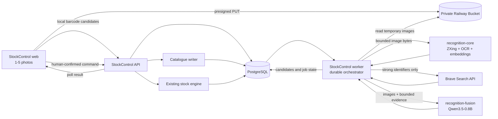

# Assisted stock capture: production implementation specification

Status: **Accepted implementation baseline**  
Last researched: **14 August 2026**
Scope: software, model, data, security, and Railway deployment design  
Primary clients: phone, tablet, and desktop browser

## 1. Decision

StockControl will add an asynchronous, human-confirmed item-identification
workflow. A user takes or uploads one to five ordinary photographs of the same
item. The photographs do not require a backdrop or a rigid framing guide. The
system uses barcode recognition, OCR, visual-example retrieval, broad visual
classification, web evidence, and a small vision-language model to propose the
item's identity.

The pipeline identifies the item only. It does not infer or commit quantity,
location, condition, ownership, or stock movement. After selecting or correcting
a suggestion, the user supplies those business fields and explicitly confirms
the stock receipt.

All feature source lives in the StockControl Git repository. The OCR/embedding
runtime and VLM runtime are independently deployed microservices, not libraries
loaded into the API process and not separate Git repositories.

Every non-barcode photograph is analysed by every applicable specialist. Results
are fused only after all photographs have completed; a high score from an early
stage does not stop later stages. There is one exception: a valid barcode that
maps unambiguously to one active StockControl item returns that item immediately
and avoids uploads and model inference. Human confirmation is still required.

The selected production components are:

- native `BarcodeDetector` when available, with self-hosted `zxing-wasm/reader`
  in the browser and ZXing-C++ on the server;
- `PP-OCRv6_small_det` plus `PP-OCRv6_small_rec` for OCR;
- `nomic-ai/nomic-embed-vision-v1.5` INT8 ONNX for visual examples and broad
  category similarity;
- `unsloth/Qwen3.5-0.8B-GGUF`, using its Q8_0 GGUF and matching F16
  multimodal projector with a pinned CPU-only `llama.cpp` runtime, as a
  provisional staging candidate for one item-level fusion proposal;
- Brave Search Web API for one bounded item-level search when a reliable query
  can be constructed; and
- the existing StockControl API, PostgreSQL database, private Railway Bucket,
  and worker deployment pattern for orchestration and durable state.

This is an assistive tool, not an autonomous stocktake. No recognition result is
trusted enough to mutate the catalogue or stock without a person.

## 2. Problem and success definition

An onboarding customer may have several buildings containing large volumes of
undocumented stock. Staff are already operating at capacity. The present
item-by-item catalogue and receipt flow requires too much repeated typing,
navigation, and prior product knowledge.

The feature succeeds if it removes enough of that work to let the same staff
record materially more stock without lowering record quality. The first customer
pilot must demonstrate at least a 10% reduction in median hands-on time per
correctly recorded item. Model benchmark accuracy alone is not the business
outcome.

The design optimises for:

1. high recall in the five suggestions shown to the user;
2. very high precision for anything labelled **Strong**;
3. barcode-assisted matching without sacrificing the full photo analysis;
4. graceful partial results when a model or the internet is unavailable;
5. short, recoverable user interactions rather than a long blocking request;
6. low idle cost for a small customer; and
7. learning from confirmed examples without online fine-tuning.

## 3. Scope

### 3.1 Included

- One to five photographs of one item per recognition session.
- Camera capture and file selection on a phone, tablet, or desktop.
- No mandatory backdrop, turntable, Raspberry Pi, on-device display, or AI
  accelerator.
- Local barcode detection with a server fallback.
- Server-side OCR, visual embedding, category matching, web enrichment, VLM
  analysis, and deterministic candidate fusion.
- Existing-item selection and editable new-item suggestions.
- Quantity and location entry after identity review.
- Atomic new-item-plus-opening-receipt and existing-item receipt paths.
- Durable jobs, retries, status recovery, privacy-aware feedback, and exemplar
  learning.
- Temporary private image storage and explicit cleanup.
- English-first validation. The selected OCR model supports a wider language set,
  but untested languages are not promised by the product.

### 3.2 Not included

- Unattended shelf scanning, video inventory, automatic item counting, or
  autonomous stock mutation.
- Inferring quantity from the number of visible objects.
- Recognising several equally prominent items in one session. The user is asked
  to tap the intended item or start separate sessions.
- Online model fine-tuning in a customer deployment.
- A vector database or Redis in the first release.
- A general-purpose internet-browsing agent. The VLM receives bounded search
  evidence and has no tools or network access.
- Supplier, cost, pack-conversion, condition, batch, or serial domains that do
  not yet exist in the runnable product.
- Offline stock commits. A failed network can preserve local draft state, but a
  server confirmation is required to change stock.

## 4. Repository integration and invariants

The implementation extends the current architecture:

- `apps/web` is React/MUI, and its camera/barcode flow — `ScanSheet`, reachable
  from every screen — is where this feature is entered rather than a second
  one alongside it.
- `apps/api` is NestJS/Fastify with authenticated `/api/v1` routes and
  capability checks.
- `apps/worker` already has a production Docker target but currently performs
  heartbeat work only.
- `packages/contracts` owns transport contracts and uses decimal strings for
  quantities.
- `packages/modules` owns framework-free business rules.
- PostgreSQL access uses Kysely and explicit migrations and privileges.
- Railway production is a dedicated customer project with a public `web`,
  private `api`, private PostgreSQL, and a private Railway Bucket in EU West.
- ADR 0004 already selects PostgreSQL jobs and `FOR UPDATE SKIP LOCKED` rather
  than adding a broker.

The following are non-negotiable:

1. Recognition output is untrusted input. Only `apps/api` authorises catalogue
   and stock changes.
2. Every catalogue choice, new-item field, quantity, and location is visibly
   confirmed by a person.
3. Every receipt uses the existing pure `receive` rule and `applyEffect` and
   produces one append-only stock transaction.
4. A new item and its opening receipt commit in one database transaction or not
   at all.
5. Retrying a commit cannot create a second item or receipt.
6. Barcodes remain unique where the current partial unique index applies. Part
   numbers are not assumed unique.
7. Recognition services never receive database credentials or write business
   state.
8. Model upgrades are pinned releases with a recorded manifest; production does
   not download `latest` weights at runtime.
9. If recognition fails, manual catalogue search and entry remain available.

## 5. User experience

### 5.1 Capture and recognition

Assisted capture is not a separate journey. It is what the one scan surface
falls back to when nothing cheaper has identified the item, and it is entered by
an explicit choice rather than by arriving on a screen.

1. Anybody, on any screen, presses the floating scan button and gets a camera.
   The live decoder runs on the stream; a shutter captures a frame from the
   same stream; a photograph already on the device and a typed or wanded code
   are the two secondary ways in. A device with no camera gets an ordinary
   dialog built round the code box instead — the field focused, a handheld
   scanner typing into it, and the photo picker beneath — never the viewfinder
   with its picture switched off. Guidance says only that the item should be
   visible and that extra angles or a label close-up improve the result. There
   is no required backdrop or frame.
2. The browser attempts barcode recognition on the device — on the live frames,
   and on each captured photograph at the stream's own resolution. A code that
   resolves to a catalogue item ends the journey there: the sheet navigates to
   that item's page and closes. No image is uploaded and no session is opened.
   Stock operations are reached from the item page, where they already live.
3. Where nothing resolves, the sheet states that plainly and asks a single
   question — is this something new? For a role holding `manageStock` in an
   installation with the feature enabled, answering yes is **the opt-in**:
   photographs are read locally by default, and that affirmative answer is the
   only path by which image bytes leave the device. It is never remembered,
   inferred, or defaulted on. Both the role and the flag are re-checked
   server-side on every request that follows. Up to five angles may be taken
   before answering.
4. Taking that choice opens a capture batch (or joins the one already open) and
   hands the photographs to it. A default location may be selected now or left
   until review. The batch is presented as a review queue rather than as a
   place to add stock from: adding starts at the scan button, and what only
   this page can do is show what is still being read, what is waiting to be
   checked and what got stuck, and act on any of it without opening each one.
5. The API validates every decoded value and retains it as recognition evidence.
   A barcode never skips the remaining photograph pipeline.
6. The browser normalises and uploads the photographs directly to the
   private Railway Bucket using short-lived presigned PUT URLs.
7. The API returns `202 Accepted`. The user may wait on the progress view or start
   capturing the next item; session cards update by polling.
8. StockControl shows up to five deduplicated identity candidates. Each candidate
   explains its evidence, for example **barcode**, **label text**, **looks like a
   confirmed item**, or **manufacturer page**. Confidence is shown as **Strong**,
   **Possible**, or **Weak**, never as a spurious percentage.
9. An expandable **Analysis details** view exposes the top results from every
   stage for every photograph. The default view does not show fifteen duplicate
   cards for three images.
10. The best selectable result is the default. A primary **Continue** action
    opens the normal item form with every recognised field pre-filled and
    editable. The user may instead select another candidate, choose **Enter
    details manually**, review later, or cancel the item.
11. When no catalogue candidate exists, OCR/barcode/VLM fields are still retained
    as an editable suggested draft rather than being hidden in analysis details.

### 5.2 Business confirmation

12. Only after identity review does the user enter quantity and location. The
    batch default may be overridden.
13. The final screen shows item, quantity, unit, and full location path.
14. A client-generated idempotency key accompanies the confirmation.
15. Success shows the item reference and new balance and returns to the capture
    batch.

An exact barcode remains high-value evidence, but never skips the photographs or
the remaining recognition stages. An archived exact match is shown but cannot
receive stock; the user is sent to the existing reactivation flow. A valid code
that matches no item is retained and pre-filled if the user creates a new item.

## 6. Runtime architecture



### 6.1 Railway services

| Service                | Exposure | State/credentials                                 | Initial cap  | Serverless |
| ---------------------- | -------- | ------------------------------------------------- | ------------ | ---------- |
| `web`                  | Public   | No service secrets                                | Existing     | No         |
| `api`                  | Private  | PostgreSQL and Bucket signing credentials         | Existing     | No         |
| `worker`               | Private  | PostgreSQL, Bucket, Brave key                     | 0.5 GB/1 CPU | No         |
| `recognition-core`     | Private  | Baked model files only                            | 3 GB/4 CPU   | Yes        |
| `recognition-fusion`   | Private  | Baked model files only; no network tools          | 4 GB/8 CPU   | Yes        |
| PostgreSQL             | Private  | Sessions, jobs, candidates, feedback, stock state | Existing     | No         |
| Railway Bucket `media` | Private  | Temporary captures and confirmed exemplar crops   | Usage-based  | N/A        |

Caps are safety limits, not billing reservations; Railway bills actual measured
resource usage. Both model services have no database pool, telemetry exporter,
update checker, or periodic outbound request, because outbound traffic can stop a
Railway Serverless service from sleeping. The always-on worker is the only job
poller.

No Redis is added. A recognition job and its session are inserted in the same
PostgreSQL transaction. The worker claims bounded jobs with `FOR UPDATE SKIP
LOCKED`, leases long work, extends leases, retries with exponential backoff and
jitter, and moves exhausted work to a visible failed state.

The root `Dockerfile` gains independent `recognition-core` and
`recognition-fusion` targets. `infra/railway` gains service configuration and
release smoke tests for them. Model artefacts are downloaded only in a controlled
model-build process, verified by SHA-256, and copied into the production image.

### 6.2 Source repository and release boundary

StockControl remains a polyglot monorepo. A runtime boundary does not require a
repository boundary. Keeping this feature in one repository lets a reviewed
commit change the capture UI, shared contracts, database migration, worker,
recognition services, model manifest, and Railway configuration together.

The repository owns these independently deployable units:

```text
apps/web                         browser capture and review
apps/api                         auth, uploads, session state and stock commit
apps/worker                      durable recognition orchestration
services/recognition-core        Python OCR/barcode/embedding HTTP service
services/recognition-fusion      pinned llama.cpp/Qwen runtime configuration
packages/contracts               browser/API transport contracts
packages/modules/stock-capture   deterministic domain/fusion rules
models/manifest.lock.json        model revisions, hashes and preprocessing IDs
infra/railway                    one deployment definition per runtime
```

Repository-boundary rules:

1. `recognition-core` and `recognition-fusion` are separate Railway services and
   processes. Neither is linked into or spawned by `apps/api`.
2. Model services do not import StockControl application packages or access its
   database. Their only integration surface is a versioned private HTTP contract.
3. The worker is the sole application caller of the model services. Browser and
   API clients cannot address them directly.
4. Every container image carries the same Git revision label. A session records
   the Git revision plus model/config manifest so mixed deployments remain
   diagnosable.
5. `recognition-core` owns its Python `pyproject.toml` and locked dependency file;
   it is not forced into the pnpm workspace. The repository root orchestrates
   both ecosystems in CI.
6. Model weights, conversion outputs, caches, evaluation photographs, and GGUF or
   ONNX build products are ignored by Git. Only manifests, conversion scripts,
   licences, checksums, and small non-sensitive fixtures are committed.
7. HTTP request/response compatibility is tested across the worker and both
   services. Internal implementation details are not shared across the boundary.

Extend `.github/workflows/ci.yml` with:

- Python format, lint, type, unit, licence, and dependency checks for
  `recognition-core`;
- a container matrix containing `api`, `web`, `worker`, `recognition-core`, and
  `recognition-fusion`;
- contract fixtures that exercise the worker against both service images;
- image checks for non-root users, pinned revision labels, health/readiness, and
  absence of runtime model downloads; and
- path-aware caching/build selection so an unrelated web change does not
  repeatedly build model layers. Contract tests still run whenever shared
  contracts, manifests, worker code, or a recognition service changes.

Large weights and the 300-500-image evaluation set do not run in ordinary PR CI.
PR CI verifies checksums, parsers, fixed miniature fixtures, and container
contracts. A protected model-promotion workflow builds the complete images,
runs the held-out evaluation and Railway benchmark, produces the SBOM, and
records the accepted image digests in the release manifest.

Production deployment remains coordinated from one reviewed Git SHA:

1. Build, scan, and retain all runtime images.
2. Deploy and verify the two stateless recognition services.
3. Run the database migration service successfully.
4. Deploy `api`, then the always-on `worker`.
5. Deploy `web`, run end-to-end smoke tests, and enable the customer feature flag.

Rollback redeploys a previously recorded compatible release manifest. A model
service can be rolled back independently only when its HTTP contract and stored
pipeline manifest remain compatible with the deployed worker.

Creating another Git repository requires a new ADR and at least one concrete
independent lifecycle: a second product consumes the service, a separate team
owns/releases it, it becomes a shared multi-tenant inference platform with its
own SLA, or a public/private source-licensing boundary requires isolation. Build
time or repository size alone first receives path filters, caching, and external
model artefact storage. These boundaries keep later extraction possible without
paying cross-repository coordination costs in v1.

## 7. Recognition pipeline

### 7.1 Session semantics

A recognition session represents one physical product and at most five images.
Each image receives an independent trace. The worker fans the images out to the
specialists, retains the top five outputs per applicable stage, performs one
item-level web lookup, and calls the VLM once per photograph before fan-in.

The per-photo VLM boundary is deliberate. Two ordinary phone photos can nearly
fill the 4,096-token multimodal context and turn a fast one-photo request into a
40-second prompt evaluation. Independent calls keep latency bounded, prevent one
invalid model response from discarding every photograph, and let deterministic
fusion reward agreement across images.

The pipeline state is:

```text
AwaitingUpload -> Queued -> ProcessingBarcode -> ProcessingImages
               -> Enriching -> Fusing -> ReviewReady

Any processing state -> Failed | Cancelled | Expired
ReviewReady          -> Committed | Cancelled | Expired
```

Failures are stage-local where possible. If OCR succeeds but the VLM is
unavailable, the user receives OCR and exemplar candidates. If every stage fails,
the session reaches `ReviewReady` with a manual-entry recommendation rather than
blocking stock entry.

### 7.2 Stage 0: browser barcode

Barcode recognition runs before browser downscaling:

1. Use the native `BarcodeDetector` only when the browser reports the required
   formats.
2. Otherwise, or if it finds nothing, run self-hosted `zxing-wasm/reader` in a Web
   Worker over the full image and a small set of contrast/rotation variants.
3. Send only decoded value, symbology, image ordinal, and library version to the
   API. Never trust a client-supplied confidence or item ID.
4. Validate length, character set, symbology, and check digit where the format has
   one. Resolve internal QR URLs and exact barcode values through the authorised
   catalogue query.
5. Retain every valid decoded code as evidence. Resolve catalogue matches in the
   worker, continue the full pipeline in every case, and preserve an unmatched
   value for the eventual new-item draft.

The browser asset is pinned and same-origin. `BarcodeDetector` is an optimisation,
not a dependency, because MDN marks it experimental and not Baseline.

### 7.3 Upload and normalisation

For every session, the API creates server-generated object keys and upload
routes. The browser:

- strips EXIF and location metadata;
- corrects orientation;
- keeps sufficient label resolution, with a 2,048-pixel maximum long edge;
- encodes JPEG or WebP at a bounded quality;
- computes SHA-256; and
- uploads directly to the Bucket.

JPEG, PNG, and WebP are normalised in the browser. If a supported HEIC source
cannot be decoded safely by that browser, it is uploaded under the same strict
limits; the worker's first isolated image step strips metadata, re-encodes a
normalised derivative, replaces the session object reference, and deletes the
source before recognition. The camera capture path requests JPEG where the
browser permits it.

Limits are five files, 12 MB per source file, 30 MB per session after
normalisation, and 40 megapixels per decoded source. The server does not trust the
extension or client MIME type. The worker checks magic bytes, decoded dimensions,
digest, decompression ratio, and actual media type under CPU, memory, and wall-time
limits before any model sees the image.

### 7.4 Stage 1: server barcode fallback

`recognition-core` runs ZXing-C++ over the normalised full image plus deterministic
rotation, greyscale, and contrast variants. The worker persists these decodes,
uses them for catalogue retrieval, and continues OCR, visual, web, and VLM stages.
An unmatched server decode remains available to pre-fill the new-item barcode.

### 7.5 Stage 2: OCR and identifier extraction

Every image runs `PP-OCRv6_small_det` and `PP-OCRv6_small_rec`. Optional document
orientation and unwarping networks are disabled; EXIF normalisation and a bounded
crop set handle ordinary product photographs.

The deterministic parser extracts candidate values without asking the OCR model
to decide identity:

- manufacturer or brand tokens;
- product name fragments;
- part, model, SKU, catalogue, and barcode-like identifiers;
- variant tokens such as size, diameter, colour, voltage, and material; and
- explicit labelled pack quantity as evidence only.

Numbers are never treated as stock quantity without a supported marker, and even
then they are not carried into the receipt field automatically. Dimensions such
as `50 mm` remain variant evidence.

The worker queries the existing catalogue by exact reference/barcode, all exact
part-number matches, conservative separator-normalised identifiers, and bounded
name tokens. It keeps up to five candidates per image, including ties. Archived
matches remain visible and non-selectable.

### 7.6 Stage 3: adaptive visual examples

The adaptive classifier is nearest-neighbour retrieval, not live fine-tuning.
`nomic-embed-vision-v1.5` produces a normalised embedding for the full image and
bounded candidate crops. The worker compares it with human-confirmed embeddings
for existing items using cosine similarity.

An exemplar result is eligible only when it passes all of:

- the model-version-specific top-one threshold;
- a minimum top-one versus top-two margin;
- crop quality and foreground-area checks; and
- no high-confidence OCR contradiction for barcode, part number, or variant.

Top five neighbours are retained even when top one is weak. Visually identical
variants cannot be distinguished by this stage and must be resolved by barcode,
text, dimensions, or the person.

At the expected SME catalogue size, embeddings are stored as versioned float16
`bytea` values. The worker loads item centroids/examples into a bounded in-memory
index and refreshes it after confirmed examples. Add `pgvector` or another vector
store only after either 50,000 active exemplars or measured p95 retrieval over
100 ms; neither is justified for the first release.

### 7.7 Stage 4: broad visual category

The same Nomic image embedding is compared with a versioned, controlled category
taxonomy such as plumbing fitting, electrical component, hand tool, fastener,
PPE, or packaging. Category text vectors are precomputed during the model build
with the aligned `nomic-embed-text-v1.5`; the text model is not deployed.

Category output narrows search and checks consistency. It is not an exact product
identity and cannot create a catalogue item by itself. A separate ImageNet or
COCO classifier is not deployed because its fixed consumer-object labels add cost
without identifying arbitrary SME stock.

No general object detector is deployed in v1. OCR regions, full-frame,
centre/multiscale, and deterministic saliency crops cover the first use case more
reliably than a COCO detector trained on unrelated classes. When several objects
remain equally prominent, the UI asks the user to tap the intended object and
reruns the crop-dependent stages.

### 7.8 Stage 5: bounded web evidence

The web stage runs for every non-barcode session but may return `not_applicable`
without a paid request. The worker makes at most one Brave Search request when it
has a strong query:

- a valid GTIN/UPC/EAN;
- manufacturer plus part/model number; or
- a sufficiently distinctive manufacturer plus product phrase.

The query builder is deterministic and sends no photograph, user name, building,
location, or quantity. It retains a bounded set of titles, snippets, URLs, and
structured product fields. It may fetch at most two HTTPS manufacturer or
configured distributor pages, with DNS and redirect validation, private-network
blocking, byte/content-type/time limits, and JSON-LD-first extraction. Arbitrary
pages are not crawled.

Web content is untrusted data. It is delimited in the VLM prompt and cannot issue
instructions. Search failures do not fail the session.

### 7.9 Stage 6: per-photo VLM proposals

For each verified photograph, the worker calls `recognition-fusion` with:

- one bounded-resolution image;
- bounded OCR observations for that image;
- opaque IDs and fields for the retrieved internal candidates;
- visual neighbours and category results; and
- bounded web evidence.

The model runs in non-thinking, greedy mode with a 4,096-token context cap and
a 384-token output cap. The output cap allows for a fully populated
`variantAttributes` array, which the prompt asks for by default: a truncated
object costs a whole corrective retry, and greedy decoding stops at the closing
brace, so the headroom is only spent when it is used. Non-thinking is enforced by the service, not requested
politely: Qwen3.5 thinks by default and a thinking pass would consume the whole
output cap before emitting any JSON. A JSON grammar/schema permits only:

- references to supplied opaque internal candidate IDs;
- a bounded external product identity containing manufacturer, name, part/model
  number, barcode, and variant attributes;
- evidence references to image ordinals and supplied observations; and
- `unknown`.

Every schema field is required; inapplicable fields use null or an empty value so
the constrained grammar cannot emit an object that the response parser rejects.

The prompt asks for a name specific enough to separate the item from a near
neighbour on the same shelf, for wording printed on the item to drive
`manufacturer` and `partNumber`, and for each remaining distinguishing property
to be carried in `variantAttributes` rather than packed into the name. It
contains no worked example of a good name: at this model size a quoted example
is treated as text permitted in the name field rather than as an illustration,
and constrained decoding then requires that field to be filled. Left without that
instruction the model answers with the shortest true label it can find, which is
accurate and useless for picking one item out of twenty similar ones. The same
prompt carries an explicit honesty constraint, because pushing a small model
toward detail also pushes it toward inventing detail, and a confident wrong
material or size is the error a reviewer is least likely to catch.
The model cannot emit an arbitrary internal UUID, call a tool, fetch a URL, or
write state. An invalid response receives one constrained retry for that photo;
after that only that photo's VLM stage is marked unavailable and all other
evidence continues. Model-generated confidence is discarded.

### 7.10 Stage 7: deterministic fusion

Raw OCR confidence, cosine similarity, search rank, and token probability are not
comparable. They are never averaged directly.

The framework-free fusion module performs these steps:

1. Canonicalise results to internal item ID, validated GTIN, or a conservative
   external identity of manufacturer plus part/model number. Name alone cannot
   merge candidates.
2. Preserve the top five from each stage and photograph. A candidate that ranks
   second repeatedly must not be lost because it was never a per-image top one.
3. Convert each stage's native score to a calibrated band using the held-out
   customer-representative set and the exact model revision.
4. Aggregate the maximum evidence per stage, add a capped multi-photo and
   cross-stage consensus bonus, and apply strong penalties for identifier or
   variant contradictions.
5. Deduplicate and return the best five candidates with stage/image evidence.

The first release uses a versioned weighted reciprocal-rank configuration tuned
on the pilot set. Once enough reviewed production outcomes exist, it may be
replaced by a small regularised logistic model and isotonic calibration. Such a
change is an evaluated model release, not online learning.

Confidence labels have operational definitions:

- **Strong**: the held-out lower-bound precision for that rule/band is at least
  98%, with no material contradiction;
- **Possible**: useful evidence exists but the Strong gate is not met; and
- **Weak**: low-support candidate shown only to improve top-five recall.

Even a Strong result requires confirmation.

## 8. Selected models and research basis

Every selected weight permits commercial integration under Apache 2.0; the
WASM wrapper is MIT and ZXing-C++ is Apache 2.0. No artefact carries a revenue
threshold, registration step, or field-of-use restriction. Exact revisions, checksums, conversion
commands, licences, and notices are recorded in `models/manifest.lock.json`
and the deployment SBOM.

| Role                            | Selected artefact                                                                                                                                               | Why this is the production default                                                                                                                                                                                                                                                                                                                                                                                                                                                                                                                                                                                                                                                                                                               |
| ------------------------------- | --------------------------------------------------------------------------------------------------------------------------------------------------------------- | ------------------------------------------------------------------------------------------------------------------------------------------------------------------------------------------------------------------------------------------------------------------------------------------------------------------------------------------------------------------------------------------------------------------------------------------------------------------------------------------------------------------------------------------------------------------------------------------------------------------------------------------------------------------------------------------------------------------------------------------------ |
| Browser barcode                 | [`zxing-wasm/reader`](https://github.com/Sec-ant/zxing-wasm)                                                                                                    | Multi-format ZXing-C++ WebAssembly, Web Worker compatible, with an approximately 1.04 MiB reader asset. Native [`BarcodeDetector`](https://developer.mozilla.org/en-US/docs/Web/API/BarcodeDetector) is used only as an opportunistic fast path because browser support is limited.                                                                                                                                                                                                                                                                                                                                                                                                                                                              |
| Server barcode                  | [ZXing-C++](https://github.com/zxing-cpp/zxing-cpp)                                                                                                             | Mature, thread-safe, multi-format reader with browser/server parity and Apache 2.0 licensing.                                                                                                                                                                                                                                                                                                                                                                                                                                                                                                                                                                                                                                                    |
| OCR                             | [`PP-OCRv6_small_det`](https://huggingface.co/PaddlePaddle/PP-OCRv6_small_det) + [`PP-OCRv6_small_rec`](https://huggingface.co/PaddlePaddle/PP-OCRv6_small_rec) | The [official OCR table](https://github.com/PaddlePaddle/PaddleOCR/blob/main/docs/version3.x/pipeline_usage/OCR.en.md) reports 84.1 detection Hmean at 9.6 MB and 81.3 recognition accuracy at 20.4 MB. Small avoids the much larger medium models while materially outperforming the tiny recognition tier. The published v6 metrics use an internal set and must not be compared directly with v5 metrics.                                                                                                                                                                                                                                                                                                                                     |
| Adaptive retrieval and category | [`nomic-embed-vision-v1.5`](https://huggingface.co/nomic-ai/nomic-embed-vision-v1.5), official INT8 ONNX                                                        | Apache 2.0, 92.9M parameters, shared image/text space, and a [96.7 MB official INT8 ONNX](https://huggingface.co/nomic-ai/nomic-embed-vision-v1.5/tree/main/onnx). One model covers exemplar similarity and zero-shot category matching.                                                                                                                                                                                                                                                                                                                                                                                                                                                                                                         |
| VLM fusion                      | [`unsloth/Qwen3.5-0.8B-GGUF`](https://huggingface.co/unsloth/Qwen3.5-0.8B-GGUF), pinned Q8_0 GGUF plus matching F16 multimodal projector                        | Apache 2.0 with no commercial condition, which the previous LFM selection could not offer. Natively multimodal at 0.8B; the selected files are about 812 MB and 205 MB respectively, against LFM's 696 MB and 854 MB. Q8_0 rather than a Q4 tier because quantisation damage at 0.8B is proportionally worse than at larger sizes, decode covers at most 384 tokens, and image prefill is projector-bound and near quant-independent. The pinned llama.cpp commit already carries the `qwen35` architecture and loads the vision side through `qwen3vl_merger`, so no runtime bump is needed. Community conversion rather than a first-party export: recorded in `models/NOTICE.txt` as a deliberate trade. Latency and accuracy are unmeasured. |
| CPU runtime                     | Pinned [`llama.cpp`](https://github.com/ggml-org/llama.cpp/blob/master/docs/multimodal.md)                                                                      | CPU-native quantised inference and a multimodal OpenAI-compatible server. The exact commit is frozen because multimodal projector support is runtime-sensitive; this commit already registers `qwen35` and `qwen3vl_merger`.                                                                                                                                                                                                                                                                                                                                                                                                                                                                                                                     |
| Web evidence                    | [Brave Search Web API](https://brave.com/search/api/)                                                                                                           | One deterministic search endpoint, $5 per 1,000 requests, and $5 monthly credit. StockControl retains control of extraction and VLM prompting rather than buying generated Answers.                                                                                                                                                                                                                                                                                                                                                                                                                                                                                                                                                              |

The evaluated but rejected initial defaults are:

- `PP-OCRv6_tiny`: lower recognition accuracy is a poor trade for identity
  extraction; medium remains a measured fallback if the small tier misses the
  pilot gate.
- SigLIP2 Base: strong general encoder but its official full artefact is roughly
  1.5 GB, while Nomic provides a much smaller official INT8 ONNX and the same
  image/text-space functions.
- LFM2.5-VL-1.6B: the previous selection, replaced for its licence rather than
  its behaviour. Every Liquid variant, including `-Extract`, carries the same
  revenue threshold, so no swap within that family resolves it.
- MiniCPM-V 4.6: a 1.3B model reportedly built on Qwen3.5-0.8B itself, so
  adopting it would mean taking the same language model wrapped in a licence
  requiring a registration questionnaire and discretionary approval above a
  usage ceiling. Strictly worse than using Qwen3.5-0.8B directly.
- Qwen3-VL-2B-Instruct: Apache 2.0 with a genuine first-party GGUF, and the
  rollback if the selected conversion proves unstable or misses the latency
  gate. Rejected only for being larger at equal licence terms.
- SmolVLM2-500M: Apache 2.0 and multi-image capable, but its official card is
  video-oriented and reports 1.8 GB GPU RAM.
- A larger VLM model: better public benchmark scores do not justify the added
  CPU latency and resident memory until the selected ensemble fails the
  StockControl pilot set. Note that per-image projector token count, not
  parameter count, dominates CPU prefill, so a larger model is not reliably
  slower and a smaller one is not reliably faster.
- An AI accelerator: [Railway currently has no GPU
  instances](https://docs.railway.com/guides/ai-agent-workers), and this design
  intentionally uses CPU-compatible models. No Raspberry Pi or accelerator is
  required at the client.

The selected model is used only as one bounded proposal source, with
confidence discarded, a person required for every decision, and no promotion
claim until the gates in section 20 are measured. The user-selected model
decision and exact artefact metadata are captured in `models/manifest.lock.json`
and `models/NOTICE.txt`; the evaluation set remains an explicit launch blocker
for accuracy and resource claims.

## 9. Service contracts

### 9.1 `recognition-core`

`POST /v1/analyse-session` accepts one to five multipart image parts plus an
opaque request ID. It returns independent `photoResults` containing:

- validated server barcode observations;
- OCR lines with bounded text, score, and normalised polygon;
- parsed identifiers and variant tokens;
- a versioned normalised image embedding;
- top category labels; and
- crop/quality metadata.

It does not receive catalogue rows, user data, location, quantity, database
credentials, Bucket credentials, or arbitrary URLs. The response has strict
array and text limits. Duplicate request IDs are safe because the service is
stateless.

The service is Python 3.12 with a minimal FastAPI/ASGI surface, `pyvips` for
bounded decode/normalisation, the pinned ZXing-C++ Python binding, PaddleOCR 3.7,
and ONNX Runtime with the OpenVINO CPU execution provider. The two PP-OCRv6 Small
weights are reproducibly exported from their pinned official artefacts; Nomic
uses its official INT8 ONNX. All models preload once, inference concurrency starts
at one session, and intra-op threads are capped at four. S0 verifies exported
OCR parity before the image is promotable.

`POST /v1/render-exemplar` accepts one already-validated image plus one of the
normalised crop boxes returned by analysis and emits a small, EXIF-free WebP.
The post-commit exemplar job uses it before the source image is deleted;
the endpoint is also stateless and has the same decoder limits.

### 9.2 `recognition-fusion`

The worker calls the private `llama-server` chat-completion route with base64
bounded images and a generated prompt. A per-service secret, private Railway
network, request-size limit, concurrency of one, and JSON grammar constrain the
surface. No public domain is created.

The container builds one pinned `llama.cpp` commit and bakes the verified Q4_0
model plus matching multimodal projector. It starts `llama-server` CPU-only with
a 4,096-token context, one inference slot, eight threads, a private service API
key, and no runtime download. Deployment readiness means the process has loaded
the model and passed a fixed image/schema probe; it does not make an outbound
health call.

### 9.3 Worker orchestration

The worker owns:

- claiming and leasing jobs;
- downloading and validating Bucket objects;
- invoking model services with deadlines;
- catalogue retrieval and in-memory visual-neighbour search;
- constructing any Brave query and safely extracting web evidence;
- building the bounded VLM prompt;
- deterministic fusion;
- transactional candidate/session writes;
- exemplar-build jobs after confirmation; and
- capture/evidence cleanup jobs.

Inference calls are pure and retryable. Candidate publication uses a transaction
conditioned on the expected session state and model manifest, so a late duplicate
cannot overwrite a newer successful result.

## 10. API and shared contracts

All routes use the existing `/api/v1` prefix, authentication middleware, Problem
Details vocabulary, and server-side capability checks.

| Method | Route                                                 | Purpose                                                       | Capability                                     |
| ------ | ----------------------------------------------------- | ------------------------------------------------------------- | ---------------------------------------------- |
| `POST` | `/stock-capture/batches`                              | Start/recover a batch; default location is optional           | `manageStock`                                  |
| `GET`  | `/stock-capture/batches/:batchId`                     | Recover owned batch and session summaries                     | `manageStock`                                  |
| `POST` | `/stock-capture/sessions`                             | Validate local codes and create/recover a recognition session | `manageStock`                                  |
| `POST` | `/stock-capture/sessions/:sessionId/uploads`          | Issue server-keyed presigned PUTs                             | `manageStock`                                  |
| `POST` | `/stock-capture/sessions/:sessionId/uploads/complete` | Verify upload declarations and atomically enqueue work        | `manageStock`                                  |
| `GET`  | `/stock-capture/sessions/:sessionId`                  | Poll status and bounded review candidates                     | `manageStock`                                  |
| `POST` | `/stock-capture/sessions/:sessionId/cancel`           | Cancel uncommitted work and schedule deletion                 | `manageStock`                                  |
| `POST` | `/stock-capture/batches/:batchId/entries`             | Commit selected/edited identity plus receipt                  | `manageStock`; `manageCatalogue` for `NewItem` |
| `POST` | `/stock-capture/batches/:batchId/complete`            | Close a batch                                                 | `manageStock`                                  |

Session and batch possession is not authorisation. Every read and mutation is
scoped to the authenticated actor. Controllers accept `unknown`, use existing
request-parsing helpers, cap all arrays/text, validate UUIDs, and parse quantities
with the existing decimal rules.

The web generates `clientBatchId`, `clientSessionId`, and `clientEntryId` UUIDs.
The API derives a canonical semantic request hash. Same ID and same hash returns
the original resource/result; same ID with another hash returns `409`.

Add stable failure codes including:

- `capture.batch_not_open`;
- `capture.session_not_ready`;
- `capture.session_expired`;
- `capture.upload_invalid`;
- `capture.recognition_unavailable`;
- `capture.idempotency_conflict`;
- `capture.ambiguous_identifier`;
- `capture.item_changed`; and
- `capture.location_unavailable`.

Recognition status polling starts at two seconds and backs off to ten seconds.
The first release does not require SSE or WebSockets; session state is durable and
recoverable after navigation or refresh.

## 11. Persistence

Add `0007-assisted-stock-capture.ts`, register it in the migration provider and
integrity manifest, update `StockControlDatabase`, and grant only the required
runtime privileges through `RUNTIME_TABLE_PRIVILEGES`.

### 11.1 `stock_capture_batches`

| Column                     | Type               | Notes                                     |
| -------------------------- | ------------------ | ----------------------------------------- |
| `id`                       | `uuid`             | Client batch UUID; primary key            |
| `actor_user_id`            | `uuid`             | User FK, `ON DELETE RESTRICT`             |
| `default_location_id`      | `uuid null`        | Optional active location FK               |
| `request_hash`             | `char(64)`         | Server SHA-256 of canonical start request |
| `status`                   | `varchar(20)`      | `Open`, `Completed`, or `Cancelled`       |
| `created_at`, `updated_at` | `timestamptz`      | Database timestamps                       |
| `closed_at`                | `timestamptz null` | Completion/cancellation time              |

### 11.2 `stock_recognition_sessions`

| Column                     | Type               | Notes                                                     |
| -------------------------- | ------------------ | --------------------------------------------------------- |
| `id`                       | `uuid`             | Client session UUID; primary key                          |
| `batch_id`                 | `uuid`             | Owned batch FK                                            |
| `actor_user_id`            | `uuid`             | User FK and ownership scope                               |
| `request_hash`             | `char(64)`         | Canonical idempotency hash                                |
| `status`                   | `varchar(32)`      | Checked state from section 7.1                            |
| `photo_count`              | `smallint`         | Between 1 and 5; barcode evidence never skips photographs |
| `local_codes`              | `jsonb`            | Bounded validated observations, not trusted matches       |
| `model_manifest`           | `jsonb`            | Exact pipeline/model/config revisions                     |
| `selected_candidate_id`    | `uuid null`        | Review selection; no stock effect                         |
| `committed_item_id`        | `uuid null`        | Populated by successful final commit                      |
| `failure_code`             | `varchar(80) null` | Stable code, no raw model text                            |
| `created_at`, `updated_at` | `timestamptz`      | Database timestamps                                       |
| `expires_at`               | `timestamptz`      | Review/evidence retention deadline                        |

### 11.3 `stock_recognition_images`

| Column                           | Type                | Notes                                         |
| -------------------------------- | ------------------- | --------------------------------------------- |
| `id`                             | `uuid`              | Server image UUID                             |
| `session_id`                     | `uuid`              | Session FK                                    |
| `ordinal`                        | `smallint`          | Unique 1 to 5 within session                  |
| `object_key`                     | `varchar(512)`      | Server-generated private key                  |
| `sha256`                         | `char(64)`          | Declared then verified digest                 |
| `media_type`                     | `varchar(40)`       | Verified type                                 |
| `byte_length`, `width`, `height` | integer types       | Verified bounded metadata                     |
| `status`                         | `varchar(24)`       | `Pending`, `Verified`, `Rejected`, `Deleted`  |
| `embedding`                      | `bytea null`        | Temporary versioned float16 query vector      |
| `embedding_model`                | `varchar(120) null` | Exact model revision                          |
| `crop_metadata`                  | `jsonb`             | Bounded normalised boxes/quality, not raw OCR |
| `delete_after`                   | `timestamptz`       | At most 30 days after upload                  |
| `deleted_at`                     | `timestamptz null`  | Tombstone for cleanup proof                   |

Use a unique constraint on `(session_id, ordinal)` and never accept an object key
from the client.

### 11.4 `stock_recognition_candidates`

| Column            | Type               | Notes                                                  |
| ----------------- | ------------------ | ------------------------------------------------------ |
| `id`              | `uuid`             | Server candidate UUID                                  |
| `session_id`      | `uuid`             | Session FK                                             |
| `rank`            | `smallint`         | Unique 1 to 5 per published result                     |
| `kind`            | `varchar(20)`      | `InternalItem` or `ExternalDraft`                      |
| `item_id`         | `uuid null`        | Internal item FK when applicable                       |
| `identity`        | `jsonb`            | Bounded editable product fields                        |
| `confidence_band` | `varchar(16)`      | `Strong`, `Possible`, `Weak`                           |
| `fusion_score`    | `double precision` | Internal ordering only; never displayed as probability |
| `evidence`        | `jsonb`            | Bounded stage/image reasons and source URLs            |
| `model_manifest`  | `jsonb`            | Reproducibility/audit record                           |
| `created_at`      | `timestamptz`      | Publication time                                       |

Candidate identity/evidence is operational state, not a stock record. Purge it 30
days after commit/cancel/expiry, retaining only privacy-safe aggregate metrics and
the committed catalogue/transaction audit.

### 11.5 `stock_recognition_jobs`

| Column                          | Type                    | Notes                                              |
| ------------------------------- | ----------------------- | -------------------------------------------------- |
| `id`                            | `uuid`                  | Job ID                                             |
| `session_id`                    | `uuid`                  | Session FK                                         |
| `job_type`, `payload_version`   | bounded text            | `Recognize`, `BuildExemplars`, or `DeleteObjects`  |
| `status`                        | bounded text            | `Ready`, `Running`, `Succeeded`, `Retry`, `Failed` |
| `deduplication_key`             | `varchar(200)`          | Unique stable handler key                          |
| `attempt_count`, `max_attempts` | `smallint`              | Checked positive limits                            |
| `available_at`                  | `timestamptz`           | Scheduled/retry time                               |
| `lease_owner`, `leased_until`   | nullable bounded fields | Crash recovery                                     |
| `last_error_code`               | `varchar(80) null`      | No image/OCR/model output                          |
| timestamps                      | `timestamptz`           | Created, updated, completed                        |

### 11.6 `item_visual_examples`

| Column                                 | Type                | Notes                                   |
| -------------------------------------- | ------------------- | --------------------------------------- |
| `id`                                   | `uuid`              | Example ID                              |
| `item_id`                              | `uuid`              | Confirmed item FK                       |
| `embedding`                            | `bytea`             | Normalised float16 vector               |
| `embedding_model`                      | `varchar(120)`      | Exact revision and preprocessing ID     |
| `crop_object_key`                      | `varchar(512) null` | Private, EXIF-free derived item crop    |
| `source_session_id`, `source_image_id` | `uuid`              | Provenance FKs                          |
| `verified_by_user_id`                  | `uuid`              | Human confirmation provenance           |
| `quality_score`                        | `real`              | Bounded quality signal                  |
| `created_at`, `retired_at`             | timestamps          | Soft retirement supports model upgrades |

Only a human-confirmed result creates a positive example. Keep at most three
diverse active examples per item initially; prefer different useful views and
retire near-duplicates. Derived crops follow the item's/customer's retention and
deletion policy. They are not cover photos and are never public.

### 11.7 `stock_capture_entries`

| Column                       | Type           | Notes                                           |
| ---------------------------- | -------------- | ----------------------------------------------- |
| `id`                         | `uuid`         | Client entry UUID and primary idempotency key   |
| `batch_id`, `session_id`     | `uuid`         | Owned batch/session FKs; `session_id` is unique |
| `actor_user_id`              | `uuid`         | User FK and ownership scope                     |
| `request_hash`               | `char(64)`     | Server hash of canonical business fields        |
| `status`                     | `varchar(20)`  | `Pending` or `Committed`                        |
| `item_id`                    | `uuid null`    | Committed item FK                               |
| `transaction_id`             | `uuid null`    | Unique committed receipt transaction FK         |
| `created_item`               | `boolean null` | Whether the operation created the item          |
| `created_at`, `committed_at` | timestamps     | Database audit times                            |

Checks require a `Committed` row to have all result fields and a `Pending` row
to have none. Entries are append-only after commit and are never deleted by
recognition-evidence cleanup. The stock transaction remains the business record
of quantity and destination.

### 11.8 `recognition_feedback`

Store selected rank, `Accepted`/`Edited`/`RejectedAll`, final item ID, which fields
were corrected, shown internal candidate IDs, stage availability, and timings.
Do not store raw OCR or prompt/completion text in telemetry. Corrections become
reviewed hard-negative examples for a later offline calibration release; they do
not trigger live fine-tuning.

## 12. Atomic commit and idempotency

`StockCaptureService.commitEntry` owns one Kysely transaction:

1. Validate/canonicalise the final identity, quantity, unit, and location and
   derive the semantic request hash on the server.
2. Insert a `Pending` `stock_capture_entries` row with `ON CONFLICT DO NOTHING`.
3. On conflict, return the original result only for the same actor, batch, and
   hash; otherwise return `capture.idempotency_conflict` without disclosing
   another user's row.
4. Lock the owned batch and recognition session `FOR UPDATE`; verify the batch is
   open and the session is `ReviewReady`.
5. Re-read a selected existing item and reject material change/archive since the
   candidate snapshot. For a new item, validate every edited field normally.
6. Create or select the item.
7. Lock the stock snapshot, call the existing `receive` decision and
   `applyEffect`, and write exactly one transaction.
8. Mark entry/session committed, write feedback, and enqueue exemplar creation in
   the same transaction.
9. Commit, then return item, transaction, and balance.

Extract transaction-aware writers because the present services own separate
database transactions:

```text
apps/api/src/inventory/catalogue-writer.ts
  createItemInTransaction(tx, input)

apps/api/src/inventory/stock-writer.ts
  receiveInTransaction(tx, command)
```

`CatalogueService` and `StockService` keep their public behaviour by opening a
transaction and delegating. The capture service delegates to both inside one
transaction. No capture-specific stock mutation is introduced.

Both ordinary and capture catalogue creation acquire the same transaction-scoped
PostgreSQL advisory lock before calculating a generated `ITM-####` reference.
This replaces retrying a unique violation inside a larger transaction, which
would leave that PostgreSQL transaction aborted. Supplied references still rely
on the unique constraint and normal validation error.

## 13. Web implementation

Two features, and the boundary between them is the opt-in.

`apps/web/src/features/scan/` owns everything that happens before anything is
sent. It is reachable from every screen and available to every role:

```text
ScanSheet.tsx                    the sequence one scan runs, and which surface shows it
Viewfinder.tsx                   full-bleed picture, reticle, shutter, edge controls
CodeEntry.tsx                    the same flow on a device with no camera
scan-reducer.ts                  explicit stages for one scan
UnidentifiedPanel.tsx            the dead end as a question, and the opt-in
PhotoTray.tsx                    the shots being held, and discarding one
photo-tray.ts                    CapturedPhoto, ordinals and preview lifetime
frame-grabber.ts                 a frame out of the live stream, as a File
barcode/provider.ts              native/WASM capability boundary
```

`ScanSheet` chooses between `Viewfinder` and `CodeEntry`; both raise the same
`UnidentifiedPanel`, which takes how another photo is added as a closed union so
that a device without a camera is never offered one.

A match is not a screen. The sheet navigates to the item's page and closes,
because there is nothing left to decide once the item is known — every stock
operation already lives on that page.

`apps/web/src/features/stock-capture/` owns everything after it:

```text
StockCapturePage.tsx             queue/session shell
ReviewQueue.tsx                  the queue, grouped by what it wants from the reader
SendingPhotos.tsx                opted-in photographs in flight, and their retry
RecognitionProgress.tsx          durable stage/status polling
CandidateReview.tsx              primary continue action, alternatives and review-later controls
AnalysisDetails.tsx              per-photo/stage evidence disclosure
ReceiptConfirmation.tsx          quantity, unit and location confirmation
capture-reducer.ts               explicit UI state machine
handoff.ts                       one-shot slot carrying opted-in photographs here
upload/normalise.ts              EXIF removal, resize, digest and PUT
```

Both reducers have explicit recoverable states rather than Boolean loading
flags. Persist only session/batch UUIDs and unsent manual form drafts in browser
storage; never persist image bytes, decoded frames, raw OCR, model prompts, or
presigned URLs. In particular the handoff is a module-level slot rather than
router state: `File` handles survive a structured clone, so history state would
accept them and then keep image bytes alive across reloads and back-navigation.
Camera and image objects are revoked on retake, close, and navigation.

The direction of dependency runs `stock-capture` → `scan`, never the reverse:
photographs and decoded codes originate at the scan surface, which knows nothing
about batches. One barcode provider serves the live camera and the still-image
decode, so the two cannot diverge. Tests inject fake barcode and recognition
providers; CI never depends on a camera or model timing, and the tests that
matter most assert that attaching a photograph sends nothing and that the
offer is absent for a role the server would refuse.

## 14. API and worker implementation

Create:

```text
apps/api/src/stock-capture/
  stock-capture.controller.ts
  stock-capture.service.ts
  recognition-session.service.ts
  recognition-upload.service.ts
  recognition-presenter.ts

apps/worker/src/recognition/
  recognition-dispatcher.ts
  recognition-handler.ts
  core-client.ts
  visual-index.ts
  web-evidence.ts
  fusion-client.ts
  candidate-fusion.ts
  exemplar-handler.ts
  capture-cleanup-handler.ts

packages/contracts/src/stock-capture/
packages/modules/stock-capture/
services/recognition-core/
services/recognition-fusion/
models/manifest.lock.json
infra/railway/recognition-core.railway.json
infra/railway/recognition-fusion.railway.json
```

Framework-free contracts/rules include identifier normalisation, canonical
request hashing, candidate identity grouping, fusion, confidence bands, state
transitions, and limits. Network, Kysely, S3, and model clients remain in app
adapters.

The API is the only service that issues presigned Bucket URLs to a browser. The
worker receives Bucket credentials to read/delete objects and write confirmed
crops. Model services receive bounded bytes over private HTTP, not credentials or
user-chosen URLs.

## 15. Image and exemplar lifecycle

[Railway Buckets](https://docs.railway.com/storage-buckets) support presigned URLs
but currently do not support lifecycle configuration, object versioning, object
lock, or server-side encryption. The application therefore owns deletion and
must not assume the Bucket will expire an object automatically.

Policy:

- original and normalised session photographs are temporary and deleted as soon
  as the session is committed/cancelled and any exemplar job finishes;
- a hard `delete_after` limit of 30 days applies even if a job is stuck;
- a janitor repeatedly claims overdue objects until the Bucket confirms deletion;
- cleanup backlog age and delete failures alert operators;
- metadata tombstones remain for audit, but the object and raw OCR do not;
- after confirmation, an exemplar job may create one EXIF-free, item-focused
  WebP crop per useful view and retain at most three per item; and
- deleting/retiring the item or disabling adaptive examples queues those crops
  for deletion and retires their embeddings.

Direct presigned browser uploads avoid routing image bytes through `api` and
avoid Railway service upload egress. Railway documents Bucket storage at $0.015
per GB-month with free Bucket operations and egress, while service egress remains
billable.

## 16. Security and privacy

### 16.1 Trust boundaries

- Authenticate and authorise every API route; UUID knowledge grants nothing.
- Treat client codes, MIME types, dimensions, hashes, model outputs, OCR, and web
  text as hostile input.
- Give model services no public domains, database credentials, Bucket keys,
  Brave key, or stock API token.
- Give `recognition-fusion` no outbound network access at application level and no
  tools in its prompt.
- Validate a VLM-selected internal candidate against the server-supplied opaque
  allowlist.

### 16.2 Upload controls

- Short-lived, single-object presigned PUT/GET grants and server-generated keys.
- CORS restricted to `PUBLIC_APP_ORIGIN`.
- Magic-byte, decoder, dimension, byte, decompression, and digest validation.
- Bounded image decoder threads, memory, pixels, and wall time.
- No SVG, PDF, HTML, archive, or arbitrary URL input.
- Quarantine/delete invalid objects without serving them back to the browser.

### 16.3 Web and prompt controls

- Build search queries from allowlisted structured fields, never raw prompts.
- Block loopback, link-local, private, metadata-service, and non-HTTPS fetches
  before and after every DNS resolution and redirect.
- Prefer configured manufacturer/distributor domains and JSON-LD; cap two page
  fetches, redirects, bytes, and time.
- Delimit OCR/search strings as data and strip control characters.
- Use a fixed system prompt and JSON grammar. Do not include secrets, user names,
  locations, quantities, or free-form application instructions.
- Record source URL and retrieval time for user evidence, but never execute page
  scripts.

### 16.4 Supply chain

- Pin model repository revision, file SHA-256, runtime commit, Python/npm package
  lock, base image digest, and preprocessing configuration.
- Build with network access but run with no model download or Hugging Face cache
  mutation.
- Preserve Apache/MIT licences and NOTICE files and generate an SBOM.
- Scan both inference images and review model-card/licence changes before any
  upgrade.

### 16.5 Data disclosure

Brave receives only the minimal product identifier query. It never receives a
photo, user identity, building/location, quantity, or internal item UUID. The
customer-facing privacy notice describes temporary cloud image processing,
confirmed exemplar retention, and the external search processor. The Brave
contract/DPA and the customer's right to disable web enrichment must be complete
before production; disabling it degrades evidence but does not block capture.

## 17. Observability and operations

Structured events contain correlation/session/job IDs, stage names, model
manifest, outcome codes, counts, durations, RSS/CPU, and candidate rank selected.
They do not contain images, OCR text, barcode/part number, web snippets, prompts,
completions, or catalogue names.

Required metrics:

- sessions queued/completed/failed/expired;
- queue depth, oldest ready age, lease expiry, retry and dead-letter count;
- per-stage availability, not-applicable share, p50/p95 time, and timeout rate;
- barcode-match share, unmatched-code persistence, and conflicting-code rate;
- candidate top-one/top-five selection and `RejectedAll` rate;
- correction rate by field and evidence family;
- cold-start count and model service p50/p95 latency;
- actual average/max RSS, vCPU seconds, Bucket bytes, Brave requests, and cost per
  completed session;
- raw-object cleanup backlog and oldest overdue deletion; and
- end-to-end capture-to-confirm and commits per batch.

Alerts cover an oldest ready job over five minutes, repeated model schema
failure, error rate over the pilot baseline, any object more than 30 days old,
and projected monthly spend over the configured Railway hard limit.

The manual entry and barcode-evidence paths remain operational when either model
service or Brave is down. A model rollback is a deployment of the preceding image
and manifest; it never rewrites recognition history or stock data.

## 18. Railway cost estimate

### 18.1 Published rates

As checked on 9 August 2026, [Railway's pricing
documentation](https://docs.railway.com/pricing/plans) lists:

- RAM: $10 per GB-month, or $0.000231 per GB-minute;
- CPU: $20 per vCPU-month, or $0.000463 per vCPU-minute;
- service network egress: $0.05 per GB;
- volume storage: $0.15 per GB-month; and
- Pro: $20 per month including $20 of resource usage.

The Pro invoice is effectively the larger of $20 and total workspace resource
usage, before add-ons/tax; it is not $20 plus usage that remains inside the
included credit. The existing web/API/PostgreSQL deployment already consumes part
or all of that workspace credit, so the table below reports incremental resource
value rather than claiming the exact invoice delta. If this were a new standalone
Railway Pro workspace, the Railway invoice would still have a $20 monthly minimum;
the estimates do not include the existing StockControl web/API/database usage.

[Railway Serverless](https://docs.railway.com/deployments/serverless) considers a
service inactive after more than ten minutes with no outbound packets and wakes
it on private or public traffic. A database pool, telemetry, or periodic network
call can prevent sleep. Cold boot therefore has an explicit retry and latency
budget.

[Railway Bucket billing](https://docs.railway.com/storage-buckets/billing) is
$0.015 per GB-month, with free operations and Bucket egress. Fractional monthly
storage is rounded up as documented. The short retention makes storage negligible
relative to compute, but it is still monitored.

[Brave Search](https://brave.com/search/api/) is $5 per 1,000 Search requests and
includes $5 monthly credit. Credit scope depends on the Brave account; do not
assume each customer project receives a separate credit, and meet the current
account/attribution terms before including that credit in a budget.

### 18.2 Planning assumptions

These are engineering estimates, not vendor benchmarks:

- average three photographs per item;
- average 0.5 MB per normalised photograph, deleted immediately after commit or
  cancellation and otherwise retained for at most 30 days;
- always-on worker average RSS 0.25 GB;
- `recognition-core` average RSS 2 GB while awake and 20 vCPU-seconds per photo;
- `recognition-fusion` average RSS 3 GB while awake and 120 vCPU-seconds per item;
- one Brave request per item as a conservative upper bound, although sessions
  without a strong query make no paid call;
- 40 model-service awake hours for a 1,000-item batched onboarding month;
- 160 model-service awake hours for a 10,000-item batched month; and
- 720 hours per billing month for planning.

The calculation is:

```text
RAM cost    = average RSS GB * awake_hours / 720 * $10
CPU cost    = vCPU_seconds * $20 / (720 * 3,600)
Search cost = max(0, request_count * $0.005 - $5 monthly credit)
```

Resource caps do not replace measurement. S0 records actual cold/warm RSS,
vCPU-seconds, image size, and latency on Railway and updates these assumptions
before production.

### 18.3 Estimated incremental monthly cost per active customer project

| Workload                                           | Worker RAM | Model RAM | Model CPU | Railway compute | Brave upper bound after credit | Bucket/egress        | Planning total |
| -------------------------------------------------- | ---------- | --------- | --------- | --------------- | ------------------------------ | -------------------- | -------------- |
| 1,000 items, captured in batches, 40 awake hours   | $2.50      | $2.78     | $1.39     | **$6.67**       | $0 (gross $5)                  | under $0.10 expected | **$7-$10**     |
| 10,000 items, captured in batches, 160 awake hours | $2.50      | $11.11    | $13.89    | **$27.50**      | $45 (gross $50)                | under $1 expected    | **$70-$85**    |
| 1,000 items, model services kept warm all month    | $2.50      | $50.00    | $1.39     | **$53.89**      | $0                             | under $0.10 expected | **$55-$60**    |
| 10,000 items, model services kept warm all month   | $2.50      | $50.00    | $13.89    | **$66.39**      | $45                            | under $1 expected    | **$110-$120**  |

The 10,000-item search upper bound is deliberately conservative. If only 40% of
those sessions produce a sufficiently strong query, Brave is about $15 after the
monthly credit and the combined planning total falls to roughly $40-$55.

Each additional 1 GB held resident continuously costs about $10 per month at the
published rate. Costs multiply across dedicated active customer deployments;
Railway and Brave included credits apply at their workspace/account scope, not
automatically per project. Estimates exclude existing StockControl services,
tax/VAT, engineering time, backup changes, and future vendor price changes.

## 19. Test strategy

### 19.1 Evaluation set

Maintain 300-500 consented, labelled product images outside Git. Stratify by:

- one to five views of the same item;
- ordinary clutter, no backdrop, varied distance, glare, blur, rotation, shadow,
  damaged labels, and small print;
- known and unknown barcodes;
- items with no barcode;
- visually similar variants with different sizes/model numbers;
- existing catalogue items, genuinely new items, archived items, and duplicate
  part numbers; and
- at least the customer's common stock categories.

Split by physical item, not photograph, so another angle of a trained exemplar
cannot leak into the test set. Store consent, label provenance, and retention
outside the source repository.

### 19.2 Model and pipeline tests

Measure:

- barcode exact precision/recall by symbology;
- OCR identifier and variant field precision/recall;
- exemplar top-one/top-three/top-five and unknown rejection;
- category accuracy where category is relevant;
- per-stage candidate coverage and complementarity;
- fused top-one/top-five recall and Strong-band precision;
- false Strong results on unknown and near-identical variants;
- VLM JSON conformance, hallucinated identifier rate, and prompt-injection set;
- p50/p95 warm and cold latency, CPU seconds, RSS, image bytes, and cost; and
- results with each stage deliberately unavailable.

Model tests run in a dedicated benchmark pipeline, not normal unit CI. Fixtures
and golden structured responses cover application CI without downloading
weights.

### 19.3 Web tests

- camera/file input, one-to-five enforcement, reorder/remove/retake;
- local barcode native/WASM fallback and durable unmatched-code evidence;
- no upload after an accepted exact return;
- direct upload retry and expired presigned URL recovery;
- progress recovery after refresh and capturing another item while queued;
- top-five deduplication and expandable per-photo evidence;
- candidate select/edit/reject-all and manual fallback;
- archived and ambiguous matches;
- quantity/location kept separate from identity suggestions;
- idempotent confirmation retry; and
- no image/raw result/presigned URL in browser persistence or logs.

### 19.4 API/worker tests with real PostgreSQL

- authentication, capability, ownership, and UUID-probing isolation;
- upload limits, object-key ownership, digest/type/dimension failures;
- session/job insert atomicity and duplicate completion callbacks;
- concurrent `SKIP LOCKED` claims, lease expiry, crash recovery, retry, and
  dead-letter behaviour;
- exact barcode uniqueness, unmatched-code retention, and conflicting multi-photo codes;
- all duplicate part-number candidates, stable fusion ties, and bounded JSON;
- late/duplicate model results cannot overwrite a newer manifest/result;
- existing-item receipt creates one entry and transaction;
- new-item flow creates item, balance, transaction, feedback, and jobs atomically;
- failure at every writer step rolls everything back;
- same key/same payload returns original result; changed payload returns `409`;
- batch close racing a commit serialises correctly;
- normal and capture item creation generate distinct references concurrently;
- object deletion retries and 30-day hard-expiry alerting; and
- migration up/down, integrity manifest, and exhaustive runtime privileges.

### 19.5 Security tests

- image bombs, malformed HEIC/JPEG/PNG/WebP, MIME spoofing, huge dimensions, and
  decoder timeouts;
- OCR control characters, SQL metacharacters, Unicode confusables, and oversized
  identifiers;
- malicious QR URLs and barcode check-digit failures;
- SSRF through DNS rebinding, redirects, IPv4/IPv6 private ranges, credentials in
  URLs, oversized pages, and wrong content types;
- prompt injection in labels and web snippets;
- VLM attempts to emit unprovided internal IDs or invalid JSON; and
- inference service access from the public internet.

### 19.6 End-to-end scenarios

1. An exact local barcode returns an existing item without upload; confirmation
   creates one receipt.
2. Three ordinary photographs produce several stage results; the user chooses a
   fused existing item and confirms quantity/location.
3. An unknown item produces an external draft; the user edits it and atomically
   creates the item and opening receipt.
4. A visually similar wrong suggestion is rejected; the correct item is selected
   and feedback/exemplar provenance is retained.
5. The VLM and Brave are unavailable; OCR/exemplar/manual paths still complete.
6. The first commit response is lost; retry still creates one receipt.
7. The app is closed during processing; reopening the batch recovers the result.

## 20. Production acceptance gates

The implementation is production-ready only when all are true on the agreed
held-out pilot set and Railway deployment:

1. Every stock mutation requires visible human confirmation.
2. Exact-barcode catalogue matches achieve 100% precision in the validation set and
   reject invalid, ambiguous, conflicting, and archived-only cases.
3. Fused top-five identity recall is at least 85%.
4. The **Strong** band has at least 98% precision and unknown-item false-Strong
   rate is at most 1%.
5. No VLM output outside the supplied internal-candidate allowlist is accepted;
   constrained JSON succeeds on at least 99.5% of calls including one retry.
6. Warm p95 is at most 30 seconds for three photos and 45 seconds for five;
   cold-start p95 is at most 75 seconds. The UI remains usable for the next
   capture while work runs.
7. Actual RSS stays within the service caps during a four-hour soak, with no
   unbounded growth or queue starvation.
8. Every temporary photograph is deleted on commit/cancellation or within 30 days in injected
   failure tests.
9. A new item and opening receipt are atomic, and retries create exactly one item
   and transaction.
10. A timed customer pilot reduces median hands-on seconds per correct item by at
    least 10% without increasing post-confirmation record errors.
11. Measured Railway cost per completed session keeps the monthly projection
    within 30% of the approved scenario or triggers an explicit re-budget.
12. Quality, type-check, build, unit, web, real-PostgreSQL integration, security,
    and E2E gates pass.

If the selected OCR or VLM misses these gates, the response is not silent
threshold manipulation. Re-run the same set with PP-OCRv6 Medium or the next
smallest approved VLM behind the existing interfaces, then record a model decision
and updated cost. StockControl remains manual/partial-assist until one passes.

## 21. Delivery plan

| Slice | Deliverable                                                                                         | Exit evidence                                                                                                |
| ----- | --------------------------------------------------------------------------------------------------- | ------------------------------------------------------------------------------------------------------------ |
| S0    | Reproducible model harness, pinned artefacts/licences, evaluation-set policy, Railway CPU benchmark | Selected stack meets provisional accuracy/schema/resource gates; measured cost assumptions replace estimates |
| S1    | Contracts, migration, job lease framework, and worker activation                                    | Real-PG claim/retry/ownership/privilege tests                                                                |
| S2    | Photo UX, local barcode, durable queue, and resumable upload                                        | Phone/browser tests; invalid upload suite; unmatched barcode retained for review                             |
| S3    | `recognition-core`, identifier parser, catalogue retrieval, and visual index                        | Per-stage evaluation and private-service smoke tests                                                         |
| S4    | Brave evidence, Qwen fusion service, deterministic fusion, and review candidates                    | Injection/SSRF/schema tests and top-five evaluation                                                          |
| S5    | Review UX, transaction writers, atomic commit, feedback, and exemplars                              | Existing/new/retry E2E and real-PG rollback/concurrency tests                                                |
| S6    | Cleanup, observability, cost alerts, runbooks, and failure modes                                    | 30-day retention/deletion proof, soak, cold start, rollback, and spend-limit rehearsal                       |
| S7    | Customer pilot and calibrated thresholds                                                            | Timed 10% value gate, error comparison, go/no-go record                                                      |

S0 is a promotion gate because model cards do not represent the customer's stock.
S1 and S2 may proceed while the benchmark is being finalised, but S3/S4 model
images are not promoted and no customer images are retained until S0 security,
licence, accuracy, and resource evidence is recorded.

## 22. Rollout and operating decisions

- Roll out behind a per-customer feature flag to one pilot installation.
- Keep the current manual add-stock and CSV import paths visible.
- Use the current dedicated-customer Railway project boundary; a shared
  multi-tenant inference plane is a later cost optimisation requiring a separate
  isolation review.
- Set Railway hard usage and service restart limits before enabling the flag.
- Pin one complete pipeline manifest per deployment. Do not mix model revisions
  inside a session.
- Retain derived exemplar crops by default only after the customer receives the
  privacy notice; provide an Admin switch to disable and purge them. Embedding-only
  examples may remain if the customer permits them, but cannot be re-embedded
  after a model change.
- Support English-labelled stock in the first pilot. Add a language only after it
  passes the same identifier and variant tests.
- Deliberate duplicate part-number creation remains possible only after the user
  sees all exact candidates and confirms the duplicate warning.

The remaining launch inputs are operational rather than architectural: the pilot
customer's consented evaluation set, their preferred manufacturer/distributor
domain list, privacy/DPA approval for Brave, and the timed baseline for the
current workflow.
